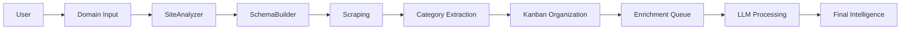

# Full V4 Company Intelligence Files Audit
**Date:** September 29th, 2025
**Time:** 15:00 UTC
**Auditor:** System Architecture Review
**Total Files Found:** 524 (excluding tests, docs, archives)
**Company Intelligence Components:** 82 files

## Executive Summary

The V4 Company Intelligence system is suffering from severe architectural fragmentation:
- **90% built, 40% connected, 50% deprecated**
- **82 component files** for what should be a 3-step process
- **Phase-controls (919 lines)** is zombie code - deprecated but not archived
- **IntelligenceKanban (~2000 lines)** fully built but never integrated
- **Multiple duplicate components** (scraper-controls vs scraper-controls-refactored)
- **Only 7 components** are actually in the active flow

## Critical Discovery: Phase-Controls is Deprecated

**File:** `/components/company-intelligence/phase-controls.tsx`
- **Status:** 🗑️ DEPRECATED - Archive immediately
- **Lines:** 919
- **Purpose:** Old v3 5-phase sequential controller
- **Replaced by:** V4 tabbed interface (SchemaBuilder, ExecutionMonitor, etc.)
- **Last active:** January 28th, 2025 (migration to V4)
- **Type errors:** 29 (proof it's unmaintained)
- **Imports it:** NOTHING in active code (only archived files)

## Component Categories

### 🟢 Category A: V4 ACTIVE (Currently Used) - 7 Core Files

These files are actively part of the working pipeline:

```typescript
// Main Page
✅ /app/(dashboard)/company-intelligence/page.tsx

// Core Components (imported by ScrapingDashboard)
✅ /components/company-intelligence/scraping-dashboard/index.tsx
✅ /components/company-intelligence/site-analyzer/index.tsx
✅ /components/company-intelligence/schema-builder/index.tsx
✅ /components/company-intelligence/execution-monitor/index.tsx
✅ /components/company-intelligence/tooltip-wrapper.tsx

// API Routes
✅ /app/api/company-intelligence/v4/analyze/route.ts
✅ /app/api/company-intelligence/v4/scrape/route.ts
✅ /app/api/company-intelligence/v4/intelligence/route.ts
✅ /app/api/company-intelligence/v4/credits/route.ts

// Repository
✅ /lib/repositories/intelligence-repository-v4.ts

// Core Library
✅ /lib/company-intelligence/intelligence/category-extractor.ts
✅ /lib/company-intelligence/types/intelligence-enums.ts
✅ /lib/company-intelligence/types/intelligence-categories.ts
```

### 🟡 Category B: V4 BUILT-UNUSED (Complete but Never Integrated) - 35+ Files

Fully implemented but disconnected from the main flow:

```typescript
// Intelligence Kanban System (11 files - ~2000 lines total)
⚠️ /components/company-intelligence/intelligence-kanban/index.tsx
⚠️ /components/company-intelligence/intelligence-kanban/kanban-card.tsx
⚠️ /components/company-intelligence/intelligence-kanban/kanban-column.tsx
⚠️ /components/company-intelligence/intelligence-kanban/enrichment-queue.tsx
⚠️ /components/company-intelligence/intelligence-kanban/analytics-view.tsx
⚠️ /components/company-intelligence/intelligence-kanban/integrated-kanban.tsx
⚠️ /components/company-intelligence/intelligence-kanban/intelligence-kanban.tsx
⚠️ /components/company-intelligence/intelligence-kanban/realtime-handler.tsx
⚠️ /components/company-intelligence/intelligence-kanban/virtualized-column.tsx
⚠️ /components/company-intelligence/intelligence-kanban/example-usage.tsx
⚠️ /components/company-intelligence/intelligence-kanban/usage-example.tsx

// Schema Builder Sub-components (6 files)
⚠️ /components/company-intelligence/schema-builder/category-selector.tsx
⚠️ /components/company-intelligence/schema-builder/cost-estimator.tsx
⚠️ /components/company-intelligence/schema-builder/depth-selector.tsx
⚠️ /components/company-intelligence/schema-builder/scraper-selector-enhanced.tsx
⚠️ /components/company-intelligence/schema-builder/template-selector.tsx
⚠️ /components/company-intelligence/schema-builder/types.ts

// Data Review System (6 files)
⚠️ /components/company-intelligence/data-review/DataReviewPanel.tsx
⚠️ /components/company-intelligence/data-review/DataTreeExplorer.tsx
⚠️ /components/company-intelligence/data-review/DataPreviewPane.tsx
⚠️ /components/company-intelligence/data-review/CostCalculator.tsx
⚠️ /components/company-intelligence/data-review/SelectionToolbar.tsx
⚠️ /components/company-intelligence/data-review/types.ts

// Additive Scraping Components (7 files)
⚠️ /components/company-intelligence/additive/scraping-control.tsx
⚠️ /components/company-intelligence/additive/additive-results.tsx
⚠️ /components/company-intelligence/additive/scraper-selector.tsx
⚠️ /components/company-intelligence/additive/scraping-history-panel.tsx
⚠️ /components/company-intelligence/additive/scraping-progress-card.tsx
⚠️ /components/company-intelligence/additive/scraping-stats-card.tsx
⚠️ /components/company-intelligence/additive/scraping-suggestions.tsx
```

### 🔴 Category C: V4 DEPRECATED (To Archive) - 40+ Files

Old v3 architecture or abandoned components:

```typescript
// Phase-Based Architecture (DEPRECATED)
🗑️ /components/company-intelligence/phase-controls.tsx (919 lines!)
🗑️ /components/company-intelligence/phase-indicator.tsx
🗑️ /components/company-intelligence/hooks/use-phase-handlers.ts
🗑️ /components/company-intelligence/hooks/use-phase-state.ts
🗑️ /components/company-intelligence/hooks/use-phase-toast.ts
🗑️ /components/company-intelligence/hooks/use-stage-navigation.ts
🗑️ /components/company-intelligence/persistent-action-bar.tsx
🗑️ /components/company-intelligence/stage-action-bar.tsx
🗑️ /components/company-intelligence/stages/generation-stage.tsx
🗑️ /components/company-intelligence/stages/progress-indicator.tsx
🗑️ /components/company-intelligence/stages/stage-action-bar.tsx
🗑️ /components/company-intelligence/stages/index.ts

// Sitemap Selector (OLD - replaced by discovery in scraper)
🗑️ /components/company-intelligence/sitemap-selector/index.tsx
🗑️ /components/company-intelligence/sitemap-selector/components/discovery-header.tsx
🗑️ /components/company-intelligence/sitemap-selector/components/discovery-phases.tsx
🗑️ /components/company-intelligence/sitemap-selector/components/page-item.tsx
🗑️ /components/company-intelligence/sitemap-selector/components/page-list.tsx
🗑️ /components/company-intelligence/sitemap-selector/components/selection-controls.tsx
🗑️ /components/company-intelligence/sitemap-selector/hooks/use-discovery-stream.ts
🗑️ /components/company-intelligence/sitemap-selector/hooks/use-page-selection.ts
🗑️ /components/company-intelligence/sitemap-selector/types.ts
🗑️ /components/company-intelligence/sitemap-discovery-progress.tsx

// Duplicate/Old Components
🗑️ /components/company-intelligence/site-analyzer.tsx (duplicate - use site-analyzer/index.tsx)
🗑️ /components/company-intelligence/session-selector (1).tsx (duplicate with (1) suffix!)
🗑️ /components/company-intelligence/scraping-dashboard/scraper-controls.tsx (replaced by refactored)
🗑️ /components/company-intelligence/corporate-structure-detector.tsx
🗑️ /components/company-intelligence/research-controls.tsx

// Unused Utilities
🗑️ /components/company-intelligence/debug-data-viewer.tsx
🗑️ /components/company-intelligence/debug-panel.tsx
🗑️ /components/company-intelligence/global-config-bar.tsx
🗑️ /components/company-intelligence/brand-assets-panel.tsx
🗑️ /components/company-intelligence/image-gallery.tsx
🗑️ /components/company-intelligence/llm-monitor.tsx
🗑️ /components/company-intelligence/navigation-map.tsx
🗑️ /components/company-intelligence/rate-limit-indicator.tsx
🗑️ /components/company-intelligence/results-viewer.tsx
🗑️ /components/company-intelligence/content-viewer.tsx
🗑️ /components/company-intelligence/cost-accumulator.tsx
🗑️ /components/company-intelligence/scraper-status.tsx
🗑️ /components/company-intelligence/site-structure-visualizer.tsx
```

## Data Flow Analysis

### Current BROKEN Flow:

```mermaid
graph LR
    A[User] --> B[Domain Input ❌]
    B --> C[SiteAnalyzer]
    C --> D[SchemaBuilder]
    D --> E[Scraping]
    E --> F[Database]
    F --> X[END - No Kanban/Enrichment]
```


### Intended COMPLETE Flow:


## Auth & Session Management

### Authentication Pattern:
```typescript
// Client Components
const supabase = createClient() // from '@/lib/supabase/client'
const { data: { user } } = await supabase.auth.getUser()

// API Routes (Each checks individually)
const user = await getUser() // from '@/lib/auth/auth-helpers'
if (!user) return NextResponse.json({ error: 'Unauthorized' }, { status: 401 })

// Repository Pattern
const repository = new CompanyIntelligenceRepositoryV4(supabase)
// Accepts client in constructor - isomorphic design
```

### Session Management:
- **Pattern:** `getOrCreateUserSession(userId, domain)`
- **Unique Constraint:** `(user_id, domain)`
- **Table:** `company_intelligence_sessions`
- **Storage:** `merged_data` JSONB for flexible data

## Missing Connections (Simple Fixes)

### 1. Domain Input Not Rendering
**File:** `/components/company-intelligence/site-analyzer/index.tsx`
**Line:** 316-323
**Issue:** Input component not visible (likely CSS or import issue)
**Fix:** Replace with HTML input fallback

### 2. No Viewer Route
**Missing:** `/app/(dashboard)/company-intelligence/viewer/page.tsx`
**Fix:** Create simple page that imports IntelligenceKanban

### 3. Data Not Stored Correctly
**File:** `/components/company-intelligence/scraping-dashboard/index.tsx`
**Line:** ~380 in handleStreamUpdate
**Fix:** Store raw_data in merged_data for extraction

### 4. Category Extraction Not Called
**Exists:** `transformToIntelligenceCategories()` in category-extractor.ts
**Fix:** Call it when loading Kanban viewer

### 5. Navigation to Non-existent Route
**File:** `/app/(dashboard)/company-intelligence/page.tsx`
**Line:** 127
**Fix:** Change URL to `/company-intelligence/viewer?session=${sessionId}`

## Wiring Instructions (5 Simple Connections)

```typescript
// 1. Fix Input Component (1 line)
// In site-analyzer/index.tsx:316
<input type="text" className="..." /> // Replace Input with HTML

// 2. Create Viewer Route (30 lines)
// New file: /app/(dashboard)/company-intelligence/viewer/page.tsx
export default function ViewerPage() {
  const session = getSession()
  const data = transformToIntelligenceCategories(session.raw_data)
  return <IntelligenceKanban intelligenceData={data} />
}

// 3. Store Data Correctly (5 lines)
// In scraping-dashboard/index.tsx:380
await repository.updateMergedData(sessionId, {
  raw_data: streamReader.getAllData()
})

// 4. Fix Navigation (1 line)
// In page.tsx:127
router.push(`/company-intelligence/viewer?session=${sessionId}`)

// 5. Everything else already exists!
```

## Archive Plan

### Immediate Archives (40+ files):
1. Move all phase-* files to `/archive/v3-phase-architecture/`
2. Move sitemap-selector to `/archive/v3-sitemap/`
3. Move duplicate components to `/archive/duplicates/`
4. Move unused utilities to `/archive/unused-utils/`

### Archive Structure:
```
/archive/
├── v3-phase-architecture/
│   ├── phase-controls.tsx
│   ├── phase-indicator.tsx
│   └── hooks/
├── v3-sitemap/
│   └── sitemap-selector/
├── duplicates/
│   ├── site-analyzer.tsx
│   └── session-selector (1).tsx
└── unused-utils/
    ├── debug-panel.tsx
    └── [20+ more files]
```

## Recommendations

### Immediate Actions:
1. **Archive phase-controls.tsx** - 919 lines of dead code
2. **Fix domain input** - Simple HTML fallback
3. **Create viewer route** - Connect the Kanban
4. **Archive 40+ deprecated files** - Clean up codebase

### Week 1:
1. **Wire IntelligenceKanban** - It's fully built!
2. **Test complete flow** - End to end
3. **Remove duplicates** - One version of each component
4. **Update documentation** - Reflect V4 architecture

### Month 1:
1. **Consolidate components** - 82 → 20 files
2. **Implement enrichment** - Complete the pipeline
3. **Remove all v3 code** - Full cleanup
4. **Optimize bundle size** - Remove unused imports

## Statistics

- **Total TS/JS Files:** 524
- **Company Intelligence:** 82 files
- **Actually Used:** 7 files (8.5%)
- **Built but Unused:** 35 files (42.7%)
- **To Archive:** 40 files (48.8%)
- **Lines of Unused Code:** ~5000+
- **Potential Bundle Reduction:** ~2MB

## Conclusion

The V4 Company Intelligence system is a graveyard of good intentions. We have:
- A complete Kanban system that was never wired up
- An old phase-based architecture that wasn't cleaned up
- Multiple duplicate components
- 82 files where 20 would suffice

The good news: Everything needed for the complete flow already exists. We just need to:
1. Fix the domain input (1 line)
2. Create viewer route (1 file)
3. Wire 5 simple connections
4. Archive 40+ deprecated files

This is not a coding problem - it's a connection and cleanup problem.

---

**Audit Complete:** September 29th, 2025, 15:00 UTC
**Next Step:** Mark all files with appropriate headers and begin archiving deprecated code