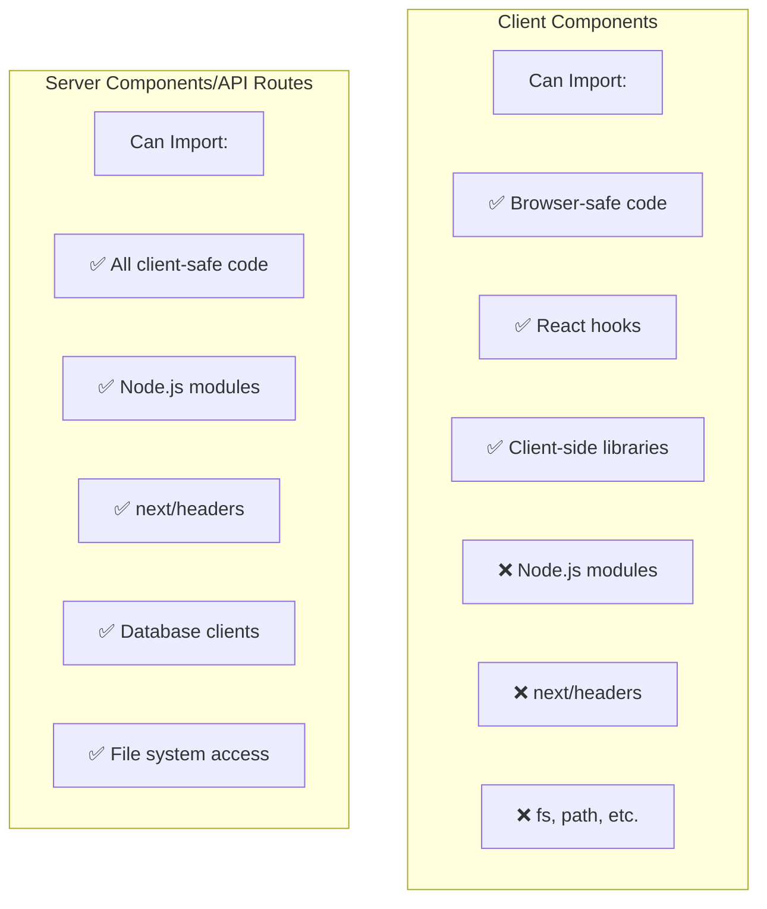

# V4 Repository Architecture Analysis: Why It Broke
**Date:** 2025-09-29T09:30:00Z
**Author:** Claude Assistant
**Purpose:** Explain why CompanyIntelligenceRepositoryV4 broke when other repositories seem to work

## Executive Summary

The breaking change wasn't about using repositories in general - it was specifically about making CompanyIntelligenceRepositoryV4 extend BaseRepository, which imports server-only code (`next/headers`). This creates a fundamental incompatibility with Next.js's client/server boundary.

## The Architecture Chain of Dependencies

### Before Our Changes (WORKING)
```
ScrapingDashboard (Client Component)
    ↓ imports
CompanyIntelligenceRepositoryV4 (Standalone Class)
    ↓ uses
SupabaseClient (passed in constructor)
    ✅ No server-only imports - WORKS!
```

### After Our Changes (BROKEN)
```
ScrapingDashboard (Client Component)
    ↓ imports
CompanyIntelligenceRepositoryV4
    ↓ extends
BaseRepository
    ↓ imports
connection-pool.ts
    ↓ imports
cookies from 'next/headers' (SERVER ONLY!)
    ❌ BREAKS! Cannot use server code in client components
```

## Why Other Components "Work"

### 1. PermanentLogger Works Everywhere
```typescript
// lib/utils/permanent-logger.ts
// ✅ No server-only imports
// ✅ Uses browser-compatible Supabase client
// ✅ Can work in both client and server
```

**Why it works:**
- PermanentLogger doesn't extend BaseRepository
- Uses `@supabase/ssr` createBrowserClient for client-side
- No imports from 'next/headers' or other server-only modules
- Designed to be isomorphic (works on both client and server)

### 2. Other Repositories That Extend BaseRepository
```typescript
// These all extend BaseRepository:
- ProjectsRepository
- TeamRepository
- BugsRepository
- ProfilesRepository
// ... and 16 more
```

**Why they "work":**
- They're NOT used in client components!
- Only used in API routes (server-side)
- If you tried to import them in a client component, they would ALSO break

### 3. The CompanyIntelligenceRepository (non-V4)
```typescript
// lib/repositories/company-intelligence-repository.ts
export class CompanyIntelligenceRepository extends BaseRepository {
```

**Status:** This ALSO extends BaseRepository and would break if used in a client component!
**Usage:** The file `usage-example.tsx` imports it but may not be actively used in the app

## The Fundamental Problem

### Next.js Client/Server Boundary Rules



### The BaseRepository Problem

BaseRepository was designed for server-side use:
```typescript
// lib/repositories/base-repository.ts
import { getPooledClient } from '@/lib/supabase/connection-pool'
// connection-pool.ts imports:
import { cookies } from 'next/headers' // ← SERVER ONLY!
```

This makes ANY repository that extends BaseRepository incompatible with client components.

## The Original V4 Design

Before our changes, CompanyIntelligenceRepositoryV4 was isomorphic:
```typescript
// ORIGINAL (Working)
export class CompanyIntelligenceRepositoryV4 {
  constructor(supabase: SupabaseClient) {
    this.supabase = supabase // Client passes in the right client
  }
}

// Client usage:
const supabase = createClient() // Browser client
const repo = new CompanyIntelligenceRepositoryV4(supabase)

// Server usage:
const supabase = createServerClient() // Server client
const repo = new CompanyIntelligenceRepositoryV4(supabase)
```

## Why We Made the Change

We attempted to follow Next.js 15's recommended Data Access Layer (DAL) pattern:
- Centralize authentication in the data layer
- Prevent forgetting auth checks
- Use connection pooling for performance
- Follow SOLID principles

These are all excellent goals, but they conflict with client component requirements.

## The Architectural Mismatch

### What Next.js Expects
```
Client Components → API Routes → Repositories → Database
        or
Server Components → Repositories → Database
```

### What We Have
```
Client Components → Repositories → Database (BREAKS if repo uses server code!)
```

## Options for Resolution

### Option 1: Full Revert (Recommended for Quick Fix)
- Revert CompanyIntelligenceRepositoryV4 to not extend BaseRepository
- Loses centralized auth but works immediately
- Time: 1 hour

### Option 2: API Layer (Proper Architecture)
- Client components call API routes
- API routes use repositories
- Follows Next.js patterns perfectly
- Time: 4-6 hours

### Option 3: Dual Repository Pattern
- Create CompanyIntelligenceRepositoryV4Client for client-side
- Keep CompanyIntelligenceRepositoryV4 for server-side
- Client version calls API routes internally
- Time: 2-3 hours

## Key Insights

1. **Repository Pattern != Always Server-Side**
   - Traditional backend patterns assume server-only execution
   - Next.js requires considering client/server boundaries

2. **BaseRepository is Server-Only**
   - Uses connection pooling with cookies
   - Cannot be used in client components
   - This is by design for security

3. **Isomorphic Code is Complex**
   - Code that works on both client and server needs careful design
   - Can't use server-only features like cookies or file system

4. **Framework Constraints Win**
   - Architectural purity must yield to framework requirements
   - Next.js's model doesn't align with traditional repository patterns

## Conclusion

The issue isn't that "repositories don't work in client components" - it's that repositories extending BaseRepository (which uses server-only code) don't work in client components.

The original V4 design was isomorphic (worked on both client and server) because it didn't use any server-only features. Our refactoring made it server-only by extending BaseRepository.

Other components like PermanentLogger work because they're designed to be isomorphic. Other repositories that extend BaseRepository would have the same problem if used in client components - they just happen to only be used server-side.

## Recommendations

1. **Immediate:** Revert V4 to not extend BaseRepository
2. **Long-term:** Migrate to API routes for all data access from client components
3. **Architecture:** Accept that client components must go through API routes for data

The key lesson: In Next.js, the client/server boundary is absolute. Server-only code cannot be imported into client components, period. This constraint must drive architectural decisions, not the other way around.