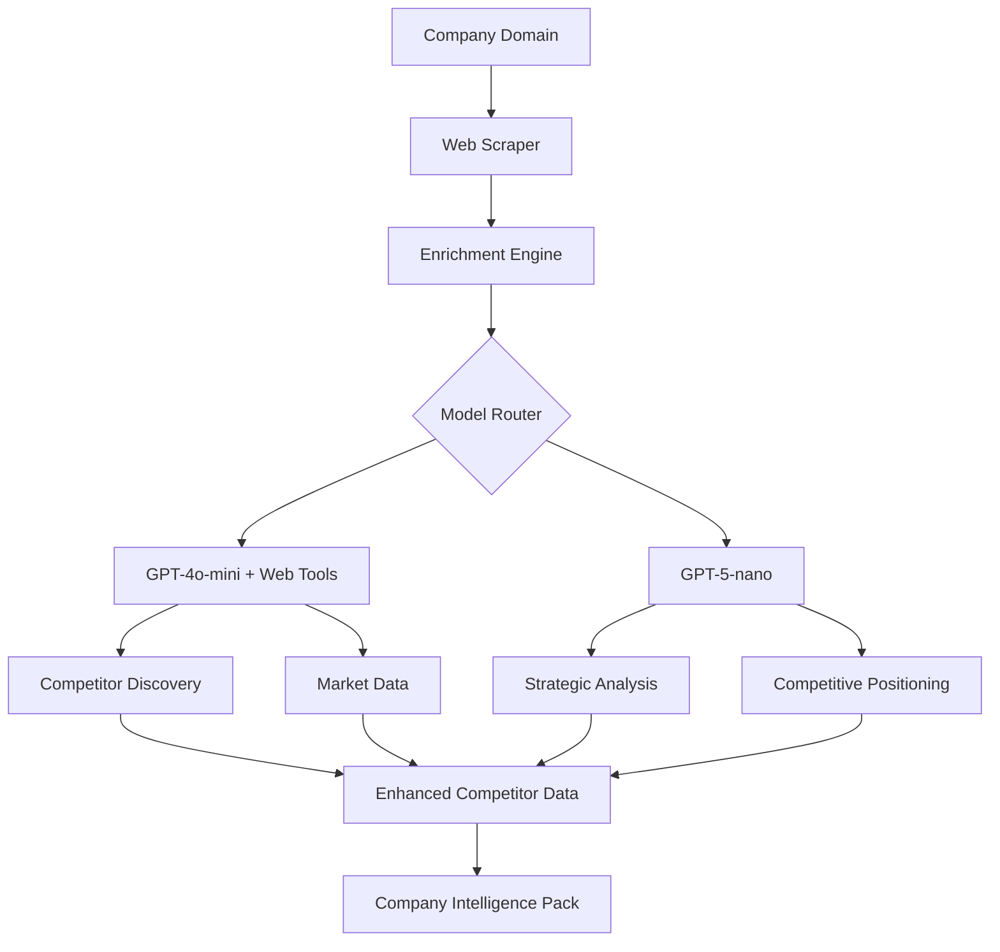

# LLM Architecture & Model Selection Guide

## Overview

This document outlines the LLM architecture and model selection strategy for Project Genie, with specific focus on optimizing for different document types and data enrichment tasks.

## Model Selection Strategy

### Core Principles

1. **Task-Specific Optimization**: Use the most appropriate model for each task type
2. **Cost Efficiency**: Balance quality with token costs
3. **Structured Output Support**: Prefer models with native JSON schema support
4. **Tool Integration**: Leverage models with function calling capabilities
5. **Fallback Chains**: Always have backup models for resilience

## Model Families & Capabilities

### GPT-4o Models (OpenAI)
**Best for**: Structured documents, form-like outputs, JSON generation

| Model | Input Cost | Output Cost | Use Cases |
|-------|------------|-------------|-----------|
| gpt-4o-nano | $0.50/1M | $2.00/1M | Testing, simple structured data |
| gpt-4o-mini | $1.50/1M | $6.00/1M | Production structured documents, web tools |
| gpt-4o | $5.00/1M | $15.00/1M | Complex documents requiring high accuracy |

**Key Features**:
- Native `zodResponseFormat` support for guaranteed schema adherence
- `chat.completions.parse()` for structured outputs
- Function calling with web search tools
- Excellent for PID, Business Case, structured data

### GPT-5 Models (via Vercel AI Gateway)
**Best for**: Narrative documents, creative content, strategic analysis

| Model | Input Cost | Output Cost | Use Cases |
|-------|------------|-------------|-----------|
| gpt-5-nano | $0.05/1M | $0.40/1M | Testing, short narratives |
| gpt-5-mini | $0.25/1M | $2.00/1M | Production narrative documents |
| gpt-5 | $1.00/1M | $8.00/1M | Premium content requiring deep reasoning |

**Key Features**:
- Superior reasoning and analytical capabilities
- Better narrative flow and creativity
- **CRITICAL**: Must use `responses.create()` API (not chat completions)
- Excellent for Risk Registers, Project Plans, strategic content

### Specialized Models

#### DeepSeek (Cost-Optimized)
- **deepseek-chat**: $0.14/1M input, $0.28/1M output
- Use for: High-volume processing, draft generation
- 128K context window

#### Groq (Speed-Optimized)
- **mixtral-8x7b**: Ultra-fast inference
- Use for: Real-time features, quick iterations
- Limited by rate limits

## Company Intelligence Architecture

### Enhanced Competitor Analysis Pipeline



### Model Configuration for Company Intelligence

#### 1. Competitor Discovery & Enrichment
```typescript
// Tool configuration for competitor analysis
export const competitorAnalysisConfig = {
  model: 'gpt-4o-mini',  // Structured data + web tools
  temperature: 0.3,      // Lower for factual accuracy
  tools: {
    web_search: {
      type: 'function',
      function: {
        name: 'web_search',
        description: 'Search for competitor information',
        parameters: {
          query: 'string',
          num_results: 'number'
        }
      }
    },
    news_search: {
      type: 'function',
      function: {
        name: 'news_search',
        description: 'Search recent news about competitors'
      }
    }
  }
}
```

#### 2. Industry & Market Analysis
```typescript
// Configuration for industry analysis
export const industryAnalysisConfig = {
  model: 'gpt-5-nano',   // Better reasoning for analysis
  temperature: 0.5,      // Balanced creativity/accuracy
  reasoning: {
    effort: 'medium',    // Good balance of speed/quality
    verbosity: 'normal'
  }
}
```

#### 3. Data Quality & Fallback Strategy
```typescript
// Fallback chain for resilience
export const fallbackChain = [
  { model: 'gpt-4o-mini', timeout: 5000 },
  { model: 'gpt-5-nano', timeout: 3000 },
  { model: 'deepseek-chat', timeout: 5000 },
  { fallback: 'pre-computed-data' }
]
```

## Structured Output Requirements

### Schema Definition Best Practices

```typescript
// CORRECT: Proper structured output schema
const CompetitorSchema = z.object({
  name: z.string(),
  website: z.string().url(),
  scope: z.enum(['local', 'regional', 'national', 'global']),
  metrics: z.object({
    revenue: z.string().nullable(),
    employees: z.number().nullable(),
    marketShare: z.number().min(0).max(100).nullable()
  }),
  dataQuality: z.object({
    source: z.enum(['verified', 'estimated', 'fallback']),
    confidence: z.number().min(0).max(100),
    lastUpdated: z.date()
  })
}).strict() // CRITICAL: Always use strict mode

// Generate with GPT-4o models
const result = await llmGateway.generateJSON<Competitor>(
  prompt,
  CompetitorSchema,
  { model: 'gpt-4o-mini' }
)
```

### Common Patterns

#### Pattern 1: Web-Enhanced Generation
```typescript
// Use GPT-4o-mini with tools for real-time data
const enrichedData = await llmGateway.generateTextWithTools(
  prompt,
  toolConfigs.competitorAnalysis
)
```

#### Pattern 2: Narrative Analysis
```typescript
// Use GPT-5 for strategic insights
const analysis = await llmGateway.generateText(
  prompt,
  { 
    model: 'gpt-5-nano',
    temperature: 0.5
  }
)
```

#### Pattern 3: Hybrid Approach
```typescript
// Combine structured data with narrative analysis
const structuredData = await getStructuredData() // GPT-4o
const narrative = await generateNarrative(structuredData) // GPT-5
return combineResults(structuredData, narrative)
```

## Cost Optimization Strategies

### 1. Development vs Production Models
- **Development**: Use nano variants for testing
- **Production**: Upgrade to mini/full models
- **Premium Features**: Reserve GPT-5/GPT-4o for paid tiers

### 2. Caching Strategy
```typescript
// Cache expensive operations
const cacheConfig = {
  competitorData: { ttl: 86400 },    // 24 hours
  industryAnalysis: { ttl: 604800 }, // 7 days
  newsData: { ttl: 3600 },          // 1 hour
  staticData: { ttl: 2592000 }      // 30 days
}
```

### 3. Progressive Enhancement
1. Start with cached/fallback data (instant)
2. Enhance with GPT-4o-mini + tools (5-10s)
3. Deep analysis with GPT-5 (optional, 10-15s)

## Error Handling & Fallbacks

### Timeout Strategy
```typescript
const timeoutConfig = {
  webSearch: 5000,      // 5 seconds
  llmGeneration: 10000, // 10 seconds
  enrichment: 15000,    // 15 seconds
  total: 30000         // 30 seconds max
}
```

### Fallback Data Quality
Always track and display data source:
- ✅ **Verified**: Real data from APIs/web
- ⚠️ **Estimated**: Calculated/industry averages
- 🔄 **Fallback**: Default/cached data
- 🤖 **AI Generated**: LLM-generated content
- ❓ **Unknown**: Source cannot be determined

## Implementation Checklist

### Phase 1: Core Infrastructure
- [x] LLM Gateway with model routing
- [x] Tool configuration system
- [x] Structured output with Zod schemas
- [ ] Data quality tracking system
- [ ] Comprehensive fallback chains

### Phase 2: Company Intelligence
- [ ] Competitor enricher with web tools
- [ ] Industry analysis with GPT-5
- [ ] Market position calculator
- [ ] Visual competitive mapping
- [ ] Data quality indicators

### Phase 3: Optimization
- [ ] Response caching layer
- [ ] Progressive enhancement
- [ ] Cost tracking per request
- [ ] Performance monitoring
- [ ] A/B testing framework

## Monitoring & Metrics

### Key Metrics to Track
1. **Response Time**: p50, p95, p99 latencies
2. **Data Quality**: % verified vs estimated data
3. **Cost per Request**: By model and feature
4. **Error Rates**: Timeouts, API failures, schema violations
5. **Cache Hit Rate**: Efficiency of caching strategy

### Logging Standards
```typescript
logger.info('LLM_GATEWAY', 'Request completed', {
  model: 'gpt-4o-mini',
  tokens: { input: 1500, output: 500 },
  cost: 0.0035,
  duration: 2500,
  dataQuality: 'verified',
  cacheHit: false
})
```

## Future Enhancements

### Short Term (Q1 2025)
- Implement A/B testing for model selection
- Add user preference learning
- Enhance caching with Redis
- Add webhook support for async generation

### Medium Term (Q2 2025)
- Custom fine-tuned models for specific domains
- Multi-modal support (images, charts)
- Real-time collaborative editing
- Advanced competitive intelligence dashboard

### Long Term (Q3-Q4 2025)
- Self-improving prompt optimization
- Automated model selection based on task
- Cost prediction before generation
- White-label API for enterprise clients

## References

- [OpenAI Structured Outputs](https://platform.openai.com/docs/guides/structured-outputs)
- [Vercel AI SDK Documentation](https://sdk.vercel.ai/docs)
- [GPT-5 via Vercel AI Gateway](https://vercel.com/changelog/gpt-5-gpt-5-mini-and-gpt-5-nano-are-now-available-in-vercel-ai-gateway)
- [Zod Schema Validation](https://zod.dev)
- [Project Genie Architecture](./project/project-genie-prompt-architecture-design.md)

---

*Last Updated: 2025-09-02*
*Version: 1.0.0*