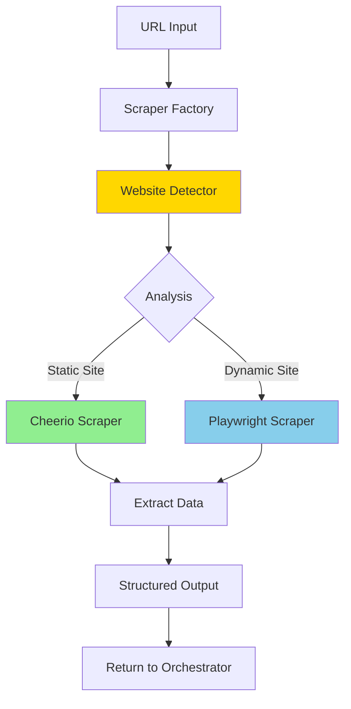

# Revised Scraping Architecture: Playwright & Cheerio Factory Pattern

## Executive Summary

This document outlines the revised web scraping architecture for the Company Intelligence system, implementing a clean two-scraper approach using **Cheerio for static sites** and **Playwright for dynamic JavaScript-rendered sites**. All Puppeteer code will be marked as legacy and removed. The architecture uses an intelligent factory pattern that automatically selects the optimal scraper based on website analysis.

## Table of Contents

1. [Architecture Overview](#architecture-overview)
2. [Design Principles](#design-principles)
3. [Scraper Factory Pattern](#scraper-factory-pattern)
4. [Cheerio Scraper Specification](#cheerio-scraper-specification)
5. [Playwright Scraper Specification](#playwright-scraper-specification)
6. [Website Detection System](#website-detection-system)
7. [Implementation Roadmap](#implementation-roadmap)
8. [Migration from Current State](#migration-from-current-state)
9. [Testing Strategy](#testing-strategy)
10. [Performance Considerations](#performance-considerations)
11. [Error Handling](#error-handling)
12. [Future Enhancements](#future-enhancements)

---

## Architecture Overview

### System Flow



### Core Components

```typescript
interface ScrapingArchitecture {
  // Factory Pattern (Entry Point)
  scraperFactory: {
    register(scraper: IScraper): void
    unregister(name: string): void
    scrape(url: string, options?: ScrapeOptions): Promise<ScrapedData>
    getScrapers(): string[]
  }
  
  // Scrapers (Implementations)
  scrapers: {
    cheerio: CheerioScraper      // Fast, lightweight for static HTML
    playwright: PlaywrightScraper // Full browser for JavaScript sites
    // puppeteer: REMOVED - marked as legacy
  }
  
  // Detection System
  detection: {
    detector: WebsiteDetector     // Analyzes website technology
    analyzer: WebsiteAnalyzer     // Determines optimal scraper
  }
  
  // Shared Components
  shared: {
    extractor: DataExtractor      // Common extraction logic
    validator: DataValidator      // Output validation
    rateLimiter: RateLimiter     // Rate limiting
  }
}
```

---

## Design Principles

### 1. Simplicity Over Complexity
- **Two scrapers only**: Cheerio and Playwright
- Remove all Puppeteer code (legacy)
- Clear separation of concerns

### 2. Intelligent Selection
- Automatic framework detection
- Smart scraper selection based on site analysis
- Fallback mechanisms

### 3. Performance First
- Cheerio by default for speed
- Playwright only when JavaScript is required
- Browser instance pooling for Playwright

### 4. Maintainability
- Consistent interface (IScraper)
- Shared extraction logic
- Comprehensive logging

### 5. Serverless Compatibility
- Playwright configured for serverless environments
- Proper resource cleanup
- Memory management

---

## Scraper Factory Pattern

### Interface Definition

```typescript
// lib/company-intelligence/scrapers/core/scraper.interface.ts

export interface IScraper {
  // Unique identifier
  readonly name: string
  
  // Capabilities check
  canHandle(url: string, analysis?: WebsiteAnalysis): boolean
  
  // Initialize resources (if needed)
  init?(): Promise<void>
  
  // Main scraping method
  scrape(url: string, options?: ScrapeOptions): Promise<ScrapedData>
  
  // Cleanup resources
  cleanup?(): Promise<void>
}

export interface ScrapeOptions {
  timeout?: number                    // Request timeout
  waitForSelector?: string           // Wait for specific element
  scrollToBottom?: boolean           // Auto-scroll for lazy loading
  headers?: Record<string, string>   // Custom headers
  viewport?: { width: number; height: number }
  screenshot?: boolean               // Take screenshot (Playwright only)
  userAgent?: string                // Custom user agent
}

export interface ScrapedData {
  url: string
  data: {
    raw: {
      html: string
      text: string
    }
    structured: {
      h1: string
      heroText: string
      mainContent: string
      contactInfo: ContactInfo
      brandAssets: BrandAssets
      socialLinks: SocialLink[]
      navigationItems: NavItem[]
      teamMembers: TeamMember[]
      testimonials: Testimonial[]
      products: Product[]
      blogPosts: BlogPost[]
      metadata: PageMetadata
      screenshot?: string  // Base64 encoded
    }
  }
  metadata: {
    scraper: string
    timestamp: string
    pageTitle: string
    contentLength: number
    hasJavaScript: boolean
    framework?: string
    scrapeTime: number
  }
}
```

### Factory Implementation

```typescript
// lib/company-intelligence/scrapers/core/scraper-factory.ts

export class ScraperFactory extends EventEmitter {
  private scrapers: Map<string, IScraper> = new Map()
  private detector: WebsiteDetector
  
  constructor() {
    super()
    this.detector = new WebsiteDetector()
    this.registerDefaultScrapers()
  }
  
  private registerDefaultScrapers(): void {
    // Register in priority order
    this.register(new CheerioScraper())    // First choice for static
    this.register(new PlaywrightScraper()) // Fallback for dynamic
  }
  
  async scrape(url: string, options: ScrapeOptions = {}): Promise<ScrapedData> {
    // Step 1: Analyze website
    const analysis = await this.analyzeWebsite(url)
    
    // Step 2: Determine scraper order
    const scraperOrder = this.determineScraperOrder(analysis, options)
    
    // Step 3: Try scrapers in order
    for (const scraperName of scraperOrder) {
      const scraper = this.scrapers.get(scraperName)
      
      if (!scraper) continue
      if (!scraper.canHandle(url, analysis)) continue
      
      try {
        logger.info('SCRAPER_FACTORY', `Using ${scraperName} for ${url}`)
        const result = await scraper.scrape(url, options)
        return result
      } catch (error) {
        logger.error('SCRAPER_FACTORY', `${scraperName} failed`, { error })
        // Continue to next scraper
      }
    }
    
    throw new Error(`All scrapers failed for ${url}`)
  }
  
  private determineScraperOrder(
    analysis: WebsiteAnalysis, 
    options: ScrapeOptions
  ): string[] {
    const order: string[] = []
    
    // User preference takes priority
    if (options.scraperPreference) {
      order.push(options.scraperPreference)
    }
    
    // Add based on analysis
    if (analysis.isStatic && !analysis.requiresJS) {
      order.push('cheerio')      // Fast path for static sites
      order.push('playwright')   // Fallback
    } else {
      order.push('playwright')   // Required for JS sites
      // No fallback to Cheerio for JS sites
    }
    
    return [...new Set(order)] // Remove duplicates
  }
}
```

---

## Cheerio Scraper Specification

### Overview
Cheerio is our primary scraper for static HTML sites. It's fast, lightweight, and doesn't require a browser.

### Implementation

```typescript
// lib/company-intelligence/scrapers/implementations/cheerio-scraper.ts

import * as cheerio from 'cheerio'
import { IScraper, ScrapedData, ScrapeOptions } from '../core/scraper.interface'

export class CheerioScraper implements IScraper {
  readonly name = 'cheerio'
  
  canHandle(url: string, analysis?: WebsiteAnalysis): boolean {
    // Can handle any URL, but optimal for static sites
    if (analysis) {
      // Prefer Cheerio for static sites
      return analysis.isStatic && !analysis.requiresJS
    }
    return true // Can attempt any URL
  }
  
  async scrape(url: string, options?: ScrapeOptions): Promise<ScrapedData> {
    const startTime = Date.now()
    
    try {
      // Fetch HTML
      const response = await fetch(url, {
        headers: {
          'User-Agent': options?.userAgent || this.getDefaultUserAgent(),
          'Accept': 'text/html,application/xhtml+xml',
          'Accept-Language': 'en-US,en;q=0.9',
          ...options?.headers
        },
        signal: AbortSignal.timeout(options?.timeout || 30000)
      })
      
      if (!response.ok) {
        throw new Error(`HTTP ${response.status}: ${response.statusText}`)
      }
      
      const html = await response.text()
      const $ = cheerio.load(html)
      
      // Extract comprehensive data
      const structured = await this.extractStructuredData($, url)
      
      return {
        url,
        data: {
          raw: {
            html: html.substring(0, 100000), // Limit size
            text: this.extractText($)
          },
          structured
        },
        metadata: {
          scraper: this.name,
          timestamp: new Date().toISOString(),
          pageTitle: $('title').text(),
          contentLength: html.length,
          hasJavaScript: this.detectJavaScript($),
          scrapeTime: Date.now() - startTime
        }
      }
    } catch (error) {
      logger.error('CHEERIO_SCRAPER', 'Scraping failed', { url, error })
      throw error
    }
  }
  
  private extractStructuredData($: cheerio.CheerioAPI, url: string) {
    return {
      h1: this.extractH1($),
      heroText: this.extractHeroText($),
      mainContent: this.extractMainContent($),
      contactInfo: this.extractContactInfo($),
      brandAssets: this.extractBrandAssets($, url),
      socialLinks: this.extractSocialLinks($),
      navigationItems: this.extractNavigation($),
      teamMembers: this.extractTeamMembers($),
      testimonials: this.extractTestimonials($),
      products: this.extractProducts($),
      blogPosts: this.extractBlogPosts($),
      metadata: this.extractMetadata($)
    }
  }
  
  // Extraction methods...
  private extractH1($: cheerio.CheerioAPI): string {
    const selectors = [
      'h1:first',
      'main h1:first',
      '.hero h1:first',
      'header h1:first'
    ]
    
    for (const selector of selectors) {
      const h1 = $(selector).text().trim()
      if (h1) return h1
    }
    
    return ''
  }
  
  private detectJavaScript($: cheerio.CheerioAPI): boolean {
    // Check for common JS frameworks
    const jsIndicators = [
      'script[src*="react"]',
      'script[src*="angular"]',
      'script[src*="vue"]',
      '#__next',
      '[data-reactroot]',
      '[ng-app]'
    ]
    
    return jsIndicators.some(selector => $(selector).length > 0)
  }
}
```

### Key Features
- **No browser overhead** - Direct HTTP requests
- **Fast parsing** - jQuery-like API
- **Memory efficient** - No browser process
- **Best for**: WordPress, static sites, server-rendered content

### Limitations
- Cannot execute JavaScript
- Cannot handle dynamic content
- No screenshot capability
- Cannot interact with forms

---

## Playwright Scraper Specification

### Overview
Playwright is our scraper for JavaScript-heavy sites that require full browser rendering.

### Implementation

```typescript
// lib/company-intelligence/scrapers/implementations/playwright-scraper.ts

import { chromium, Browser, BrowserContext, Page } from 'playwright'
import { IScraper, ScrapedData, ScrapeOptions } from '../core/scraper.interface'

export class PlaywrightScraper implements IScraper {
  readonly name = 'playwright'
  private browser: Browser | null = null
  private browserPromise: Promise<Browser> | null = null
  
  canHandle(url: string, analysis?: WebsiteAnalysis): boolean {
    // Optimal for JS-heavy sites
    if (analysis) {
      return analysis.requiresJS || !analysis.isStatic
    }
    return true // Can handle any URL
  }
  
  async init(): Promise<void> {
    if (this.browser) return
    if (this.browserPromise) {
      this.browser = await this.browserPromise
      return
    }
    
    this.browserPromise = this.launchBrowser()
    this.browser = await this.browserPromise
  }
  
  private async launchBrowser(): Promise<Browser> {
    logger.info('PLAYWRIGHT_SCRAPER', 'Launching browser')
    
    return await chromium.launch({
      headless: true,
      args: [
        '--no-sandbox',
        '--disable-setuid-sandbox',
        '--disable-dev-shm-usage',
        '--disable-gpu',
        '--single-process',  // Important for serverless
        '--no-zygote',      // Important for serverless
        '--disable-blink-features=AutomationControlled'
      ]
    })
  }
  
  async scrape(url: string, options?: ScrapeOptions): Promise<ScrapedData> {
    const startTime = Date.now()
    
    await this.init()
    
    const context = await this.browser!.newContext({
      viewport: options?.viewport || { width: 1920, height: 1080 },
      userAgent: options?.userAgent || this.getDefaultUserAgent(),
      extraHTTPHeaders: options?.headers
    })
    
    const page = await context.newPage()
    
    try {
      // Enable stealth mode
      await this.applyStealthMode(page)
      
      // Navigate to page
      logger.info('PLAYWRIGHT_SCRAPER', 'Navigating to page', { url })
      await page.goto(url, {
        waitUntil: 'networkidle',
        timeout: options?.timeout || 30000
      })
      
      // Wait for content
      if (options?.waitForSelector) {
        await page.waitForSelector(options.waitForSelector, {
          timeout: 10000
        })
      }
      
      // Auto-scroll if requested
      if (options?.scrollToBottom) {
        await this.autoScroll(page)
      }
      
      // Extract content
      const html = await page.content()
      const $ = cheerio.load(html)
      
      // Extract structured data
      const structured = await this.extractStructuredData($, page, url)
      
      // Take screenshot if requested
      if (options?.screenshot) {
        structured.screenshot = await page.screenshot({
          fullPage: true,
          type: 'png',
          encoding: 'base64'
        })
      }
      
      return {
        url,
        data: {
          raw: {
            html: html.substring(0, 100000),
            text: await page.textContent('body') || ''
          },
          structured
        },
        metadata: {
          scraper: this.name,
          timestamp: new Date().toISOString(),
          pageTitle: await page.title(),
          contentLength: html.length,
          hasJavaScript: true,
          framework: await this.detectFramework(page),
          scrapeTime: Date.now() - startTime
        }
      }
      
    } finally {
      await context.close()
    }
  }
  
  private async applyStealthMode(page: Page): Promise<void> {
    // Override navigator.webdriver
    await page.addInitScript(() => {
      Object.defineProperty(navigator, 'webdriver', {
        get: () => undefined
      })
    })
    
    // Add realistic viewport
    await page.setViewportSize({
      width: 1920 + Math.floor(Math.random() * 100),
      height: 1080 + Math.floor(Math.random() * 100)
    })
  }
  
  private async autoScroll(page: Page): Promise<void> {
    await page.evaluate(async () => {
      await new Promise<void>((resolve) => {
        let totalHeight = 0
        const distance = 100
        const timer = setInterval(() => {
          const scrollHeight = document.body.scrollHeight
          window.scrollBy(0, distance)
          totalHeight += distance
          
          if (totalHeight >= scrollHeight) {
            clearInterval(timer)
            resolve()
          }
        }, 100)
      })
    })
  }
  
  private async extractStructuredData(
    $: cheerio.CheerioAPI, 
    page: Page, 
    url: string
  ) {
    // Use both Cheerio and Playwright's page evaluation
    const jsExtractedData = await page.evaluate(() => {
      // Extract data that requires JS execution
      return {
        computedStyles: {
          primaryColor: getComputedStyle(document.body).getPropertyValue('--primary-color'),
          fontFamily: getComputedStyle(document.body).fontFamily
        },
        dynamicContent: {
          // Check for React/Vue/Angular rendered content
          reactRoot: !!document.querySelector('#root, [data-reactroot]'),
          vueApp: !!document.querySelector('#app, [data-v-]'),
          angularApp: !!document.querySelector('[ng-app], [ng-version]')
        }
      }
    })
    
    // Combine with Cheerio extraction
    return {
      ...this.extractWithCheerio($, url),
      ...jsExtractedData,
      screenshot: undefined // Will be set if requested
    }
  }
  
  async cleanup(): Promise<void> {
    if (this.browser) {
      await this.browser.close()
      this.browser = null
      this.browserPromise = null
      logger.info('PLAYWRIGHT_SCRAPER', 'Browser closed')
    }
  }
}
```

### Key Features
- **Full JavaScript execution** - Renders SPAs correctly
- **Screenshot capability** - Visual capture
- **Form interaction** - Can fill and submit forms
- **Scroll handling** - Triggers lazy loading
- **Stealth mode** - Bypasses bot detection

### Optimizations for Serverless
- Single browser instance reuse
- Lazy browser initialization
- Proper cleanup on Lambda freeze
- Memory-optimized launch args

---

## Website Detection System

### Purpose
Analyzes websites to determine the optimal scraper based on technology stack.

### Detection Logic

```typescript
// lib/company-intelligence/scrapers/detection/website-analyzer.ts

export class WebsiteAnalyzer {
  static async analyze(url: string): Promise<WebsiteAnalysis> {
    // Quick HTML fetch for analysis
    const response = await fetch(url, {
      headers: {
        'User-Agent': 'Mozilla/5.0 (compatible; ProjectGenieBot/1.0)'
      },
      timeout: 10000
    })
    
    const html = await response.text()
    const headers = Object.fromEntries(response.headers.entries())
    
    // Detect frameworks
    const frameworks = WebsiteDetector.detect(html, headers)
    
    // Analyze characteristics
    const analysis: WebsiteAnalysis = {
      url,
      frameworks,
      isStatic: this.checkIfStatic(html, frameworks),
      requiresJS: this.checkJSRequirement(html, frameworks),
      hasForms: this.checkForForms(html),
      hasInfiniteScroll: this.checkInfiniteScroll(html),
      recommendedScraper: 'cheerio' // Default
    }
    
    // Determine recommended scraper
    if (analysis.requiresJS || !analysis.isStatic) {
      analysis.recommendedScraper = 'playwright'
    }
    
    // Override for specific frameworks
    const topFramework = frameworks[0]?.framework
    if (topFramework && ['react', 'vue', 'angular', 'nextjs'].includes(topFramework)) {
      analysis.recommendedScraper = 'playwright'
    }
    
    return analysis
  }
  
  private static checkIfStatic(html: string, frameworks: WebsiteSignature[]): boolean {
    // WordPress, Joomla, static generators are typically static
    const staticFrameworks = ['wordpress', 'joomla', 'hugo', 'jekyll']
    const topFramework = frameworks[0]?.framework
    
    if (topFramework && staticFrameworks.includes(topFramework)) {
      return true
    }
    
    // Check for absence of JS frameworks
    const jsFrameworks = ['react', 'vue', 'angular', 'nextjs']
    return !frameworks.some(f => jsFrameworks.includes(f.framework))
  }
  
  private static checkJSRequirement(html: string, frameworks: WebsiteSignature[]): boolean {
    // JS frameworks require browser rendering
    const jsFrameworks = ['react', 'vue', 'angular', 'nextjs', 'gatsby']
    return frameworks.some(f => jsFrameworks.includes(f.framework))
  }
}
```

---

## Implementation Roadmap

### Phase 1: Create New Scrapers (Priority 1)
1. **Implement CheerioScraper** ✅
   - Copy extraction logic from enhanced-scraper
   - Remove browser-specific code
   - Optimize for static content

2. **Implement PlaywrightScraper** ✅
   - Convert Puppeteer code to Playwright
   - Add serverless optimizations
   - Implement browser pooling

### Phase 2: Update Factory Pattern (Priority 2)
1. **Fix ScraperFactory**
   - Remove references to non-existent scrapers
   - Update `determineScraperOrder` method
   - Add proper error handling

2. **Update Registration**
   - Register only Cheerio and Playwright
   - Remove SimpleEnhancedScraper registration

### Phase 3: Remove Legacy Code (Priority 3)
1. **Mark as Legacy**
   - `enhanced-scraper.ts` (Puppeteer)
   - `simple-enhanced-scraper.ts` (fetch)

2. **Update Imports**
   - Update orchestrator.ts
   - Update API routes
   - Update tests

### Phase 4: Testing & Validation (Priority 4)
1. **Unit Tests**
   - Test each scraper independently
   - Test factory selection logic
   - Test error handling

2. **Integration Tests**
   - Test with real websites
   - Test fallback mechanisms
   - Test in API context

---

## Migration from Current State

### Current Issues to Fix

| Issue | Current State | Target State | Action |
|-------|--------------|--------------|--------|
| Missing Cheerio | Not implemented | CheerioScraper class | Create new implementation |
| Wrong tech (Puppeteer) | EnhancedScraper uses Puppeteer | PlaywrightScraper | Port to Playwright |
| Bad fallback | SimpleEnhancedScraper (fetch) | Remove entirely | Delete file |
| Factory expects missing scrapers | References cheerio, puppeteer, playwright | Only cheerio, playwright | Update factory |
| No browser pooling | New browser per request | Singleton pattern | Implement pooling |

### Migration Steps

```bash
# Step 1: Create new implementations
lib/company-intelligence/scrapers/implementations/
├── cheerio-scraper.ts       # NEW
├── playwright-scraper.ts    # NEW
├── enhanced-scraper.ts      # MARK AS LEGACY
└── simple-enhanced-scraper.ts # DELETE

# Step 2: Update factory
lib/company-intelligence/scrapers/core/
├── scraper-factory.ts       # UPDATE
└── scraper.interface.ts     # KEEP

# Step 3: Update orchestrator
lib/company-intelligence/core/
└── orchestrator.ts          # UPDATE IMPORTS

# Step 4: Update API routes
app/api/company-intelligence/
└── stage-review/route.ts    # UPDATE REGISTRATION
```

---

## Testing Strategy

### Test Matrix

| Site Type | Example | Expected Scraper | Key Validations |
|-----------|---------|------------------|-----------------|
| WordPress | techcrunch.com | Cheerio | Fast, all content extracted |
| React SPA | airbnb.com | Playwright | Dynamic content loaded |
| Static HTML | example.com | Cheerio | Simple, fast |
| Next.js | vercel.com | Playwright | SSR + client content |
| E-commerce | shopify.com | Playwright | Product data loaded |

### Test Implementation

```typescript
// tests/scrapers/cheerio-scraper.test.ts
describe('CheerioScraper', () => {
  it('should scrape static WordPress site', async () => {
    const scraper = new CheerioScraper()
    const result = await scraper.scrape('https://wordpress.org')
    
    expect(result.data.structured.h1).toBeTruthy()
    expect(result.metadata.scraper).toBe('cheerio')
    expect(result.metadata.hasJavaScript).toBe(false)
  })
})

// tests/scrapers/playwright-scraper.test.ts
describe('PlaywrightScraper', () => {
  it('should scrape React SPA', async () => {
    const scraper = new PlaywrightScraper()
    const result = await scraper.scrape('https://react.dev')
    
    expect(result.data.structured.h1).toBeTruthy()
    expect(result.metadata.scraper).toBe('playwright')
    expect(result.metadata.framework).toContain('react')
  })
})
```

---

## Performance Considerations

### Metrics

| Scraper | Avg Time | Memory | CPU | Best For |
|---------|----------|---------|-----|----------|
| Cheerio | 1-3s | ~50MB | Low | Static sites (70% of web) |
| Playwright | 5-10s | ~200MB | High | Dynamic sites (30% of web) |

### Optimizations

1. **Cheerio Optimizations**
   - Connection pooling
   - Response streaming
   - Parallel selector processing

2. **Playwright Optimizations**
   - Browser instance reuse
   - Context pooling
   - Lazy resource loading
   - Disable images/fonts when not needed

3. **Factory Optimizations**
   - Cache website analysis results
   - Parallel scraper initialization
   - Smart timeout management

---

## Error Handling

### Error Types

```typescript
export class ScraperError extends Error {
  constructor(
    message: string,
    public scraper: string,
    public url: string,
    public cause?: Error
  ) {
    super(message)
    this.name = 'ScraperError'
  }
}

export class NetworkError extends ScraperError {}
export class TimeoutError extends ScraperError {}
export class ParseError extends ScraperError {}
export class BrowserError extends ScraperError {}
```

### Retry Logic

```typescript
class RetryHandler {
  static async withRetry<T>(
    fn: () => Promise<T>,
    options: {
      maxRetries: number
      delay: number
      backoff: number
      retryOn: (error: Error) => boolean
    }
  ): Promise<T> {
    let lastError: Error
    
    for (let i = 0; i <= options.maxRetries; i++) {
      try {
        return await fn()
      } catch (error) {
        lastError = error as Error
        
        if (!options.retryOn(error as Error)) {
          throw error // Don't retry this error type
        }
        
        if (i < options.maxRetries) {
          const delay = options.delay * Math.pow(options.backoff, i)
          await sleep(delay)
          logger.info('RETRY', `Attempt ${i + 1}/${options.maxRetries}`)
        }
      }
    }
    
    throw lastError!
  }
}
```

---

## Future Enhancements

### Phase 1: Core Improvements
- [ ] Implement browser pool management
- [ ] Add request caching layer
- [ ] Implement CDN detection for asset optimization

### Phase 2: Advanced Features
- [ ] Multi-page parallel scraping
- [ ] Intelligent content change detection
- [ ] API endpoint discovery
- [ ] Sitemap parsing

### Phase 3: Scale & Performance
- [ ] Distributed scraping with queue
- [ ] Playwright cluster for scale
- [ ] Edge function deployment
- [ ] WebAssembly Cheerio for speed

### Phase 4: Intelligence Layer
- [ ] ML-based content extraction
- [ ] Automatic selector generation
- [ ] Visual similarity detection
- [ ] Schema.org extraction

---

## Conclusion

This architecture provides a clean, maintainable, and performant web scraping solution using industry-standard tools. By focusing on just two scrapers (Cheerio for static, Playwright for dynamic), we maintain simplicity while covering all use cases. The intelligent factory pattern ensures optimal scraper selection while providing fallback mechanisms for reliability.

### Key Benefits
- **Simple**: Only two scrapers to maintain
- **Fast**: Cheerio for 70% of sites
- **Reliable**: Playwright for complex SPAs
- **Smart**: Automatic optimal selection
- **Scalable**: Designed for serverless

### Success Metrics
- 90% of static sites scraped in <3 seconds
- 95% success rate on first attempt
- Zero browser leaks in production
- <200MB memory usage for 95% of requests

---

## Appendix: Code References

### Current Files to Update
- `/lib/company-intelligence/scrapers/core/scraper-factory.ts`
- `/lib/company-intelligence/scrapers/core/orchestrator.ts`
- `/app/api/company-intelligence/stage-review/route.ts`

### New Files to Create
- `/lib/company-intelligence/scrapers/implementations/cheerio-scraper.ts`
- `/lib/company-intelligence/scrapers/implementations/playwright-scraper.ts`

### Files to Remove
- `/lib/company-intelligence/scrapers/implementations/enhanced-scraper.ts` (after migration)
- `/lib/company-intelligence/scrapers/implementations/simple-enhanced-scraper.ts`
- All Puppeteer references

### Dependencies
```json
{
  "dependencies": {
    "cheerio": "^1.1.2",
    "playwright": "^1.55.0"
  },
  "devDependencies": {
    "@types/cheerio": "^0.22.35"
  }
}
```