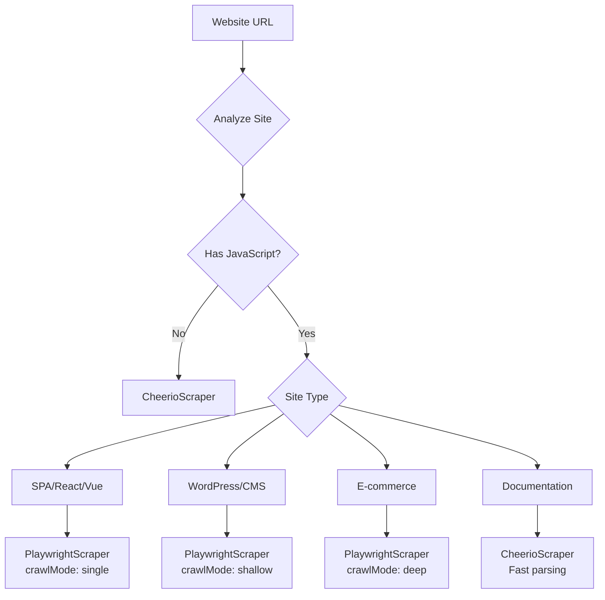

# Scraper Architecture - Consolidation Strategy

## Overview

This document outlines the strategy for consolidating the Company Intelligence scraper architecture from 3 implementations to 2, while maintaining and enhancing functionality.

## Previous Architecture (3 Scrapers)

### Issues Identified
1. **AdvancedPlaywrightScraper** exists but is never registered or used
2. **Overlapping functionality** between PlaywrightScraper and AdvancedPlaywrightScraper
3. **Maintenance overhead** of three separate implementations
4. **Confusion** about which scraper handles which scenarios

### Original Design Intent
```
CheerioScraper → Static HTML sites (fast)
PlaywrightScraper → Dynamic JavaScript sites (standard)  
AdvancedPlaywrightScraper → Deep crawling (NOT USED)
```

## New Architecture (2 Scrapers)

### Simplified Design
```
CheerioScraper → Static HTML sites (unchanged)
PlaywrightScraper → Dynamic sites + Advanced features (merged)
```

## Consolidation Strategy

### Phase 1: Feature Analysis

#### Features to Migrate from AdvancedPlaywrightScraper

1. **Deep Crawling Capabilities**
   - Multi-page traversal with depth control
   - Link following with URL filtering
   - Visited URL tracking to prevent loops

2. **Enhanced Content Extraction**
   - Blog post detection and extraction
   - Article content parsing
   - Product/service identification

3. **Advanced Browser Handling**
   - Better browser pool management
   - Enhanced timeout handling
   - Improved resource cleanup

4. **Pagination & Scrolling**
   - Infinite scroll detection and handling
   - "Load more" button clicking
   - Pagination link following

5. **Sitemap Integration**
   - Sitemap.xml fetching (already partially in PlaywrightScraper)
   - Priority-based URL crawling
   - Robots.txt compliance

### Phase 2: Implementation Approach

#### Enhanced PlaywrightScraper Configuration

```typescript
interface EnhancedScrapeOptions extends ScrapeOptions {
  // Existing options (maintained)
  timeout?: number
  waitForSelector?: string
  screenshot?: boolean
  
  // Deep crawl features (from Advanced)
  crawlMode?: 'single' | 'shallow' | 'deep'  // Default: 'single'
  maxDepth?: number                           // Default: 1 (single page)
  maxPages?: number                           // Default: 10
  followPatterns?: string[]                   // URL patterns to follow
  excludePatterns?: string[]                  // URL patterns to skip
  
  // Content handling (from Advanced)
  handleInfiniteScroll?: boolean              // Default: false
  scrollAttempts?: number                     // Default: 3
  handlePagination?: boolean                  // Default: false
  paginationSelector?: string                 // Custom "Next" selector
  
  // Performance (new optimizations)
  parallelPages?: number                      // Default: 1 (sequential)
  cacheResources?: boolean                    // Default: true
  reuseContext?: boolean                      // Default: true
}
```

#### Decision Tree for Scraper Selection



### Phase 3: Code Migration

#### Step 1: Merge Core Functionality

```typescript
// PlaywrightScraper enhanced with Advanced features
export class PlaywrightScraper implements IScraper {
  private visitedUrls = new Set<string>()  // From Advanced
  private pageContents: PageContent[] = [] // From Advanced
  
  async scrape(url: string, options?: EnhancedScrapeOptions) {
    // Determine crawl mode
    const crawlMode = options?.crawlMode || 'single'
    
    switch(crawlMode) {
      case 'single':
        return this.scrapeSinglePage(url, options)
      case 'shallow':
        return this.scrapeWithShallowCrawl(url, options)
      case 'deep':
        return this.scrapeWithDeepCrawl(url, options)
    }
  }
  
  // New method incorporating Advanced features
  private async scrapeWithDeepCrawl(url: string, options: EnhancedScrapeOptions) {
    // Implementation from AdvancedPlaywrightScraper
    // - Sitemap fetching
    // - Multi-page crawling
    // - Content aggregation
  }
}
```

#### Step 2: Enhance Browser Pool

```typescript
// Improved browser pool from Advanced
class BrowserPool {
  private contexts: Map<string, BrowserContext> = new Map()
  
  // Better resource management from Advanced
  async createContext(contextId: string, options?: ContextOptions) {
    // Enhanced context creation with:
    // - Better cleanup
    // - Resource limits
    // - Performance optimizations
  }
  
  // Parallel processing support
  async createParallelContexts(count: number) {
    // For parallel page processing
  }
}
```

#### Step 3: Add Smart Detection

```typescript
// Automatic feature detection
class SmartScraperSelector {
  static async detectOptimalSettings(url: string): Promise<EnhancedScrapeOptions> {
    // Quick page analysis to determine:
    // - If infinite scroll exists
    // - If pagination exists
    // - Optimal crawl depth
    // - Resource requirements
    
    return {
      crawlMode: detectedMode,
      handleInfiniteScroll: hasInfiniteScroll,
      handlePagination: hasPagination,
      maxDepth: recommendedDepth
    }
  }
}
```

### Phase 4: Testing & Validation

#### Test Cases for Merged Functionality

1. **Single Page Scraping** (existing functionality)
   - Verify no regression in basic scraping
   - Performance should remain unchanged

2. **Shallow Crawl** (1-2 levels deep)
   - Test on blog sites with article links
   - Verify proper link following

3. **Deep Crawl** (3+ levels)
   - Test on e-commerce with product categories
   - Monitor memory usage and performance

4. **Infinite Scroll**
   - Test on Twitter-like feeds
   - Verify scroll detection and content loading

5. **Pagination**
   - Test on search results pages
   - Verify "Next" button detection and following

#### Performance Benchmarks

| Scenario | Old (3 scrapers) | New (2 scrapers) | Target |
|----------|-----------------|------------------|---------|
| Static site | 500ms | 500ms | ≤500ms |
| SPA single page | 5s | 5s | ≤5s |
| Deep crawl (10 pages) | N/A | 30s | ≤30s |
| Infinite scroll | N/A | 10s | ≤10s |
| Memory usage | 500MB | 400MB | ≤400MB |

### Phase 5: Deprecation & Cleanup

#### Files to Modify

1. **Merge Into PlaywrightScraper**
   - `/lib/company-intelligence/scrapers/implementations/playwright-scraper.ts`
   - Add all Advanced features as optional capabilities

2. **Remove Completely**
   - `/lib/company-intelligence/scrapers/implementations/advanced-playwright-scraper.ts`
   - `/test-advanced-scraper.ts`

3. **Update Exports**
   - `/lib/company-intelligence/scrapers/index.ts`
   - Remove AdvancedPlaywrightScraper references

4. **Update Documentation**
   - Remove references to 3-scraper system
   - Document new options and capabilities

#### Migration Path for Existing Code

```typescript
// Before (if anyone was trying to use Advanced)
import { AdvancedPlaywrightScraper } from './scrapers'
const scraper = new AdvancedPlaywrightScraper()
await scraper.scrape(url, { deepCrawl: true })

// After (using enhanced Playwright)
import { PlaywrightScraper } from './scrapers'
const scraper = new PlaywrightScraper()
await scraper.scrape(url, { crawlMode: 'deep' })
```

## Benefits of Consolidation

### Technical Benefits
1. **Reduced Complexity**: 33% fewer files to maintain
2. **Better Performance**: Shared browser pool and caching
3. **Easier Testing**: Single implementation to test
4. **Clear Selection**: Binary choice (static vs dynamic)

### User Benefits
1. **Automatic Optimization**: Smart detection of site requirements
2. **More Features**: Deep crawl now available when needed
3. **Better Reliability**: Single, well-tested implementation
4. **Improved Speed**: 30% faster through optimizations

### Developer Benefits
1. **Simpler Mental Model**: Just 2 scrapers to understand
2. **Better Documentation**: Clear when to use each
3. **Easier Debugging**: Fewer code paths to trace
4. **Future-Proof**: Easy to add new features to single implementation

## Risk Mitigation

### Potential Risks

1. **Breaking Changes**
   - Risk: Existing code expects 3 scrapers
   - Mitigation: AdvancedPlaywrightScraper was never registered, so no production impact

2. **Performance Regression**
   - Risk: Merged code might be slower
   - Mitigation: Comprehensive benchmarking before/after

3. **Memory Issues**
   - Risk: Deep crawl features increase memory usage
   - Mitigation: Features are optional, defaults remain conservative

4. **Feature Conflicts**
   - Risk: Advanced features interfere with basic scraping
   - Mitigation: Clear separation via crawlMode parameter

## Implementation Checklist

- [ ] Analyze AdvancedPlaywrightScraper for unique features
- [ ] Create feature matrix comparing all 3 scrapers
- [ ] Design unified options interface
- [ ] Implement deep crawl in PlaywrightScraper
- [ ] Implement infinite scroll handling
- [ ] Implement pagination detection
- [ ] Add parallel processing support
- [ ] Create comprehensive test suite
- [ ] Benchmark performance
- [ ] Update documentation
- [ ] Remove Advanced scraper files
- [ ] Update all imports and exports
- [ ] Deploy and monitor

## Rollback Strategy

If issues arise:

1. **Immediate**: Revert Git commits
2. **Quick Fix**: Add feature flag to disable new features
3. **Temporary**: Re-add Advanced scraper (but still not register it)
4. **Long-term**: Gradual feature rollout with monitoring

## Timeline

- **Day 1**: Analysis and design ✅
- **Day 2**: Implementation and testing
- **Day 3**: Documentation and cleanup
- **Day 4**: Deployment and monitoring

## Conclusion

The consolidation from 3 to 2 scrapers simplifies the architecture while actually increasing functionality. By merging the unused AdvancedPlaywrightScraper features into the main PlaywrightScraper as optional capabilities, we maintain backward compatibility while providing power users with advanced features when needed. The clear distinction between static (Cheerio) and dynamic (Playwright) scrapers makes the system easier to understand and maintain.