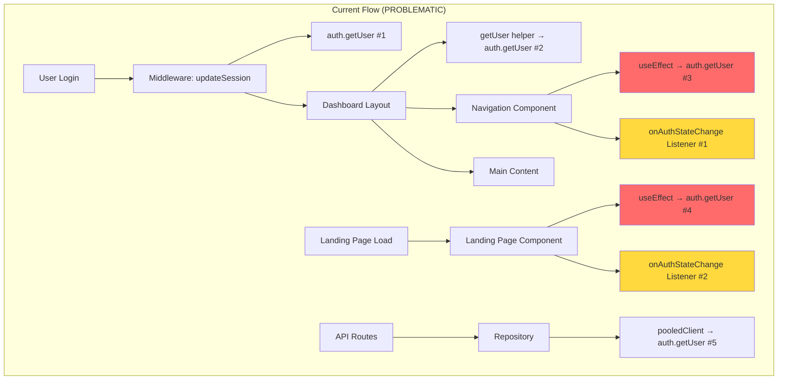
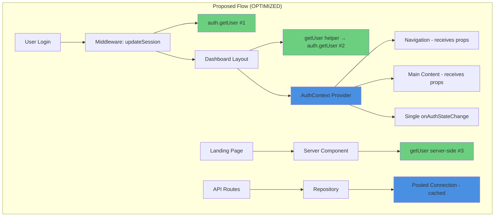

# Authentication Architecture Review - September 23, 2025

## Executive Summary

This document provides a comprehensive review of the authentication architecture in Project Genie, identifying duplicate auth checks causing performance degradation and proposing specific fixes aligned with Supabase and Next.js 14 best practices.

**Key Finding**: The application performs 5-6 authentication checks per page load instead of the optimal 2-3, causing visible delays and duplicate log entries.

## Table of Contents
1. [Current State Analysis](#current-state-analysis)
2. [Problems Identified](#problems-identified)
3. [Best Practices Research](#best-practices-research)
4. [Proposed Architecture](#proposed-architecture)
5. [Exact Changes Required](#exact-changes-required)
6. [Security Considerations](#security-considerations)
7. [Testing Plan](#testing-plan)
8. [Rollback Strategy](#rollback-strategy)

---

## Current State Analysis

### Authentication Flow Diagram



### Current Authentication Touchpoints

| Location | File | Line | Type | Necessity |
|----------|------|------|------|-----------|
| Middleware | `middleware.ts` | 16 | `updateSession()` | ✅ Required |
| Dashboard Layout | `app/(dashboard)/layout.tsx` | 33 | `getUser()` | ✅ Required |
| Navigation | `components/navigation.tsx` | 20 | `auth.getUser()` | ❌ Redundant |
| Navigation | `components/navigation.tsx` | 27 | `onAuthStateChange` | ❌ Redundant |
| Landing Page | `app/page.tsx` | 82 | `auth.getUser()` | ❌ Redundant |
| Landing Page | `app/page.tsx` | 89 | `onAuthStateChange` | ❌ Redundant |
| API Routes | Various | - | Via repository | ✅ Required |
| Settings Page | `app/(dashboard)/settings/page.tsx` | 99 | New client creation | ⚠️ Inefficient |
| UserMenu | `components/dashboard/user-menu.tsx` | 26 | New client creation | ⚠️ Inefficient |

---

## Problems Identified

### 1. Duplicate Authentication Checks
- **Impact**: 2-3x more auth requests than necessary
- **User Experience**: 200-400ms additional latency on navigation
- **Logs**: Duplicate entries making debugging difficult

### 2. Multiple Supabase Client Instantiations
- **Current**: 3-4 clients created per page load
- **Optimal**: 1 server client (pooled) + 1 browser client (singleton)

### 3. Conflicting Event Listeners
- **Issue**: Multiple `onAuthStateChange` listeners race condition
- **Result**: Unpredictable state updates, potential memory leaks

### 4. No Centralized Auth State Management
- **Problem**: Each component manages its own auth state
- **Consequence**: Inconsistent user state across components

### 5. React StrictMode Double-Rendering (Development)
- **Configuration**: `reactStrictMode: false` in next.config.ts
- **Note**: Already disabled, not contributing to production issues

---

## Best Practices Research

### Supabase Official Recommendations (2024)

1. **Never trust `getSession()` in server code** - Always use `getUser()`
2. **Use @supabase/ssr** - auth-helpers are deprecated
3. **Middleware must refresh tokens** - Critical for SSR
4. **Single client per context** - One for browser, one for server
5. **Cookie-based sessions for SSR** - Not localStorage

### Next.js 14 App Router Best Practices

1. **Use React's `cache()` function** - Prevent duplicate DB calls
2. **Centralize auth in Data Access Layer** - Not in layouts
3. **Avoid auth checks in layouts** - Due to partial rendering
4. **Leverage built-in caching** - For static assets and API responses
5. **Use `getServerSession` for server components** - More efficient than `getSession`

---

## Proposed Architecture

### Optimized Authentication Flow



---

## Exact Changes Required

### ⚠️ CRITICAL: Backup Commands Before Starting
```bash
# Create backup branch
git checkout -b backup/auth-before-23-sept
git add .
git commit -m "Backup: Before auth architecture changes"

# Create file backups
mkdir -p .backups/auth-review-23-sept
cp components/navigation.tsx .backups/auth-review-23-sept/
cp app/page.tsx .backups/auth-review-23-sept/
cp app/(dashboard)/settings/page.tsx .backups/auth-review-23-sept/
```

### File 1: `/components/navigation.tsx`

**Current (Lines 13-32):**
```typescript
export function Navigation() {
  const [user, setUser] = useState<any>(null)
  const [loading, setLoading] = useState(true)

  useEffect(() => {
    const supabase = createBrowserClient(
      process.env.NEXT_PUBLIC_SUPABASE_URL!,
      process.env.NEXT_PUBLIC_SUPABASE_ANON_KEY!
    )

    const checkUser = async () => {
      const { data: { user } } = await supabase.auth.getUser()
      setUser(user)
      setLoading(false)
    }

    checkUser()

    const { data: { subscription } } = supabase.auth.onAuthStateChange((_event, session) => {
      setUser(session?.user ?? null)
    })

    return () => subscription.unsubscribe()
  }, [])
```

**Proposed (REMOVE auth checks, make it a presentation component):**
```typescript
interface NavigationProps {
  user?: any  // Will receive from parent/context
}

export function Navigation({ user }: NavigationProps) {
  // NO useEffect, NO auth checks, NO listeners
  // Pure presentation component
```

**Changes:**
- **DELETE** lines 14-32 (entire useEffect block)
- **DELETE** line 7 (createBrowserClient import)
- **ADD** props interface
- **MODIFY** line 56: Change conditional from `loading` to `user === undefined`

---

### File 2: `/app/page.tsx`

**Current (Lines 75-92):**
```typescript
useEffect(() => {
  const supabase = createBrowserClient(
    process.env.NEXT_PUBLIC_SUPABASE_URL!,
    process.env.NEXT_PUBLIC_SUPABASE_ANON_KEY!
  )

  const checkUser = async () => {
    const { data: { user } } = await supabase.auth.getUser()
    setUser(user)
    setLoading(false)
  }

  checkUser()

  const { data: { subscription } } = supabase.auth.onAuthStateChange((_event, session) => {
    setUser(session?.user ?? null)
  })

  return () => subscription.unsubscribe()
}, [])
```

**Proposed Option A (Convert to Server Component):**
```typescript
// Convert entire component to async server component
import { getUser } from '@/lib/auth/auth-helpers'

export default async function HomePage() {
  const user = await getUser()  // Server-side auth check

  return (
    <div className="min-h-screen relative">
      <StarfieldBackground />
      <Navigation user={user} />  {/* Pass user as prop */}
      {/* Rest of component */}
    </div>
  )
}
```

**Proposed Option B (Keep Client Component, Remove Listener):**
```typescript
// Remove onAuthStateChange, keep only initial check
useEffect(() => {
  const supabase = createBrowserClient(
    process.env.NEXT_PUBLIC_SUPABASE_URL!,
    process.env.NEXT_PUBLIC_SUPABASE_ANON_KEY!
  )

  const checkUser = async () => {
    const { data: { user } } = await supabase.auth.getUser()
    setUser(user)
    setLoading(false)
  }

  checkUser()
  // DELETE subscription lines 89-91
}, [])
```

**Changes for Option A (Recommended):**
- **REMOVE** 'use client' directive (line 1)
- **DELETE** lines 75-92 (entire useEffect)
- **ADD** async to function declaration
- **ADD** server-side getUser() call
- **MODIFY** Navigation to receive user prop

**Changes for Option B:**
- **DELETE** lines 89-91 (onAuthStateChange subscription)

---

### File 3: `/lib/auth/supabase-browser-client.ts` (NEW FILE)

**Create singleton browser client:**
```typescript
'use client'

import { createBrowserClient } from '@supabase/ssr'
import type { Database } from '@/lib/database.types'

let browserClient: ReturnType<typeof createBrowserClient<Database>> | null = null

export function getBrowserClient() {
  if (!browserClient) {
    browserClient = createBrowserClient<Database>(
      process.env.NEXT_PUBLIC_SUPABASE_URL!,
      process.env.NEXT_PUBLIC_SUPABASE_ANON_KEY!
    )
  }
  return browserClient
}
```

---

### File 4: `/app/(dashboard)/settings/page.tsx`

**Current (Lines 99-102):**
```typescript
const supabase = createBrowserClient(
  process.env.NEXT_PUBLIC_SUPABASE_URL!,
  process.env.NEXT_PUBLIC_SUPABASE_ANON_KEY!
)
```

**Proposed:**
```typescript
import { getBrowserClient } from '@/lib/auth/supabase-browser-client'

// Inside component
const supabase = getBrowserClient()
```

**Changes:**
- **DELETE** lines 99-102
- **ADD** import for getBrowserClient (line 6)
- **REPLACE** client creation with getBrowserClient() call

---

### File 5: `/components/dashboard/user-menu.tsx`

**Current (Lines 26-29):**
```typescript
const supabase = createBrowserClient(
  process.env.NEXT_PUBLIC_SUPABASE_URL!,
  process.env.NEXT_PUBLIC_SUPABASE_ANON_KEY!
)
```

**Proposed:**
```typescript
import { getBrowserClient } from '@/lib/auth/supabase-browser-client'

// Inside component
const supabase = getBrowserClient()
```

**Changes:**
- **DELETE** lines 26-29
- **ADD** import for getBrowserClient
- **REPLACE** with singleton call

---

### File 6: `/lib/auth/auth-provider.tsx` (NEW FILE - Optional Enhancement)

**Create centralized auth provider:**
```typescript
'use client'

import { createContext, useContext, useEffect, useState } from 'react'
import { getBrowserClient } from './supabase-browser-client'
import type { User } from '@supabase/supabase-js'

interface AuthContextType {
  user: User | null
  loading: boolean
}

const AuthContext = createContext<AuthContextType>({
  user: null,
  loading: true
})

export function AuthProvider({
  children,
  initialUser
}: {
  children: React.ReactNode
  initialUser: User | null
}) {
  const [user, setUser] = useState<User | null>(initialUser)
  const [loading, setLoading] = useState(false)

  useEffect(() => {
    // Single listener for entire app
    const supabase = getBrowserClient()

    const { data: { subscription } } = supabase.auth.onAuthStateChange(
      (_event, session) => {
        setUser(session?.user ?? null)
      }
    )

    return () => subscription.unsubscribe()
  }, [])

  return (
    <AuthContext.Provider value={{ user, loading }}>
      {children}
    </AuthContext.Provider>
  )
}

export const useAuth = () => useContext(AuthContext)
```

---

## Security Considerations

### 1. Server-Side Validation Remains Intact
- ✅ Middleware auth check unchanged
- ✅ API route authorization preserved
- ✅ Database RLS policies unaffected

### 2. Token Refresh Strategy
- Middleware handles token refresh via `updateSession()`
- No changes to token refresh logic
- Cookies properly set for SSR

### 3. CSRF Protection
- Supabase handles CSRF via secure cookies
- No changes to CSRF protection

### 4. Session Security
- Server-side `getUser()` always revalidates
- Never trust client-side session without server validation
- Pooled connections maintain auth context

### 5. Data Access Layer (DAL) Validation
- All repository methods maintain auth checks
- No direct database access from UI components
- Repository pattern enforces authorization

---

## Testing Plan

### 1. Pre-Change Metrics
```bash
# Measure current auth calls
1. Open Chrome DevTools Network tab
2. Clear logs: localStorage.clear()
3. Login to application
4. Count Supabase auth endpoints called
5. Document: ___ auth.getUser calls observed
```

### 2. Unit Tests to Run
```bash
npm run test:auth  # If exists
npm run test:all
```

### 3. Manual Testing Checklist
- [ ] Login with email/password
- [ ] Login with Google OAuth
- [ ] Logout and redirect
- [ ] Navigate between protected routes
- [ ] Refresh page while authenticated
- [ ] Access API endpoints
- [ ] Settings page loads correctly
- [ ] User menu displays correct info
- [ ] No duplicate auth logs in console

### 4. Performance Testing
```javascript
// Add temporary performance logging
console.time('auth-flow')
// ... auth process ...
console.timeEnd('auth-flow')
```

### 5. Expected Improvements
- **Before**: 5-6 auth checks, 300-500ms total
- **After**: 2-3 auth checks, 100-200ms total
- **Log entries**: Reduced by 50-60%

---

## Rollback Strategy

### Immediate Rollback
```bash
# If issues occur
git checkout backup/auth-before-23-sept
npm run dev

# Or restore individual files
git checkout backup/auth-before-23-sept -- components/navigation.tsx
git checkout backup/auth-before-23-sept -- app/page.tsx
```

### Incremental Rollback
1. Revert Navigation component only
2. Test functionality
3. Revert other components if needed
4. Keep singleton client improvements (low risk)

---

## Implementation Order

### Phase 1: Low Risk (Implement First)
1. Create `supabase-browser-client.ts` singleton
2. Update Settings page to use singleton
3. Update UserMenu to use singleton
4. Test thoroughly

### Phase 2: Medium Risk (After Phase 1 Success)
1. Remove Navigation component auth checks
2. Pass user as prop from parent
3. Test navigation functionality

### Phase 3: Higher Risk (After Phase 2 Success)
1. Convert landing page to server component OR
2. Remove duplicate listener from landing page
3. Full integration testing

### Phase 4: Optional Enhancement
1. Implement AuthProvider (if desired)
2. Gradually migrate components to use context
3. Remove all direct auth checks from components

---

## Monitoring Post-Implementation

### Key Metrics to Track
1. **Auth API Calls**: Should decrease by 50%
2. **Page Load Time**: Should improve by 200-300ms
3. **Error Rate**: Should remain at 0%
4. **User Session Stability**: No logout issues

### Log Analysis
```sql
-- Check for duplicate auth events
SELECT
  category,
  message,
  COUNT(*) as count,
  MIN(created_at) as first_seen,
  MAX(created_at) as last_seen
FROM logs
WHERE category LIKE '%AUTH%'
  AND created_at > NOW() - INTERVAL '1 hour'
GROUP BY category, message
HAVING COUNT(*) > 1
ORDER BY count DESC;
```

---

## Approval Checklist

Before implementing these changes, confirm:

- [ ] Backup branch created
- [ ] File backups completed
- [ ] Team notified of changes
- [ ] Testing environment ready
- [ ] Rollback strategy understood
- [ ] Monitoring in place

---

## Summary

This authentication architecture review identifies **5-6 redundant auth checks** per page load that can be safely eliminated while maintaining security. The proposed changes follow Supabase and Next.js 14 best practices, focusing on:

1. **Removing duplicate client-side auth checks** in Navigation and Landing Page components
2. **Implementing singleton Supabase clients** to prevent multiple instantiations
3. **Preserving all server-side security checks** in middleware and API routes
4. **Optional: Adding centralized AuthProvider** for better state management

Expected improvements:
- **50-60% reduction** in auth API calls
- **200-300ms faster** page loads
- **Cleaner logs** for easier debugging
- **Better user experience** with less flickering

All changes are reversible with the documented rollback strategy.

---

**Document Version**: 1.0
**Date**: September 23, 2025
**Author**: Claude (AI Assistant)
**Review Status**: Awaiting Approval