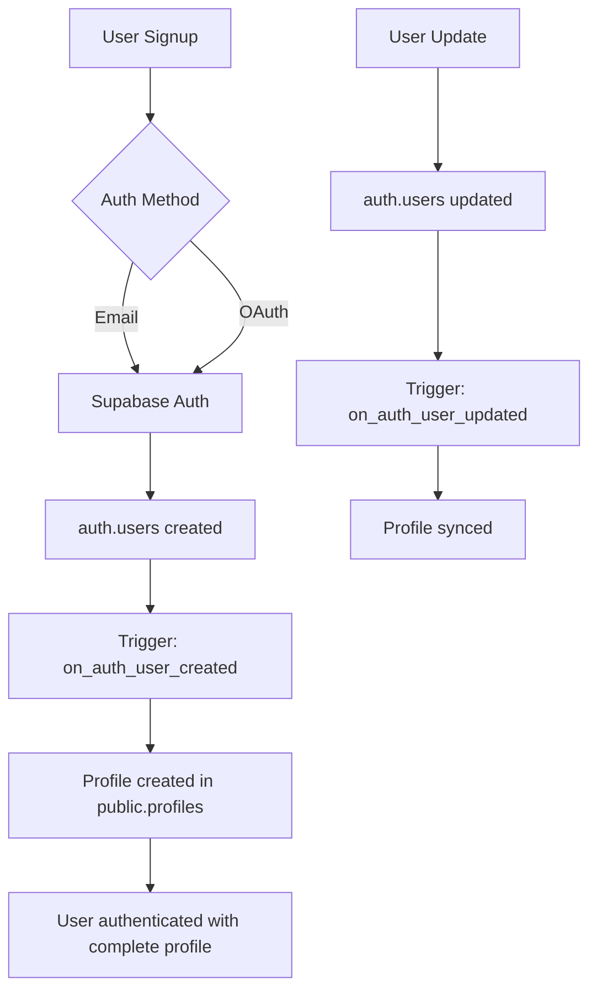

# Authentication Issues & Solutions

## Supabase SSR Authentication Context

### The Authentication Storage Mismatch Problem
**If logging or any auth-dependent feature stops working, CHECK THIS FIRST!**

#### The Issue:
- **App uses `@supabase/ssr`** → Stores auth in **COOKIES**
- **Component uses `@supabase/supabase-js`** → Looks in **LOCAL STORAGE**
- **Result:** Component can't see auth, operates as "anon" instead of "authenticated"

#### The Fix:
```typescript
// ✅ CORRECT - For client-side code that needs auth context
import { createBrowserClient } from '@supabase/ssr'

// ❌ WRONG - Won't see cookie-based auth
import { createClient } from '@supabase/supabase-js'
```

#### Environment-Aware Pattern:
```typescript
const isServer = typeof window === 'undefined'

if (!isServer) {
  // CLIENT: Use SSR package to read auth from cookies
  this.supabase = createBrowserClient(url, anonKey)
} else {
  // SERVER: Use service role for bypassing RLS if needed
  this.supabase = createClient(url, serviceRoleKey || anonKey, options)
}
```

#### Key Rule:
**If the app uses @supabase/ssr, ALL components needing auth MUST use @supabase/ssr!**

## PermanentLogger Authentication Issue (2025-01-17)

### The Problem
**PermanentLogger fails with RLS violations even when users are authenticated!**

This is a critical authentication context mismatch that causes logging to completely fail in production. The issue occurs because:
- The main application uses `@supabase/ssr` which stores authentication in **cookies**
- PermanentLoggerDB uses `@supabase/supabase-js` which looks for authentication in **local storage**
- Result: Even authenticated users appear as anonymous to the logger, triggering RLS policy violations

### Symptoms
Look for these errors in the browser console:
```
Failed to load resource: the server responded with a status of 401 ()
[PermanentLogger.flush] Failed after 3 attempts. Last error: Error: new row violates row-level security policy for table "permanent_logs"
```

### Root Cause
The authentication storage mismatch occurs in `/lib/utils/permanent-logger-db.ts`:
```typescript
// CURRENT PROBLEMATIC CODE:
import { createClient } from '@supabase/supabase-js'  // ❌ Looks in local storage

this.supabase = createClient(url, key, {
  auth: {
    persistSession: false  // Still doesn't see cookie auth
  }
})
```

### The Fix: Environment-Aware Client Initialization
Update `permanent-logger-db.ts` to detect the environment and use the appropriate Supabase client:

```typescript
private getClient(): SupabaseClient {
  if (!this.supabase) {
    const url = process.env.NEXT_PUBLIC_SUPABASE_URL
    const key = process.env.NEXT_PUBLIC_SUPABASE_ANON_KEY

    if (!url || !key) {
      throw new Error('Missing Supabase environment variables for logging')
    }

    const isServer = typeof window === 'undefined'

    if (!isServer) {
      // CLIENT: Use SSR package to read auth from cookies
      const { createBrowserClient } = require('@supabase/ssr')
      this.supabase = createBrowserClient(url, key)
    } else {
      // SERVER: Use regular client (no auth needed for logging)
      const { createClient } = require('@supabase/supabase-js')
      this.supabase = createClient(url, key, {
        auth: {
          persistSession: false
        }
      })
    }
  }

  return this.supabase
}
```

### Why This Fix Works
1. **Client-side**: Uses `@supabase/ssr` to read authentication from cookies (where the app stores it)
2. **Server-side**: Uses `@supabase/supabase-js` (no auth context needed for server logs)
3. **RLS Policies**: The existing "Allow all inserts" policy already permits logging
4. **Security**: Uses anon key (safe for public use), never exposes service role key

### Testing the Fix
After implementing:
1. Log in to the application
2. Perform actions that trigger logging
3. Check browser console - no more 401 errors
4. Verify in Supabase dashboard that logs are being inserted
5. Check that `user_id` field is properly populated (not null)

### Important Notes
- **NEVER use service role key client-side** - This is a critical security violation
- **The fix is documented in both CLAUDE.md and code comments** - Check permanent-logger-db.ts
- **This is a known issue since 2025-09-14** - First discovered with SSR authentication
- **Repository pattern exception**: PermanentLoggerDB requires direct DB access to avoid circular dependencies

## Profile Creation (Automatic via Database Trigger)

### How It Works
User profiles are **automatically created** by a PostgreSQL trigger when users sign up. No client-side profile creation is needed.

**Location**: `supabase/migrations/20250117_consolidated_profile_trigger.sql`
**Architecture Doc**: See `/docs/repository-pattern-architecture.md` for complete auth flow

**Process**:
1. User signs up via Supabase Auth
2. Database trigger `on_auth_user_created` fires automatically
3. Profile is created with data from auth metadata
4. Updates are synced via `on_auth_user_updated` trigger

**Key Points**:
- ✅ No client-side `ensureProfile()` calls needed
- ✅ No race conditions
- ✅ Works with all auth methods (OAuth, email, etc.)
- ✅ Profile guaranteed to exist after signup
- ✅ Single source of truth for profile creation

## Common Authentication Issues

### Issue: User appears logged in but operations fail
**Cause**: Authentication context mismatch between SSR and regular client
**Solution**: Ensure all components use `@supabase/ssr`

### Issue: RLS policies blocking authenticated users
**Cause**: Client using wrong auth storage location
**Solution**: Use environment-aware client initialization

### Issue: Profile not found after signup
**Cause**: Looking for profile before trigger completes
**Solution**: Profile is created automatically - no client-side creation needed

### Issue: OAuth users have incomplete profiles
**Cause**: Missing metadata from OAuth provider
**Solution**: Database trigger handles all auth methods uniformly

## Authentication Flow Diagram



## Best Practices

1. **Always use @supabase/ssr for client-side auth**
2. **Let database triggers handle profile creation**
3. **Never expose service role key**
4. **Use environment-aware patterns for isomorphic code**
5. **Test auth flow with multiple providers**
6. **Monitor RLS policy violations in logs**
7. **Document auth context requirements in components**
