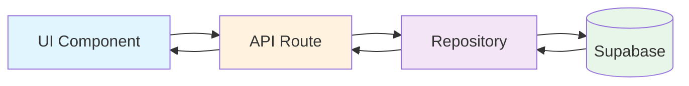
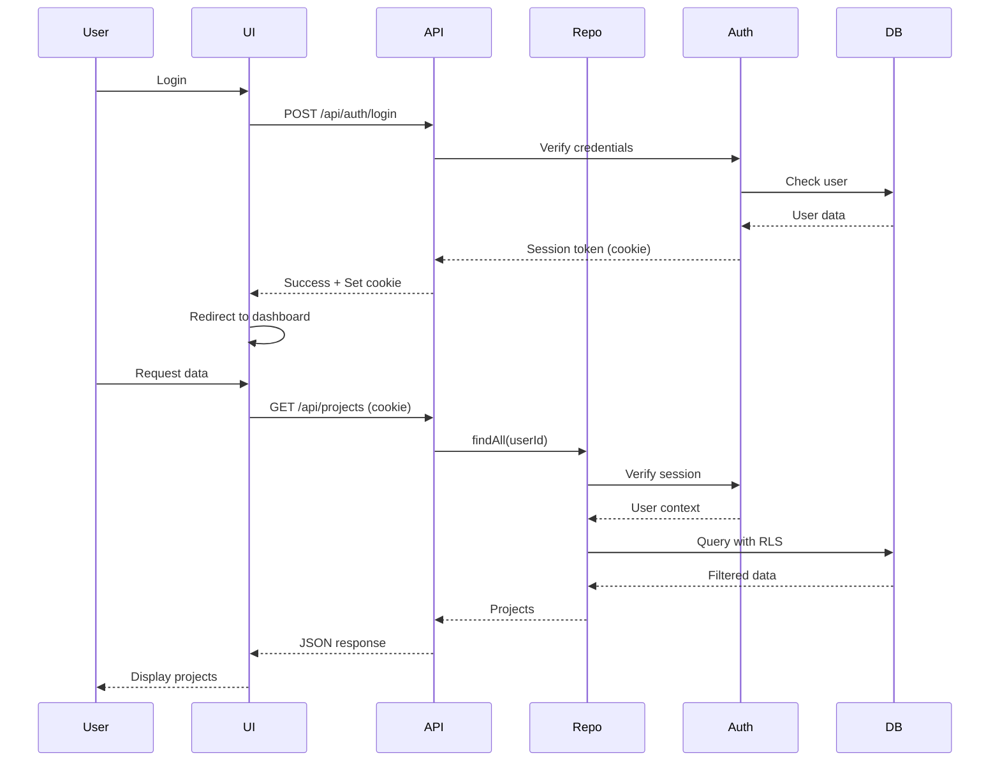

# Repository Pattern Architecture

## Overview

The Repository Pattern is **MANDATORY** for all database operations in this project. It provides a clean separation between data access logic and business logic, ensuring maintainability, testability, and security.

## Architecture Flow



## Core Principles

### 1. **NEVER Direct Database Access**
- UI components NEVER access database directly
- API routes NEVER make direct Supabase calls
- ALL database operations go through repositories

### 2. **Single Responsibility**
- Repositories handle ONLY data access
- Business logic stays in services/API routes
- UI components handle ONLY presentation

### 3. **Type Safety**
- Use generated database types
- Strict TypeScript throughout
- Runtime validation at boundaries

## Implementation Guide

### Base Repository Class

```typescript
// lib/repositories/base-repository.ts
import { createServerClient } from '@supabase/ssr'
import { cookies } from 'next/headers'
import type { Database } from '@/lib/database.types'
import { permanentLogger } from '@/lib/utils/permanent-logger'

export abstract class BaseRepository<T> {
  protected abstract tableName: string
  
  protected async getClient() {
    const cookieStore = cookies()
    return createServerClient<Database>(
      process.env.NEXT_PUBLIC_SUPABASE_URL!,
      process.env.NEXT_PUBLIC_SUPABASE_ANON_KEY!,
      {
        cookies: {
          get(name: string) {
            return cookieStore.get(name)?.value
          },
        },
      }
    )
  }
  
  protected async execute<R>(
    operation: string,
    fn: (client: any) => Promise<R>
  ): Promise<R> {
    const timer = permanentLogger.timing(`repo_${operation}`, {
      table: this.tableName
    })
    
    try {
      const client = await this.getClient()
      const result = await fn(client)
      timer.stop()
      return result
    } catch (error) {
      permanentLogger.captureError(`REPO_${this.tableName.toUpperCase()}`, error as Error, {
        operation,
        table: this.tableName
      })
      timer.stop()
      throw error
    }
  }
}
```

### Concrete Repository Implementation

```typescript
// lib/repositories/projects-repository.ts
import { BaseRepository } from './base-repository'
import type { Database } from '@/lib/database.types'
import { permanentLogger } from '@/lib/utils/permanent-logger'

type Project = Database['public']['Tables']['projects']['Row']
type ProjectInsert = Database['public']['Tables']['projects']['Insert']
type ProjectUpdate = Database['public']['Tables']['projects']['Update']

export class ProjectsRepository extends BaseRepository<Project> {
  protected tableName = 'projects'
  
  private static instance: ProjectsRepository
  
  static getInstance(): ProjectsRepository {
    if (!this.instance) {
      this.instance = new ProjectsRepository()
    }
    return this.instance
  }
  
  async create(data: ProjectInsert): Promise<Project> {
    return this.execute('create', async (client) => {
      permanentLogger.breadcrumb('repo_create_start', 'Creating project', { data })
      
      const { data: project, error } = await client
        .from(this.tableName)
        .insert(data)
        .select()
        .single()
      
      if (error) {
        permanentLogger.captureError('REPO_PROJECTS', error, {
          operation: 'create',
          data
        })
        throw new Error(`Failed to create project: ${error.message}`)
      }
      
      permanentLogger.info('REPO_PROJECTS', 'Project created', { 
        id: project.id,
        name: project.name 
      })
      
      return project
    })
  }
  
  async findById(id: string): Promise<Project | null> {
    return this.execute('findById', async (client) => {
      const { data, error } = await client
        .from(this.tableName)
        .select('*')
        .eq('id', id)
        .single()
      
      if (error) {
        if (error.code === 'PGRST116') {
          // Not found is not an error
          return null
        }
        throw new Error(`Failed to find project: ${error.message}`)
      }
      
      return data
    })
  }
  
  async findAll(userId?: string): Promise<Project[]> {
    return this.execute('findAll', async (client) => {
      let query = client.from(this.tableName).select('*')
      
      if (userId) {
        query = query.eq('user_id', userId)
      }
      
      const { data, error } = await query
        .order('created_at', { ascending: false })
      
      if (error) {
        throw new Error(`Failed to fetch projects: ${error.message}`)
      }
      
      permanentLogger.debug('REPO_PROJECTS', 'Projects fetched', { 
        count: data?.length || 0,
        userId 
      })
      
      return data || []
    })
  }
  
  async update(id: string, data: ProjectUpdate): Promise<Project> {
    return this.execute('update', async (client) => {
      permanentLogger.breadcrumb('repo_update_start', 'Updating project', { 
        id, 
        changes: Object.keys(data) 
      })
      
      const { data: project, error } = await client
        .from(this.tableName)
        .update(data)
        .eq('id', id)
        .select()
        .single()
      
      if (error) {
        throw new Error(`Failed to update project: ${error.message}`)
      }
      
      permanentLogger.info('REPO_PROJECTS', 'Project updated', { id })
      return project
    })
  }
  
  async delete(id: string): Promise<void> {
    return this.execute('delete', async (client) => {
      const { error } = await client
        .from(this.tableName)
        .delete()
        .eq('id', id)
      
      if (error) {
        throw new Error(`Failed to delete project: ${error.message}`)
      }
      
      permanentLogger.info('REPO_PROJECTS', 'Project deleted', { id })
    })
  }
  
  // Complex queries
  async findByStatus(status: string): Promise<Project[]> {
    return this.execute('findByStatus', async (client) => {
      const { data, error } = await client
        .from(this.tableName)
        .select('*')
        .eq('status', status)
        .order('priority', { ascending: false })
      
      if (error) {
        throw new Error(`Failed to fetch projects by status: ${error.message}`)
      }
      
      return data || []
    })
  }
  
  async search(query: string): Promise<Project[]> {
    return this.execute('search', async (client) => {
      const { data, error } = await client
        .from(this.tableName)
        .select('*')
        .or(`name.ilike.%${query}%,description.ilike.%${query}%`)
        .order('created_at', { ascending: false })
        .limit(20)
      
      if (error) {
        throw new Error(`Search failed: ${error.message}`)
      }
      
      return data || []
    })
  }
}
```

### API Route Implementation

```typescript
// app/api/projects/route.ts
import { NextRequest, NextResponse } from 'next/server'
import { ProjectsRepository } from '@/lib/repositories/projects-repository'
import { permanentLogger } from '@/lib/utils/permanent-logger'
import { z } from 'zod'

const CreateProjectSchema = z.object({
  name: z.string().min(1).max(100),
  description: z.string().optional(),
  status: z.enum(['active', 'pending', 'complete']).default('pending')
})

export async function GET(req: NextRequest) {
  const timer = permanentLogger.timing('api_projects_get')
  permanentLogger.breadcrumb('api_entry', 'GET /api/projects')
  
  try {
    const searchParams = req.nextUrl.searchParams
    const status = searchParams.get('status')
    
    const repository = ProjectsRepository.getInstance()
    
    const projects = status 
      ? await repository.findByStatus(status)
      : await repository.findAll()
    
    permanentLogger.info('API_PROJECTS', 'Projects fetched', { 
      count: projects.length,
      status 
    })
    
    timer.stop()
    return NextResponse.json(projects)
    
  } catch (error) {
    permanentLogger.captureError('API_PROJECTS', error as Error, {
      method: 'GET',
      url: req.url
    })
    
    timer.stop()
    return NextResponse.json(
      { error: 'Failed to fetch projects' },
      { status: 500 }
    )
  }
}

export async function POST(req: NextRequest) {
  const timer = permanentLogger.timing('api_projects_create')
  permanentLogger.breadcrumb('api_entry', 'POST /api/projects')
  
  try {
    const body = await req.json()
    
    // Validate input
    const validated = CreateProjectSchema.parse(body)
    
    permanentLogger.breadcrumb('validation_complete', 'Input validated', {
      fields: Object.keys(validated)
    })
    
    const repository = ProjectsRepository.getInstance()
    const project = await repository.create(validated)
    
    permanentLogger.info('API_PROJECTS', 'Project created via API', { 
      id: project.id 
    })
    
    timer.stop()
    return NextResponse.json(project, { status: 201 })
    
  } catch (error) {
    if (error instanceof z.ZodError) {
      permanentLogger.warn('API_PROJECTS', 'Validation failed', { 
        errors: error.errors 
      })
      
      timer.stop()
      return NextResponse.json(
        { error: 'Invalid input', details: error.errors },
        { status: 400 }
      )
    }
    
    permanentLogger.captureError('API_PROJECTS', error as Error, {
      method: 'POST'
    })
    
    timer.stop()
    return NextResponse.json(
      { error: 'Failed to create project' },
      { status: 500 }
    )
  }
}
```

### UI Component Implementation

```typescript
// components/projects/project-list.tsx
'use client'

import { useState, useEffect } from 'react'
import { permanentLogger } from '@/lib/utils/permanent-logger'
import type { Project } from '@/lib/database.types'

export function ProjectList() {
  const [projects, setProjects] = useState<Project[]>([])
  const [loading, setLoading] = useState(true)
  const [error, setError] = useState<string | null>(null)
  
  useEffect(() => {
    fetchProjects()
  }, [])
  
  async function fetchProjects() {
    const timer = permanentLogger.timing('ui_fetch_projects')
    permanentLogger.breadcrumb('ui_fetch_start', 'Fetching projects')
    
    try {
      const response = await fetch('/api/projects')
      
      if (!response.ok) {
        throw new Error(`HTTP ${response.status}`)
      }
      
      const data = await response.json()
      setProjects(data)
      
      permanentLogger.info('UI_PROJECTS', 'Projects loaded', { 
        count: data.length 
      })
      
    } catch (err) {
      permanentLogger.captureError('UI_PROJECTS', err as Error)
      setError('Failed to load projects')
      // NO FALLBACK DATA - show real error
      
    } finally {
      setLoading(false)
      timer.stop()
    }
  }
  
  async function createProject(name: string) {
    permanentLogger.breadcrumb('ui_create_start', 'Creating project', { name })
    
    try {
      const response = await fetch('/api/projects', {
        method: 'POST',
        headers: { 'Content-Type': 'application/json' },
        body: JSON.stringify({ name })
      })
      
      if (!response.ok) {
        const error = await response.json()
        throw new Error(error.error || 'Failed to create')
      }
      
      const newProject = await response.json()
      setProjects(prev => [newProject, ...prev])
      
      permanentLogger.info('UI_PROJECTS', 'Project created in UI', { 
        id: newProject.id 
      })
      
    } catch (err) {
      permanentLogger.captureError('UI_PROJECTS', err as Error)
      setError('Failed to create project')
    }
  }
  
  // NO MOCK DATA - show real states
  if (loading) return <div>Loading projects...</div>
  if (error) return <div>Error: {error}</div>
  if (projects.length === 0) return <div>No projects yet</div>
  
  return (
    <div>
      {projects.map(project => (
        <ProjectCard key={project.id} project={project} />
      ))}
    </div>
  )
}
```

## Authentication Flow with Repository Pattern



## Special Cases

### 1. PermanentLogger Exception
PermanentLogger has its own DB layer to avoid circular dependencies:
```
Logger → Repository → Logger = ❌ Circular!
Logger → Direct DB = ✅ Allowed (exception)
```

### 2. File Storage Operations
Storage operations split between direct and repository:
```typescript
// Direct storage operation (allowed)
const { data: file } = await supabase.storage
  .from('avatars')
  .upload(path, file)

// Metadata through repository (required)
await profileRepository.updateAvatarUrl(userId, file.path)
```

### 3. Real-time Subscriptions
Subscriptions can be direct but should emit through repositories:
```typescript
// Setup subscription (direct allowed)
const subscription = supabase
  .channel('projects')
  .on('postgres_changes', { 
    event: '*', 
    schema: 'public',
    table: 'projects' 
  }, async (payload) => {
    // Process through repository
    const project = await projectRepository.findById(payload.new.id)
    updateUI(project)
  })
  .subscribe()
```

## Migration Guide

### Step 1: Identify Violations
```bash
# Find direct Supabase usage
grep -r "supabase.from(" --include="*.tsx" --include="*.ts" \
  --exclude-dir=node_modules \
  --exclude-dir=repositories
```

### Step 2: Create Repository
1. Extend BaseRepository
2. Define type-safe methods
3. Add error handling and logging

### Step 3: Update API Routes
1. Remove direct Supabase calls
2. Use repository instance
3. Add input validation

### Step 4: Update Components
1. Remove Supabase imports
2. Call API routes instead
3. Handle loading/error states

## Testing Repositories

```typescript
// __tests__/repositories/projects-repository.test.ts
import { ProjectsRepository } from '@/lib/repositories/projects-repository'
import { createMockSupabaseClient } from '@/test/mocks'

describe('ProjectsRepository', () => {
  let repository: ProjectsRepository
  let mockClient: any
  
  beforeEach(() => {
    mockClient = createMockSupabaseClient()
    repository = ProjectsRepository.getInstance()
    repository.getClient = jest.fn().mockResolvedValue(mockClient)
  })
  
  it('should create a project', async () => {
    const mockProject = { id: '123', name: 'Test' }
    mockClient.from().insert().select().single.mockResolvedValue({
      data: mockProject,
      error: null
    })
    
    const result = await repository.create({ name: 'Test' })
    
    expect(result).toEqual(mockProject)
    expect(mockClient.from).toHaveBeenCalledWith('projects')
  })
  
  it('should handle errors', async () => {
    mockClient.from().insert().select().single.mockResolvedValue({
      data: null,
      error: { message: 'DB Error' }
    })
    
    await expect(repository.create({ name: 'Test' }))
      .rejects.toThrow('Failed to create project')
  })
})
```

## Benefits of Repository Pattern

1. **Separation of Concerns**: Business logic separate from data access
2. **Testability**: Easy to mock repositories for testing
3. **Maintainability**: Changes to database isolated to repositories
4. **Type Safety**: Single source of truth for data types
5. **Security**: RLS policies consistently applied
6. **Debugging**: Centralized logging and error handling
7. **Caching**: Can add caching layer transparently
8. **Migration**: Easy to switch databases if needed

## Common Mistakes to Avoid

1. **Direct DB Access in Components** - Always go through API routes
2. **Business Logic in Repositories** - Keep repositories data-focused
3. **Missing Error Handling** - Always catch and log errors
4. **Ignoring Type Safety** - Use generated types everywhere
5. **Forgetting Breadcrumbs** - Add at all boundaries
6. **Not Using Singleton** - Repositories should be singletons
7. **Circular Dependencies** - Watch for Logger → Repo → Logger
8. **Missing Validation** - Validate at API boundaries

## Checklist for New Features

- [ ] Create repository extending BaseRepository
- [ ] Define TypeScript types from database
- [ ] Implement CRUD methods with logging
- [ ] Create API routes using repository
- [ ] Add input validation with Zod
- [ ] Update UI to call API routes
- [ ] Handle loading/error states
- [ ] Add breadcrumbs at boundaries
- [ ] Write repository tests
- [ ] Document new endpoints
