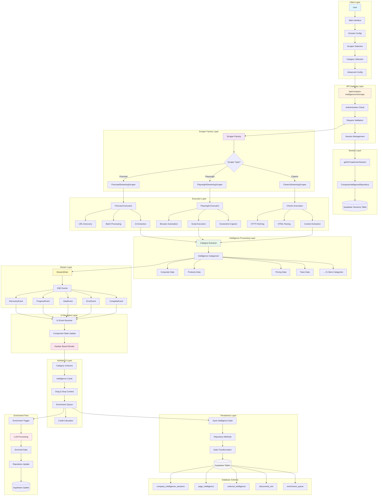
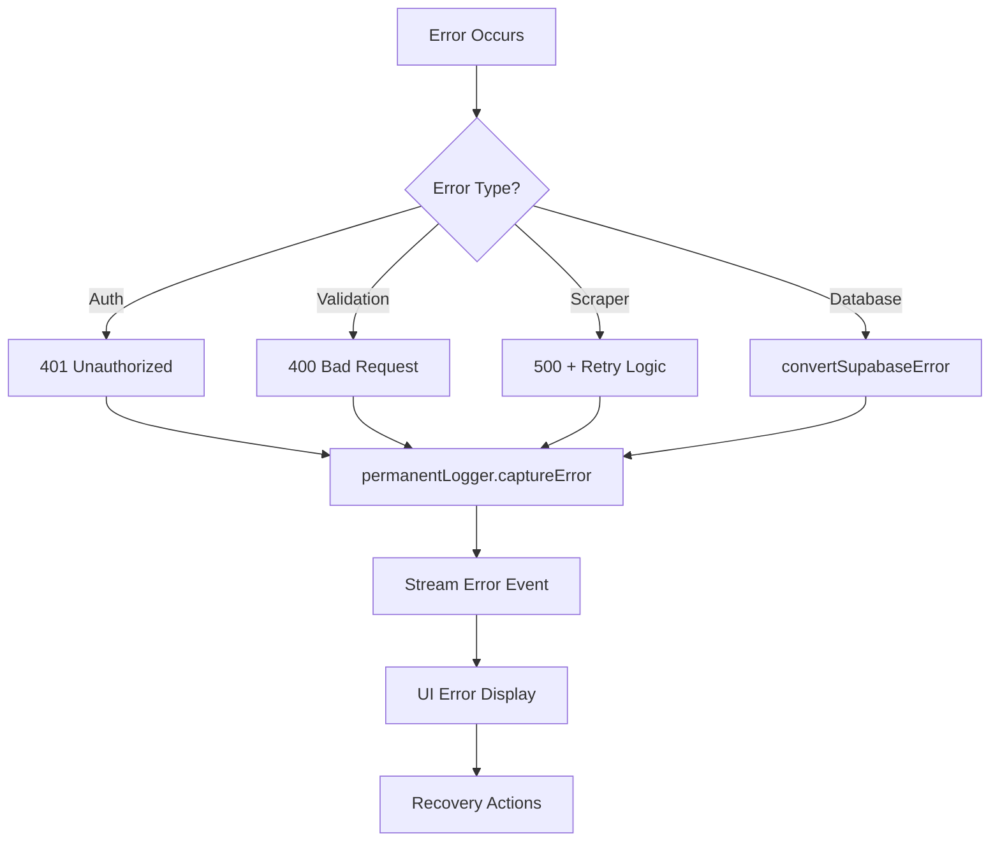
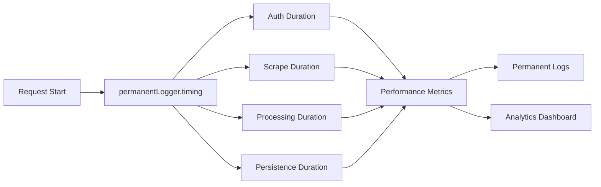
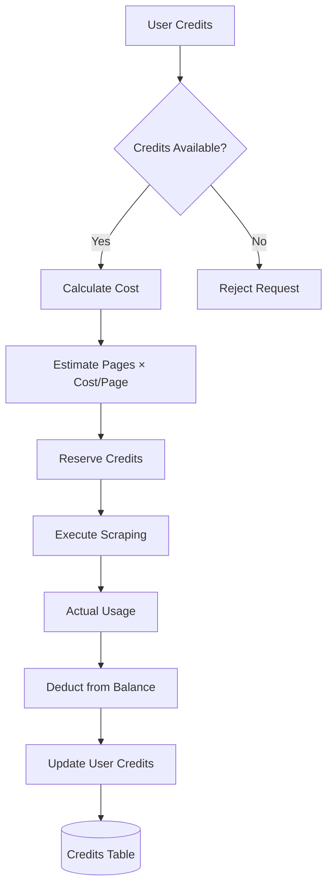

# V4 Company Intelligence Data Flow Diagram
**Generated:** 2025-09-25
**Purpose:** Complete data flow mapping from scraper API through UI to repository and persistence

## Complete Data Flow Architecture



## Data Transformation Points

### 1. Input Transformation (UI → API)
```typescript
// User Input
{
  domain: "example.com",
  depth: "comprehensive",
  categories: ["corporate", "products", "pricing"],
  scraperType: "firecrawl",
  maxPages: 50
}
↓
// API Request Body
{
  domain: "example.com",
  scraperType: "FIRECRAWL",
  config: {
    maxPages: 50,
    depth: IntelligenceDepth.COMPREHENSIVE,
    categories: [IntelligenceCategory.CORPORATE, ...]
  }
}
```

### 2. Scraper Configuration Transform (API → Scraper)
```typescript
// API Config
{
  scraperType: "FIRECRAWL",
  config: { maxPages: 50, categories: [...] }
}
↓
// Firecrawl Config
{
  urls: ["https://example.com", ...],
  scrapeOptions: {
    formats: ["markdown", "extract", "links"],
    extract: { schema: mergedZodSchema },
    timeout: 30000
  }
}
```

### 3. Raw Data → Intelligence Transform (Scraper → Categories)
```typescript
// Firecrawl Response
{
  url: "https://example.com/about",
  markdown: "# About Us...",
  extract: { company_name: "Example Corp", ... }
}
↓
// Categorized Intelligence
{
  category: IntelligenceCategory.CORPORATE,
  items: [{
    id: "uuid",
    type: "company_info",
    content: { name: "Example Corp", ... },
    confidence: 0.95
  }]
}
```

### 4. Intelligence → UI State Transform
```typescript
// Intelligence Data
{
  [IntelligenceCategory.CORPORATE]: {
    metadata: { label: "Corporate", icon: "building" },
    items: [...],
    confidence: 0.95
  }
}
↓
// Kanban Columns
[{
  id: "CORPORATE",
  title: "Corporate",
  items: [...],
  expanded: true,
  color: "blue"
}]
```

### 5. UI State → Database Transform
```typescript
// Kanban State
{
  enrichmentQueue: [item1, item2, ...],
  categories: { CORPORATE: {...}, ... }
}
↓
// Database Update
{
  merged_data: {
    intelligence: { categories: {...} },
    enrichment_queue: [...]
  }
}
```

## Critical Integration Points

### 1. Session Management
- **Entry:** `getOrCreateUserSession(userId, domain)`
- **Constraint:** UNIQUE(user_id, domain)
- **Output:** SessionData with `id` for all operations

### 2. SSE Streaming
- **Entry:** `new StreamWriter(sessionId, correlationId, signal)`
- **Events:** 5 distinct types (Discovery, Progress, Data, Error, Complete)
- **Client:** EventSource API subscription

### 3. Repository Layer
- **Pattern:** All DB access through repositories
- **Error Handling:** `convertSupabaseError()` for all Supabase errors
- **Logging:** `permanentLogger.captureError()` for all errors

### 4. Type Safety Checkpoints
- **API Boundary:** Zod validation of request/response
- **Scraper Output:** Runtime type validation
- **Database Operations:** TypeScript types from Supabase
- **UI Props:** Component prop validation

## Error Handling Flow



## Performance Metrics Flow



## Credit Flow Management



## Missing Components (Per Audit)

### Currently Missing:
1. **Category Extractor** - Transforms raw data to categories
2. **Intelligence Enums** - Type definitions for categories
3. **Kanban Components** - UI for drag & drop
4. **Enrichment Queue Table** - Database persistence
5. **Credit Calculator** - Cost estimation logic

### Data Flow Breaks:
- ❌ Scraper → Category Extractor (component missing)
- ❌ Category Extractor → Kanban UI (no types)
- ❌ Kanban UI → Enrichment Queue (no components)
- ❌ Enrichment Queue → Database (no table)

---

**Note:** This diagram represents the INTENDED architecture from the design documents. Actual implementation has gaps as noted in the compliance audit report.