# Document Generation with Company Intelligence Integration Flow

## Complete System Flow Diagram

This diagram shows the complete flow from domain input through both the document wizard and company intelligence pipelines, and how they merge to enhance report generation.

```mermaid
flowchart TB
    Start([User Enters Domain]) --> Split{Two Parallel Flows}

    %% Document Generation Flow (Left Side)
    Split -->|Traditional Flow| Wizard[Document Generation Wizard]

    Wizard --> WizStep1[Step 1: Project Details<br/>- Name, Description<br/>- Start/End Dates<br/>- Budget]
    WizStep1 -->|DB Write| DB1[(projects table)]

    WizStep1 --> WizStep2[Step 2: Objectives & Scope<br/>- Goals, Deliverables<br/>- Success Criteria<br/>- Constraints]
    WizStep2 -->|DB Write| DB2[(project_objectives table)]

    WizStep2 --> WizStep3[Step 3: Stakeholders<br/>- Roles, Responsibilities<br/>- Contact Info<br/>- Influence/Interest]
    WizStep3 -->|DB Write| DB3[(stakeholders table)]

    WizStep3 --> WizStep4[Step 4: Risks & Assumptions<br/>- Risk Assessment<br/>- Mitigation Plans<br/>- Dependencies]
    WizStep4 -->|DB Write| DB4[(risks table)]

    WizStep4 --> WizStep5[Step 5: Additional Context<br/>- Industry Info<br/>- Regulatory Requirements<br/>- Special Considerations]
    WizStep5 -->|DB Write| DB5[(project_context table)]

    %% Company Intelligence Flow (Right Side)
    Split -->|Intelligence Flow| CIStart[Company Intelligence Pipeline]

    CIStart --> Phase1[Phase 1: Discovery<br/>🔍 Site Analysis]
    Phase1 --> P1Process[- Domain validation<br/>- Sitemap discovery<br/>- Technology detection<br/>- Site structure mapping]
    P1Process -->|DB Write| CIDB1[(company_intelligence_sessions<br/>site_analysis_results)]
    P1Process -->|SSE Stream| Stream1[Progress Events to UI]

    Phase1 --> Phase2[Phase 2: Scraping<br/>📊 Content Collection]
    Phase2 --> P2Strategy{Strategy Selection}

    P2Strategy -->|Static Sites| Static[Static Strategy<br/>Cheerio + Axios]
    P2Strategy -->|Dynamic Sites| Dynamic[Dynamic Strategy<br/>Playwright]
    P2Strategy -->|SPAs| SPA[SPA Strategy<br/>Framework-aware]

    Static --> P2Process[Scrape Selected Pages]
    Dynamic --> P2Process
    SPA --> P2Process

    P2Process -->|DB Write| CIDB2[(scraped_content<br/>page_intelligence)]
    P2Process -->|SSE Stream| Stream2[Incremental Updates]

    Phase2 --> Phase3[Phase 3: Extraction<br/>🧩 Data Structuring]
    Phase3 --> LLM1[LLM Stage 1: Content Analysis<br/>GPT-4 Turbo]
    LLM1 --> Extract[- Extract entities<br/>- Identify relationships<br/>- Categorize content<br/>- Find patterns]
    Extract -->|DB Write| CIDB3[(extracted_entities<br/>entity_relationships)]

    Phase3 --> Phase4[Phase 4: Data Review<br/>✅ Human Validation]
    Phase4 --> Review[- Tree view of data<br/>- Cost calculator<br/>- Selection controls<br/>- Preview pane]
    Review -->|User Selection| Selected[Selected Data Points]
    Selected -->|DB Write| CIDB4[(selected_intelligence)]

    Phase4 --> Phase5[Phase 5: Enrichment<br/>🔮 External Data]
    Phase5 --> EnrichCheck{Enrichers Enabled?}

    EnrichCheck -->|If Enabled| Enrichers[Multiple Enrichers<br/>- Financial Data<br/>- LinkedIn Profiles<br/>- Google Business<br/>- Social Media<br/>- News & PR<br/>- Competitors]
    Enrichers --> LLM2[LLM Stage 2: Enrichment<br/>GPT-5 Mini]
    LLM2 -->|DB Write| CIDB5[(enriched_intelligence<br/>external_intelligence_summary)]

    EnrichCheck -->|If Disabled| SkipEnrich[Use Scraped Data Only]

    Phase5 --> Phase6[Phase 6: Generation<br/>📄 Intelligence Pack]
    LLM2 --> Phase6
    SkipEnrich --> Phase6

    Phase6 --> LLM3[LLM Stage 3: Pack Generation<br/>GPT-5 Mini]
    LLM3 --> GenPack[Generate Intelligence Pack<br/>- Executive Summary<br/>- Market Analysis<br/>- Competitor Insights<br/>- Risk Assessment<br/>- Recommendations]
    GenPack -->|DB Write| CIDB6[(intelligence_packs)]

    %% Merge Point
    WizStep5 --> Merge{Combine Data Sources}
    GenPack --> Merge

    %% Document Generation with Enhanced Context
    Merge --> DocGen[Document Generation Engine]

    DocGen --> LLM4[LLM Stage 4: Document Generation<br/>GPT-4.1 Mini / GPT-5 Mini]

    LLM4 --> DocTypes{Document Type}

    DocTypes -->|PID| PID[Project Initiation Document<br/>+ Market Context<br/>+ Competitor Analysis<br/>+ Industry Risks]
    DocTypes -->|Business Case| BC[Business Case<br/>+ Financial Insights<br/>+ Market Opportunity<br/>+ ROI Analysis]
    DocTypes -->|Risk Register| RR[Risk Register<br/>+ Industry Risks<br/>+ Regulatory Risks<br/>+ Competitor Threats]

    PID -->|Structured Output| Format1[Unified Pack Formatter]
    BC -->|Structured Output| Format1
    RR -->|Unstructured Output| Format2[Document Formatter]

    Format1 -->|DB Write| FinalDB[(artifacts table)]
    Format2 -->|DB Write| FinalDB

    FinalDB --> PDF[PDF Generation<br/>Playwright HTML→PDF]

    PDF --> Output([Enhanced Document with<br/>Company Intelligence])

    %% Legend
    style LLM1 fill:#e1f5fe
    style LLM2 fill:#e1f5fe
    style LLM3 fill:#e1f5fe
    style LLM4 fill:#e1f5fe
    style Merge fill:#ffecb3
    style Output fill:#c8e6c9
```



## Data Flow Details

### Traditional Document Flow (Left Branch)
1. **User Input via Wizard**: Multi-step form collecting project details
2. **Database Writes**: Each step persists to specific tables
3. **Context Building**: Accumulates user-provided project context

### Company Intelligence Flow (Right Branch)
1. **Phase 1 - Discovery**
   - Domain validation and normalization
   - Sitemap.xml parsing
   - Technology stack detection
   - Site structure analysis
   - **DB**: `company_intelligence_sessions`, `site_analysis_results`

2. **Phase 2 - Scraping**
   - Strategy-based scraping (Static/Dynamic/SPA)
   - Incremental content collection
   - Real-time progress via SSE
   - **DB**: `scraped_content`, `page_intelligence`

3. **Phase 3 - Extraction** (LLM Stage 1)
   - Content analysis and structuring
   - Entity extraction
   - Relationship mapping
   - Pattern identification
   - **DB**: `extracted_entities`, `entity_relationships`

4. **Phase 4 - Data Review**
   - Human-in-the-loop validation
   - Cost calculation
   - Data selection interface
   - **DB**: `selected_intelligence`

5. **Phase 5 - Enrichment** (LLM Stage 2)
   - External API calls (if enrichers enabled)
   - Financial data enrichment
   - Social media analysis
   - Competitor intelligence
   - **DB**: `enriched_intelligence`, `external_intelligence_summary`

6. **Phase 6 - Generation** (LLM Stage 3)
   - Intelligence pack creation
   - Executive summaries
   - Market analysis reports
   - **DB**: `intelligence_packs`

### Merged Flow (Combined Context)
- **Enhanced Document Generation** (LLM Stage 4)
  - Combines wizard data + intelligence data
  - Context-aware document creation
  - Industry-specific insights injection
  - Competitor-aware recommendations

### Database Integration Points
- **15+ tables** involved in the complete flow
- **Transactional writes** at each phase
- **Session management** for state persistence
- **Credit tracking** for cost management

### LLM Processing Stages
1. **Content Analysis** (GPT-4 Turbo) - Extraction phase
2. **Data Enrichment** (GPT-5 Mini) - Enrichment phase
3. **Pack Generation** (GPT-5 Mini) - Intelligence summary
4. **Document Generation** (GPT-4.1/5 Mini) - Final documents

### Real-time Communication
- **SSE Streams** for progress updates
- **EventFactory** unified event system
- **Incremental data loading**
- **Progress indicators** at each phase

## Integration Benefits

### Enhanced Document Quality
- **Market Context**: Real competitor data instead of generic analysis
- **Industry Risks**: Actual regulatory requirements from company's sector
- **Financial Insights**: Real revenue/funding data where available
- **Team Information**: Actual leadership and organizational structure
- **Brand Assets**: Real logos, colors, messaging for consistency

### Data Sources Combined
1. **User Input** (Wizard)
   - Project objectives
   - Budget and timeline
   - Stakeholder information
   - Initial risk assessment

2. **Company Intelligence** (Scraping + Enrichment)
   - Market position
   - Competitor landscape
   - Industry trends
   - Regulatory environment
   - Financial health
   - Social presence
   - Technology stack

### Output Documents Enhanced With:
- **PID**: Market validation, competitor threats, industry standards
- **Business Case**: Real financial benchmarks, market opportunity sizing
- **Risk Register**: Industry-specific risks, regulatory compliance needs
- **Charter**: Organizational alignment with company structure
- **Other Docs**: Context-aware content based on actual company data

## Key Architecture Decisions

### Repository Pattern
- All database access through repositories
- No direct Supabase calls from components
- Centralized error handling

### Session Management
- `getOrCreateUserSession()` for idempotency
- Unique constraint on (user_id, domain)
- Automatic session recovery

### Error Handling
- PermanentLogger for all errors
- Supabase error conversion
- No silent failures

### Performance Optimization
- Strategy-based scraping
- Browser pool management
- Incremental SSE updates
- Lazy loading components

## Future Enhancements

### Quick Wins (From Manifest)
1. **Enable 9 Disabled Enrichers** (~2 hours)
   - Financial enricher
   - LinkedIn enricher
   - Google Business enricher
   - Social media enrichers
   - News enricher

2. **Populate Empty Tables** (22 tables ready)
   - `llm_call_logs` for cost tracking
   - `generation_analytics` for performance
   - `corporate_entities` for org structure

3. **Activate Web Search Tools**
   - Sector risks tool
   - Industry practices tool
   - Quality standards tool

### Planned Improvements
- Multi-tenant intelligence sharing
- Intelligence cache for common domains
- Automated enricher discovery
- ML-based content classification
- Real-time collaboration features
```