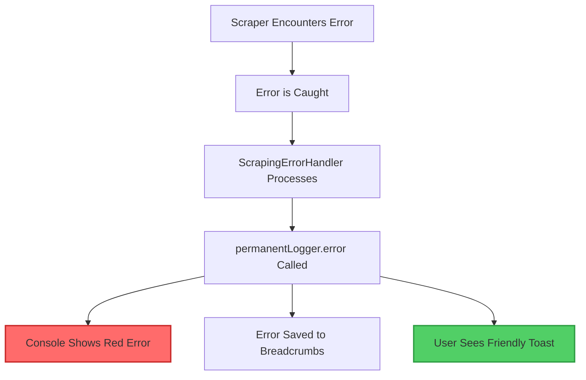

# 🚨 Error Handling & Logging System - Complete Documentation

**Created**: January 13, 2025
**Purpose**: Explain how error handling and logging work in Project Genie
**Key Point**: Red console errors are INTENTIONAL - they're the logging system working correctly!

---

## 📌 TL;DR - Important Points

1. **Red errors in console are NORMAL** - They're permanentLogger showing you errors for debugging
2. **Errors are being CAUGHT** - The app isn't crashing, errors are handled gracefully
3. **Errors are being LOGGED** - Full context is saved for debugging
4. **Users see FRIENDLY messages** - Scary technical errors are translated for users

---

## 🔴 Understanding Console Errors

### What You See:
```
❌ [SCRAPING_EXECUTION] Static HTML (Cheerio) HTTP 500
❌ [EVENT_BUS] Error notification
```

### What's Actually Happening:
This is **NOT an application error** - it's the **logging system working correctly**!

The permanentLogger intentionally displays errors in red with ❌ emoji to make them highly visible during development. This is a FEATURE, not a bug.

---

## 🔄 Complete Error Flow

### When a Scraper Fails:



### Code Path:
1. **Error Occurs**: `lib/company-intelligence/scrapers/executors/static-executor.ts`
   ```typescript
   // Error happens here (e.g., HTTP 500)
   const response = await fetch(url)
   ```

2. **Error Caught**: `lib/company-intelligence/error-handler.ts`
   ```typescript
   ScrapingErrorHandler.handleError(context, error, options)
   ```

3. **Error Logged**: `lib/utils/permanent-logger.ts:937`
   ```typescript
   this.originalConsole.error(`${finalColor}${finalEmoji} [${entry.category}] ${entry.message}${resetColor}`)
   ```

4. **User Notified**: Via toast notification system
   ```typescript
   notificationSender(userMessage, 'warning', EventPriority.NORMAL)
   ```

---

## 🎨 Why Console Shows Red Errors

### The permanentLogger Design:

```typescript
// lib/utils/permanent-logger.ts
private consoleOutput(entry: LogEntry, emoji: string, color: string) {
  if (entry.level === 'error' || entry.level === 'critical') {
    // RED for errors - THIS IS INTENTIONAL!
    this.originalConsole.error(`${finalColor}${finalEmoji} [${entry.category}] ${entry.message}${resetColor}`)
  }
}
```

### Color Coding System:
- 🔴 **RED** = Errors (need attention)
- 🟡 **YELLOW** = Warnings (recoverable issues)
- 🔵 **BLUE** = Info (normal operations)
- ⚡ **BLUE** = Performance metrics
- ✅ **GREEN** = Success messages

---

## 🛡️ Error Recovery System

### Recoverable vs Non-Recoverable Errors:

| Error Type | Console Shows | User Sees | Action Taken |
|------------|---------------|-----------|--------------|
| **HTTP 500-504** | ❌ Red error (for debugging) | 🟡 "Website having issues..." | Retry 3x |
| **Rate Limit 429** | ❌ Red error | 🟡 "Rate limited, waiting..." | Wait & retry |
| **Access Denied 403** | ❌ Red error | ⚠️ "Access denied, skipping" | Skip page |
| **Network Error** | ❌ Red error | 🟡 "Connection issue..." | Retry 2x |
| **Fatal Error** | ❌ Red error | ❌ "Operation failed" | Stop operation |

### Error Recovery Implementation:

```typescript
// lib/company-intelligence/utils/error-recovery.ts
export class ErrorRecovery {
  static isRecoverable(error: any): boolean {
    const recoverableCodes = [429, 500, 502, 503, 504, 'ETIMEDOUT']
    return recoverableCodes.includes(errorCode)
  }

  static getUserMessage(error: any, url?: string): string {
    // Converts technical errors to friendly messages
    // "ECONNREFUSED" → "Cannot connect to website"
    // "500" → "Website is experiencing issues"
  }
}
```

---

## 📊 Logging Levels Explained

### What Each Level Means:

1. **CRITICAL** (Red + Alert)
   - App-breaking errors
   - Data loss risks
   - Requires immediate attention

2. **ERROR** (Red)
   - Operation failures
   - Caught exceptions
   - Non-fatal but needs fixing

3. **WARNING** (Yellow)
   - Recoverable issues
   - Performance degradation
   - Should be monitored

4. **INFO** (Blue)
   - Normal operations
   - Status updates
   - Debugging information

5. **DEBUG** (Gray)
   - Detailed traces
   - Development only
   - Not shown in production

---

## 🔍 How to Read Error Logs

### Example Error Log:
```
❌ [SCRAPING_EXECUTION] Static HTML (Cheerio) HTTP 500
    at EnhancedPermanentLogger.consoleOutput (lib/utils/permanent-logger.ts:937:28)
    at ScrapingErrorHandler.handleError (lib/company-intelligence/error-handler.ts:58:21)
```

### What This Tells You:
1. **❌** = Error level (not a crash, just an error log)
2. **[SCRAPING_EXECUTION]** = Category/context where error occurred
3. **Static HTML (Cheerio) HTTP 500** = Actual error message
4. **Stack trace** = Code path to debug the issue

---

## ✅ Key Points to Remember

### These Are NOT Problems:
- ❌ Red console errors during scraping
- Multiple error logs in sequence
- Stack traces in the console
- Event bus error notifications

### These ARE Problems:
- Application crashes/white screens
- Infinite loading states
- No error messages at all (silent failures)
- Errors not being logged

---

## 🎯 Event System Integration

### How Events and Errors Work Together:

1. **Normal Event Flow**:
   ```
   EventFactory.progress() → StreamWriter → SSE → Client → Toast
   ```

2. **Error Event Flow**:
   ```
   Error → EventFactory.error() → permanentLogger → Console (red) → User Toast (yellow/red)
   ```

3. **Why Both Systems**:
   - **Events**: For real-time updates and progress
   - **Logging**: For debugging and error tracking
   - **Together**: Complete visibility into system behavior

---

## 🛠️ Debugging Guide

### When You See Red Errors:

1. **Check the Category** - Shows which system failed
2. **Read the Message** - Describes what went wrong
3. **Check User Toast** - See what the user experienced
4. **Review Breadcrumbs** - Trace the error path

### Using Breadcrumbs:
```typescript
// Breadcrumbs show the trail leading to an error
permanentLogger.breadcrumb('navigation', 'User clicked scrape button')
permanentLogger.breadcrumb('scraping', 'Started scraping bigfluffy.ai')
permanentLogger.breadcrumb('network', 'Fetching /services page')
// ERROR OCCURS HERE
permanentLogger.error('SCRAPING', 'HTTP 500 from server')
// Breadcrumbs help you retrace what happened
```

---

## 📝 Common Scenarios Explained

### Scenario 1: "I see red errors but the app still works"
**Answer**: That's correct! The red errors are logs for debugging. The app continues working because errors are caught and handled.

### Scenario 2: "Why do I see EVENT_BUS errors?"
**Answer**: The event bus logs all events including errors. This is normal - it's showing that error events are being processed correctly.

### Scenario 3: "The console is full of red text during scraping"
**Answer**: Expected behavior when websites have issues. Each failed request is logged for debugging, but the scraper continues with other pages.

### Scenario 4: "Should I fix these red console errors?"
**Answer**: Only if they represent actual bugs. Red logging of external failures (HTTP 500, rate limits) is normal and expected.

---

## 🚀 Best Practices

### For Developers:

1. **Don't Hide Errors** - Let permanentLogger show them
2. **Add Context** - Include useful data in error logs
3. **Use Breadcrumbs** - Help trace error paths
4. **Translate for Users** - Technical errors → friendly messages

### For Error Handling:

```typescript
// ✅ GOOD - Detailed logging, friendly user message
try {
  await riskyOperation()
} catch (error) {
  permanentLogger.error('OPERATION', 'Detailed technical error', { error, context })
  showToast('Something went wrong. Please try again.', 'warning')
}

// ❌ BAD - Silent failure
try {
  await riskyOperation()
} catch (error) {
  // Don't do nothing!
}
```

---

## 📚 Related Documentation

- `/lib/utils/permanent-logger.ts` - Logging system implementation
- `/lib/company-intelligence/error-handler.ts` - Error handling logic
- `/lib/company-intelligence/utils/error-recovery.ts` - Recovery strategies
- `/lib/realtime-events/README.md` - Event system documentation
- `/docs/error-logging-best-practices.md` - Best practices guide

---

## 🎉 Summary

The red console errors you see are **the logging system working correctly**, not application failures. They provide crucial debugging information while the app continues to function normally. The system is designed to:

1. **Catch all errors** (no crashes)
2. **Log everything** (full visibility)
3. **Show developers details** (red console output)
4. **Show users friendly messages** (yellow/red toasts)

This is a robust, production-ready error handling system working exactly as designed!