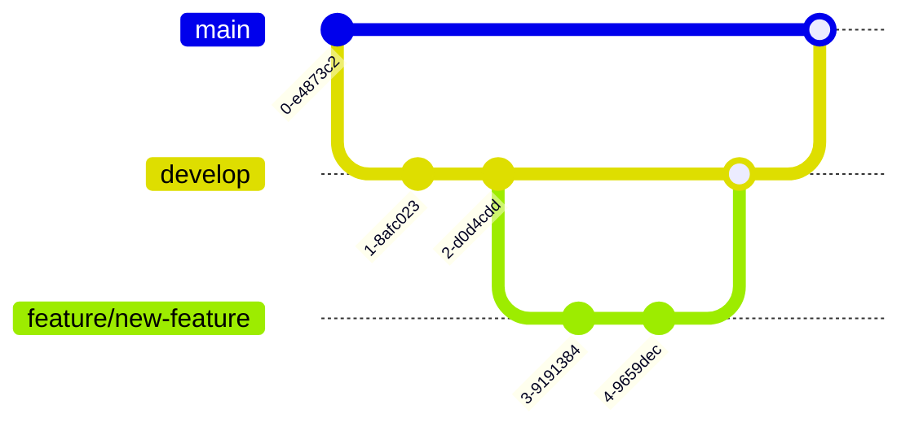

# Mermaid Diagrams Complete Guide

## Overview
This guide provides comprehensive documentation for all Mermaid diagram types supported in Project Genie. Mermaid is a JavaScript-based diagramming and charting tool that uses text definitions to create diagrams dynamically.

## Table of Contents
1. [Core Diagrams](#core-diagrams)
2. [Project Management Diagrams](#project-management-diagrams)
3. [Technical Diagrams](#technical-diagrams)
4. [Business Analysis Diagrams](#business-analysis-diagrams)
5. [Integration Guide](#integration-guide)
6. [Best Practices](#best-practices)

---

## Core Diagrams

### 1. Flowchart
**Use Case**: Process flows, decision trees, algorithms


### 2. Sequence Diagram
**Use Case**: API interactions, communication protocols, user flows


### 3. Class Diagram
**Use Case**: Object-oriented design, data models, system architecture


### 4. State Diagram
**Use Case**: State machines, workflow states, lifecycle management


### 5. Entity Relationship Diagram
**Use Case**: Database schemas, data relationships


### 6. Git Graph
**Use Case**: Version control flow, branching strategies


### 7. Pie Chart
**Use Case**: Distribution analysis, resource allocation


---

## Project Management Diagrams

### 8. Timeline
**Use Case**: Project phases, historical events, roadmaps


### 9. Gantt Chart
**Use Case**: Project scheduling, task dependencies, resource planning


### 10. Kanban Board
**Use Case**: Sprint planning, task management, workflow visualization


### 11. User Journey
**Use Case**: Customer experience mapping, user flow analysis


---

## Technical Diagrams

### 12. Architecture Diagram
**Use Case**: System architecture, microservices, infrastructure design


### 13. Block Diagram
**Use Case**: System components, module relationships, high-level architecture
```mermaid
block-beta
columns 3

Frontend:
  Web["Web Application"]
  Mobile["Mobile App"]

Backend:
  API["API Gateway"]
  Auth["Authentication"]
  Docs["Document Service"]

Infrastructure:
  DB[("PostgreSQL")]
  Cache[("Redis")]
  Storage[("S3")]

Web --> API
Mobile --> API
API --> Auth
API --> Docs
Auth --> DB
Docs --> DB
Docs --> Storage
API --> Cache
```

### 14. Packet Diagram
**Use Case**: Network protocols, data transmission, packet structure


---

## Business Analysis Diagrams

### 15. Mind Map
**Use Case**: Brainstorming, concept mapping, idea organization


### 16. Quadrant Chart
**Use Case**: SWOT analysis, risk assessment, priority matrix


### 17. Tree Map
**Use Case**: Hierarchical data, file structures, organizational charts


### 18. Sankey Diagram
**Use Case**: Resource flow, budget allocation, energy consumption


### 19. XY Chart
**Use Case**: Data visualization, trends analysis, correlations


### 20. Requirement Diagram
**Use Case**: Requirements traceability, specifications, compliance
```mermaid
requirementDiagram
    requirement system_requirements {
        id: SR-001
        text: System shall support 1000 concurrent users
        risk: high
        verifymethod: test
    }

    requirement performance_requirements {
        id: PR-001
        text: Response time shall be under 2 seconds
        risk: medium
        verifymethod: analysis
    }

    element api_gateway {
        type: module
        docref: api-spec.md
    }

    element load_balancer {
        type: component
        docref: infra-design.md
    }

    api_gateway - satisfies -> system_requirements
    load_balancer - satisfies -> performance_requirements
```

---

## Integration Guide

### Using Mermaid in Project Genie

#### 1. In Markdown Files
```markdown
\`\`\`mermaid
flowchart LR
    A[Start] --> B[Process] --> C[End]
\`\`\`
```

#### 2. In Document Formatters
```typescript
import { createFlowchart, createGanttChart } from '@/lib/utils/mermaid-helpers'

const flowchart = createFlowchart({
  title: 'Process Flow',
  nodes: [...],
  connections: [...]
})

const gantt = createGanttChart({
  title: 'Project Schedule',
  tasks: [...],
  milestones: [...]
})
```

#### 3. In React Components (MANDATORY APPROACH)

##### ✅ CORRECT - Use MermaidDiagram Component
```tsx
import { MermaidDiagram, SafeMermaidDiagram } from '@/components/mermaid-diagram'

// Basic usage - automatically includes export features
<MermaidDiagram
  definition={diagramCode}
  type="gantt"
  showControls={true}  // Enables: SVG export, PNG export, Copy to clipboard
/>

// Full featured usage
<SafeMermaidDiagram
  definition={mermaidCode}
  type="flowchart"
  title="System Architecture"
  showControls={true}        // Export/Copy buttons
  lazy={true}                // IntersectionObserver
  cache={true}               // SVG caching
  height={400}               // Fixed height
  onSuccess={(svg) => console.log('Rendered!')}
  onError={(err) => console.error(err)}
  fallback={<CustomFallback />}
/>
```

##### ❌ WRONG - Direct Service Usage (DRY VIOLATION)
```typescript
// NEVER DO THIS - Duplicates component logic
import { mermaidService } from '@/lib/services/mermaid-service'

// This violates DRY - the component handles all this
await mermaidService.initialize({...})
const result = await mermaidService.render(...)
container.innerHTML = result.svg
```

##### Component Props Reference
| Prop | Type | Default | Description |
|------|------|---------|-------------|
| definition | string | required | Mermaid diagram code |
| type | string | 'auto' | Diagram type hint |
| title | string | - | Diagram title |
| showControls | boolean | false | Show export/copy buttons |
| lazy | boolean | false | Lazy load when visible |
| cache | boolean | true | Cache rendered SVG |
| theme | MermaidTheme | DEFAULT | Color theme |
| height/width | string/number | - | Fixed dimensions |
| onSuccess | (svg: string) => void | - | Success callback |
| onError | (error: Error) => void | - | Error callback |
| fallback | ReactNode | - | Custom fallback UI |

##### Export Features Included Automatically
| Feature | Component Provides | Manual Implementation |
|---------|-------------------|----------------------|
| SVG Export | ✅ Built-in button | ❌ 20+ lines code |
| PNG Export | ✅ Built-in button | ❌ 30+ lines code |
| Copy to Clipboard | ✅ Built-in button | ❌ 15+ lines code |
| Error Handling | ✅ Error boundary | ❌ Try-catch blocks |
| Loading State | ✅ Spinner | ❌ State management |
| Lazy Loading | ✅ IntersectionObserver | ❌ Complex logic |
| Caching | ✅ Automatic | ❌ Manual cache |

#### 4. PDF Export (MANDATORY APPROACH)

##### ✅ CORRECT - Use DirectPDFDownloadButton Component
```tsx
import { DirectPDFDownloadButton } from '@/components/documents/pdf-download-button'

// Simple usage
<DirectPDFDownloadButton
  document={documentData}
  buttonText="Export as PDF"
/>

// Full featured usage
<DirectPDFDownloadButton
  document={document}
  buttonText="Download PDF"
  showIcon={true}
  size="sm"
  variant="outline"
  whiteLabel={false}
  showDraft={false}
  classification="PUBLIC"
  forceRegenerate={false}
/>
```

##### ❌ WRONG - Direct API Calls (DRY VIOLATION)
```typescript
// NEVER DO THIS - Duplicates component logic
const response = await fetch('/api/pdf/generate', {
  method: 'POST',
  headers: { 'Content-Type': 'application/json' },
  body: JSON.stringify(requestBody)
})
const blob = await response.blob()
// ... 40+ more lines of download logic
```

##### PDF Component Features
- Automatic error handling
- Loading states
- Document formatting
- Watermarking support
- Classification labels
- Force regenerate option
- Consistent filename generation

---

## Best Practices

### 1. Syntax Guidelines
- **No leading spaces**: Don't indent diagram type declarations
- **Consistent indentation**: Use 2 or 4 spaces for nested content
- **Proper quotes**: Use double quotes for labels with special characters
- **Valid IDs**: Use alphanumeric characters and underscores for node IDs

### 2. Performance Optimization
- **Lazy loading**: Load Mermaid only when diagrams are present
- **Caching**: Cache rendered SVGs for repeated diagrams
- **Size limits**: Keep diagrams under 100 nodes for optimal performance

### 3. Accessibility
- **Alt text**: Provide text descriptions for screen readers
- **Fallbacks**: Always include text representations
- **Color contrast**: Ensure sufficient contrast in custom themes

### 4. Error Handling
```typescript
try {
  const svg = await mermaid.render(id, definition)
  container.innerHTML = svg
} catch (error) {
  container.innerHTML = getFallbackContent(definition)
  console.error('Mermaid render error:', error)
}
```

### 5. Theme Customization
```javascript
mermaid.initialize({
  startOnLoad: false,
  theme: 'default',
  themeVariables: {
    primaryColor: '#6366f1',
    primaryTextColor: '#fff',
    primaryBorderColor: '#4f46e5',
    lineColor: '#e5e7eb',
    secondaryColor: '#f3f4f6',
    tertiaryColor: '#fef3c7'
  }
})
```

---

## Common Patterns

### Project Management Suite
```typescript
// Timeline for project phases
createTimelineDiagram({
  title: 'Project Roadmap',
  entries: projectPhases
})

// Gantt for detailed scheduling
createGanttChart({
  title: 'Development Schedule',
  tasks: sprintTasks
})

// Kanban for current sprint
createKanbanBoard({
  title: 'Sprint 12',
  columns: ['Todo', 'In Progress', 'Review', 'Done'],
  cards: currentTasks
})
```

### Technical Documentation Suite
```typescript
// Architecture overview
createArchitectureDiagram({
  title: 'System Architecture',
  services: microservices,
  connections: apiRoutes
})

// Database schema
createEntityRelationship({
  title: 'Data Model',
  entities: dbTables,
  relationships: foreignKeys
})

// API flow
createSequenceDiagram({
  title: 'API Request Flow',
  participants: services,
  interactions: apiCalls
})
```

### Business Analysis Suite
```typescript
// Risk assessment
createQuadrantChart({
  title: 'Risk Matrix',
  xAxis: 'Impact',
  yAxis: 'Probability',
  items: risks
})

// User experience
createUserJourney({
  title: 'Customer Journey',
  stages: journeyStages,
  ratings: satisfactionScores
})

// Strategic planning
createMindMap({
  title: 'Strategy Map',
  root: 'Business Goals',
  branches: strategicInitiatives
})
```

---

## Troubleshooting

### Common Issues

1. **Syntax Error**: Check for proper indentation and valid syntax
2. **Rendering Failed**: Ensure Mermaid is properly initialized
3. **Missing Diagrams**: Verify diagram type is supported in your Mermaid version
4. **Performance Issues**: Reduce diagram complexity or implement lazy loading

### Debug Mode
```javascript
mermaid.initialize({
  logLevel: 'debug',
  securityLevel: 'loose',
  startOnLoad: false
})
```

---

## Editor Support & Setup

### Editor Support Matrix

| Editor | Built-in Support | Setup Required | Live Preview | Export PDF/SVG | Cost | Notes |
|--------|-----------------|----------------|--------------|----------------|------|-------|
| **VS Code** | ❌ | Extensions | ✅ | ✅ | Free | Most popular, best extension support |
| **Obsidian** | ✅ | None | ✅ | ✅ | Free | Native support, excellent for documentation |
| **GitHub Web** | ✅ | None | ✅ | ❌ | Free | Automatic rendering in markdown files |
| **Typora** | ✅ | Enable in settings | ✅ | ✅ | $14.99 | WYSIWYG editor with live preview |
| **Notion** | ✅ | None | ✅ | ✅ | Free/Paid | Type `/mermaid` to create diagram block |
| **MarkEdit** | ❌ | Not available | ❌ | ❌ | Free | No Mermaid support |
| **HackMD/CodiMD** | ✅ | None | ✅ | ✅ | Free/Paid | Online collaborative editor |
| **Marked 2** | ✅ | Preprocessor | ✅ | ✅ | $13.99 | macOS preview app, pairs with any editor |
| **IntelliJ IDEA** | ❌ | Plugin | ✅ | ✅ | Free/Paid | Mermaid plugin available |
| **Sublime Text** | ❌ | Package | Preview only | ❌ | Free/Paid | Limited support via packages |

### VS Code Setup (Recommended)

#### Essential Extensions

```bash
# Install via command line
code --install-extension bierner.markdown-mermaid              # Core Mermaid support
code --install-extension bpruitt-goddard.mermaid-markdown-syntax-highlighting  # Syntax highlighting
code --install-extension shd101wyy.markdown-preview-enhanced   # Enhanced preview with export

# Alternative: Install via VS Code UI
# 1. Open Extensions (Cmd+Shift+X on Mac, Ctrl+Shift+X on Windows/Linux)
# 2. Search for "Markdown Preview Mermaid Support"
# 3. Click Install
```

#### Configuration

Add to your VS Code settings.json:
```json
{
  "markdown.preview.mermaid.theme": "default",
  "markdown-preview-enhanced.enableScriptExecution": true,
  "markdown-preview-enhanced.mermaidTheme": "default",
  "markdown-preview-enhanced.previewTheme": "github-light.css"
}
```

#### Usage
1. Open any `.md` file with Mermaid blocks
2. Press `Cmd+Shift+V` (Mac) or `Ctrl+Shift+V` (Windows/Linux) for preview
3. Diagrams render automatically in preview pane

### Browser Extensions

#### Chrome/Edge
- **Extension**: [GitHub + Mermaid](https://chrome.google.com/webstore/detail/github-%2B-mermaid/goiiopgdnkogdbjmncgedmgpoajilohe)
- **Features**: Renders Mermaid on GitHub, GitLab, Bitbucket
- **Installation**: Chrome Web Store → Search "GitHub Mermaid" → Add to Chrome

#### Firefox
- **Extension**: [Mermaid Extension for GitHub](https://addons.mozilla.org/en-US/firefox/addon/github-mermaid/)
- **Features**: Automatic rendering on code hosting platforms
- **Installation**: Firefox Add-ons → Search "Mermaid" → Add to Firefox

### Alternative Editors

#### Obsidian (Best for Documentation)
```markdown
# No setup needed - works out of the box
1. Download from https://obsidian.md
2. Open your markdown files
3. Mermaid renders automatically
```

#### Typora (WYSIWYG Editor)
```markdown
1. Download from https://typora.io
2. Go to Preferences → Markdown → Diagrams
3. Enable "Mermaid"
4. Restart Typora
```

#### Notion (Cloud-Based)
```markdown
1. Type /mermaid in any page
2. Paste your diagram code
3. Click outside to render
```

### Online Editors (No Installation)

| Editor | URL | Best For | Features |
|--------|-----|----------|----------|
| **Mermaid Live** | https://mermaid.live | Testing & debugging | Export SVG/PNG, share links |
| **StackEdit** | https://stackedit.io | Quick editing | Google Drive sync |
| **HackMD** | https://hackmd.io | Collaboration | Real-time co-editing |
| **Dillinger** | https://dillinger.io | Simple editing | Cloud storage integration |

### Troubleshooting Editor Issues

#### VS Code - Diagrams Not Rendering
```bash
# Solution 1: Check extensions are enabled
code --list-extensions | grep mermaid

# Solution 2: Reload VS Code window
Cmd+Shift+P → "Developer: Reload Window"

# Solution 3: Check markdown preview settings
Cmd+, → Search "markdown.preview" → Enable Mermaid
```

#### MarkEdit Users - No Native Support
Since MarkEdit doesn't support Mermaid, use this workflow:
1. **Edit** in MarkEdit (for speed)
2. **Preview** using:
   - Push to GitHub (auto-renders)
   - Open in VS Code with extensions
   - Copy to https://mermaid.live
   - Use Marked 2 app alongside

#### General Issues
- **Syntax errors**: Use https://mermaid.live to validate
- **Old Mermaid version**: Update editor/extension
- **Theme issues**: Try default theme first
- **Performance**: Reduce diagram complexity

### Command-Line Tools

#### Mermaid CLI
```bash
# Install globally
npm install -g @mermaid-js/mermaid-cli

# Convert .mmd file to SVG
mmdc -i diagram.mmd -o output.svg

# Convert markdown with mermaid to PDF
mmdc -i document.md -o document.pdf --md

# Batch convert all diagrams
for file in *.mmd; do
  mmdc -i "$file" -o "${file%.mmd}.svg"
done
```

## Resources

- [Official Mermaid Documentation](https://mermaid.js.org/)
- [Mermaid Live Editor](https://mermaid.live/)
- [Mermaid CLI](https://github.com/mermaid-js/mermaid-cli)
- [VS Code Extension](https://marketplace.visualstudio.com/items?itemName=bierner.markdown-mermaid)
- [Editor Comparison](https://mermaid.js.org/ecosystem/integrations.html)

---

## Version Compatibility

This guide is compatible with:
- Mermaid.js v10.0.0 and above (for Timeline, Mindmap, Quadrant)
- Mermaid.js v11.0.0 and above (for Block, Architecture, Packet, Kanban)

Always check the [Mermaid changelog](https://github.com/mermaid-js/mermaid/releases) for the latest features and breaking changes.