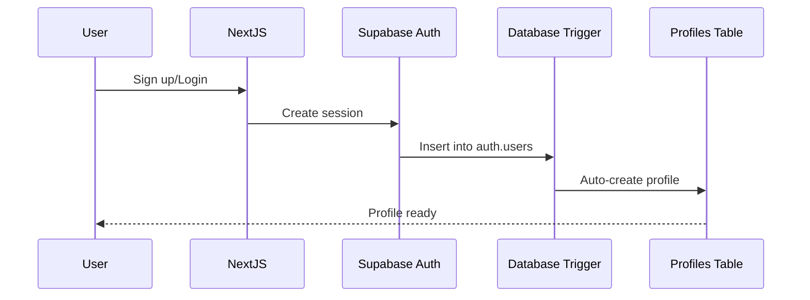

# Repository Pattern Architecture Documentation

## Table of Contents
1. [Overview](#overview)
2. [Architecture Layers](#architecture-layers)
3. [Repository Pattern Implementation](#repository-pattern-implementation)
4. [Supabase Integration](#supabase-integration)
5. [Type Safety](#type-safety)
6. [API Design](#api-design)
7. [Authentication & Profile Management](#authentication--profile-management)
8. [Best Practices & Guidelines](#best-practices--guidelines)
9. [Migration Path](#migration-path)

---

## Overview

This document outlines the repository pattern architecture implemented in Project Genie, providing a comprehensive guide to our data access layer, type safety approach, and integration with Supabase services.

### Key Principles
- **Separation of Concerns**: UI → API → Repository → Database
- **Type Safety**: End-to-end TypeScript types from database to UI
- **DRY (Don't Repeat Yourself)**: Single source of truth for each operation
- **SOLID Principles**: Each repository has a single responsibility
- **No Direct Database Access**: All database operations go through repositories

---

## Architecture Layers

```
┌─────────────────────────────────────────────────────────┐
│                    UI Components                        │
│              (React Components, Pages)                  │
└────────────────────┬────────────────────────────────────┘
                     │ HTTP/Fetch
┌────────────────────▼────────────────────────────────────┐
│                   API Routes                            │
│            (Next.js API endpoints)                      │
└────────────────────┬────────────────────────────────────┘
                     │ Repository Calls
┌────────────────────▼────────────────────────────────────┐
│                  Repositories                           │
│         (Type-safe database abstraction)                │
└────────────────────┬────────────────────────────────────┘
                     │ Supabase Client
┌────────────────────▼────────────────────────────────────┐
│                PostgreSQL Database                      │
│              (With RLS, Triggers, Functions)            │
└─────────────────────────────────────────────────────────┘
```

### Layer Responsibilities

#### 1. UI Components
- **Role**: User interface and interaction
- **Allowed**: Fetch from API endpoints, handle user events
- **Forbidden**: Direct database access, direct repository usage
- **Example**:
```typescript
// ✅ CORRECT - UI calls API
const response = await fetch('/api/profile')
const profile = await response.json()

// ❌ WRONG - Direct database access
const { data } = await supabase.from('profiles').select()
```

#### 2. API Routes
- **Role**: HTTP endpoint handling, request validation
- **Allowed**: Use repositories, handle auth, validate input
- **Forbidden**: Direct database queries
- **Example**:
```typescript
// ✅ CORRECT - API uses repository
const profilesRepo = ProfilesRepository.getInstance()
const profile = await profilesRepo.getCurrentProfile()

// ❌ WRONG - Direct database access
const { data } = await supabase.from('profiles').select()
```

#### 3. Repositories
- **Role**: Database operations, type safety, caching
- **Allowed**: Direct database queries, caching logic
- **Forbidden**: HTTP handling, UI logic
- **Example**:
```typescript
// ✅ CORRECT - Repository handles database
async getProfile(id: string): Promise<Profile> {
  const { data, error } = await this.client
    .from('profiles')
    .select('*')
    .eq('id', id)
    .single()

  if (error) throw error
  return data
}
```

#### 4. Database Layer
- **Role**: Data persistence, constraints, triggers
- **Features**: RLS policies, triggers, functions, indexes
- **Example**: Automatic profile creation trigger

---

## Repository Pattern Implementation

### Base Repository

All repositories extend `BaseRepository`, providing common functionality:

```typescript
// lib/repositories/base-repository.ts
export abstract class BaseRepository {
  protected logger = permanentLogger

  // Common error handling
  protected async execute<T>(
    operation: string,
    fn: (client: SupabaseClient) => Promise<T>
  ): Promise<T> {
    try {
      const client = await this.getClient()
      return await fn(client)
    } catch (error) {
      this.logger.captureError(`REPO_${this.constructor.name}`, error, {
        operation
      })
      throw error
    }
  }

  // Get current authenticated user
  protected async getCurrentUser(): Promise<User> {
    const client = await this.getClient()
    const { data: { user }, error } = await client.auth.getUser()
    if (error || !user) throw new Error('Not authenticated')
    return user
  }
}
```

### Repository Structure

Each repository follows this pattern:

```typescript
// lib/repositories/[entity]-repository.ts
import { BaseRepository } from './base-repository'
import type { Database } from '@/lib/database.types'

// Extract types from generated database types
type Entity = Database['public']['Tables']['entities']['Row']
type EntityInsert = Database['public']['Tables']['entities']['Insert']
type EntityUpdate = Database['public']['Tables']['entities']['Update']

export class EntitiesRepository extends BaseRepository {
  private static instance: EntitiesRepository

  // Singleton pattern
  static getInstance(): EntitiesRepository {
    if (!this.instance) {
      this.instance = new EntitiesRepository()
    }
    return this.instance
  }

  // CRUD operations
  async create(data: Omit<EntityInsert, 'id'>): Promise<Entity> {
    // Implementation
  }

  async findById(id: string): Promise<Entity | null> {
    // Implementation
  }

  async update(id: string, data: EntityUpdate): Promise<Entity> {
    // Implementation
  }

  async delete(id: string): Promise<void> {
    // Implementation
  }
}
```

### Current Repositories

| Repository | Table | Purpose |
|------------|-------|---------|
| ProfilesRepository | profiles | User profile management |
| ProjectsRepository | projects | Project CRUD operations |
| ArtifactsRepository | artifacts | Document management |
| BugsRepository | bug_reports | Bug tracking (global visibility) |
| AdminSettingsRepository | admin_settings | Admin configuration |
| CompanyIntelligenceRepository | company_intelligence_sessions | Company research sessions |
| PhaseDataRepository | merged_data in sessions | Phase data management |
| LogsRepository | permanent_logs | Application logging |
| TeamRepository | project_members | Team management |
| TasksRepository | tasks | Task management |
| RisksRepository | risks | Risk management |
| CorporateEntitiesRepository | corporate_entities | Corporate entity management |

---

## Supabase Integration

### Authentication Flow



### Database Triggers

#### Automatic Profile Creation
Located in: `supabase/migrations/20250117_consolidated_profile_trigger.sql`

```sql
CREATE OR REPLACE FUNCTION public.handle_new_user()
RETURNS trigger AS $$
BEGIN
  INSERT INTO public.profiles (id, email, full_name, created_at, updated_at)
  VALUES (
    new.id,
    new.email,
    COALESCE(
      new.raw_user_meta_data->>'full_name',
      new.raw_user_meta_data->>'name',
      split_part(new.email, '@', 1)
    ),
    now(),
    now()
  )
  ON CONFLICT (id) DO UPDATE SET
    email = EXCLUDED.email,
    full_name = COALESCE(EXCLUDED.full_name, profiles.full_name),
    updated_at = now();
  RETURN new;
END;
$$ LANGUAGE plpgsql SECURITY DEFINER;

CREATE TRIGGER on_auth_user_created
  AFTER INSERT ON auth.users
  FOR EACH ROW
  EXECUTE FUNCTION public.handle_new_user();
```

**Benefits**:
- No client-side profile creation needed
- Eliminates race conditions
- Works with all auth methods (OAuth, email, etc.)
- Profile guaranteed to exist after signup

### Row Level Security (RLS)

RLS policies ensure data isolation:

```sql
-- Users can only see their own profiles
CREATE POLICY "profiles_select" ON profiles
  FOR SELECT USING (auth.uid() = id);

-- Users can only update their own profiles
CREATE POLICY "profiles_update" ON profiles
  FOR UPDATE USING (auth.uid() = id);
```

### Storage Integration

For file operations, we use Supabase Storage directly in API routes:

```typescript
// API route handles storage
const { data, error } = await supabase.storage
  .from('avatars')
  .upload(filePath, file)

// Update profile via repository
const profilesRepo = ProfilesRepository.getInstance()
await profilesRepo.updateProfile({ avatar_url: publicUrl })
```

---

## Type Safety

### Database Types Generation

Types are automatically generated from the database schema:

```bash
# Generate types
supabase gen types typescript --local > lib/database.types.ts

# Auto-generate on development
npm run predev  # Runs type generation before dev server
```

### Type Usage in Repositories

```typescript
import type { Database } from '@/lib/database.types'

// Full type safety from database
type Profile = Database['public']['Tables']['profiles']['Row']
type ProfileInsert = Database['public']['Tables']['profiles']['Insert']
type ProfileUpdate = Database['public']['Tables']['profiles']['Update']

// Repository methods with explicit types
async getProfile(id: string): Promise<Profile> {
  // TypeScript knows exact shape of Profile
}

async updateProfile(id: string, data: ProfileUpdate): Promise<Profile> {
  // Only valid update fields allowed
}
```

### Benefits
- **Compile-time safety**: Catch errors before runtime
- **IDE autocomplete**: See available fields as you type
- **Refactoring confidence**: Schema changes break compilation
- **Zero runtime overhead**: Types are stripped in production

---

## API Design

### RESTful Endpoints

```typescript
// app/api/[resource]/route.ts
export async function GET(request: NextRequest) {
  // List or get single resource
}

export async function POST(request: NextRequest) {
  // Create new resource
}

// app/api/[resource]/[id]/route.ts
export async function GET(request: NextRequest, { params }) {
  // Get single resource by ID
}

export async function PATCH(request: NextRequest, { params }) {
  // Update resource
}

export async function DELETE(request: NextRequest, { params }) {
  // Delete resource
}
```

### API Examples

#### Profile API
- `GET /api/profile` - Get current user's profile
- `PATCH /api/profile` - Update profile
- `POST /api/profile/avatar` - Upload avatar

#### Bug Tracker API (Beta - Global Visibility)
- `GET /api/bugs` - Get all bugs (global)
- `POST /api/bugs` - Create bug
- `PATCH /api/bugs/[id]` - Update bug
- `DELETE /api/bugs/[id]` - Delete bug

#### Admin Stats API
- `GET /api/admin/stats` - Get aggregate statistics

---

## Authentication & Profile Management

### Key Decisions

1. **Database Triggers for Profile Creation**
   - Profiles created automatically via PostgreSQL trigger
   - No client-side `ensureProfile()` calls needed
   - Single source of truth in database

2. **Supabase Auth Integration**
   - Authentication state in cookies (SSR-friendly)
   - Auth metadata synced to profiles table
   - OAuth providers supported out-of-box

3. **Special Cases**

#### PermanentLogger Database Layer
- Has its own DB layer (`permanent-logger-db.ts`)
- Avoids circular dependency: Logger → Repository → Logger
- Direct database access is intentional and necessary

#### Bug Tracker Beta Feature
- Global visibility for collaborative debugging
- All users see all bugs across all projects
- No user filtering in repository

---

## Best Practices & Guidelines

### DO's ✅

1. **Always use repositories in API routes**
```typescript
const repo = ProfilesRepository.getInstance()
const profile = await repo.getCurrentProfile()
```

2. **Always generate IDs in database**
```sql
id UUID DEFAULT gen_random_uuid() PRIMARY KEY
```

3. **Always handle errors properly**
```typescript
try {
  const result = await repo.operation()
} catch (error) {
  permanentLogger.captureError('CATEGORY', error, context)
  throw error // Re-throw after logging
}
```

4. **Always use typed responses**
```typescript
async getProfile(id: string): Promise<Profile> // Not Promise<any>
```

### DON'Ts ❌

1. **Never access database from UI components**
```typescript
// ❌ WRONG in component
const { data } = await supabase.from('profiles').select()
```

2. **Never generate UUIDs in application code**
```typescript
// ❌ WRONG
const id = crypto.randomUUID()
await repo.create({ id, ...data })
```

3. **Never skip the repository layer**
```typescript
// ❌ WRONG in API route
const { data } = await supabase.from('profiles').select()
```

4. **Never return mock/fallback data**
```typescript
// ❌ WRONG
catch (error) {
  return [] // Silent failure
}
```

---

## Migration Path

### From Direct Database Access to Repository Pattern

#### Step 1: Identify Violations
```bash
# Search for direct database access
grep -r "\.from(" --include="*.tsx" --include="*.ts"
```

#### Step 2: Create/Update Repository
```typescript
// Create repository if doesn't exist
export class EntityRepository extends BaseRepository {
  // Implementation
}
```

#### Step 3: Create API Endpoint
```typescript
// app/api/entities/route.ts
export async function GET() {
  const repo = EntityRepository.getInstance()
  const entities = await repo.getAll()
  return NextResponse.json(entities)
}
```

#### Step 4: Update UI Component
```typescript
// Before
const { data } = await supabase.from('entities').select()

// After
const response = await fetch('/api/entities')
const data = await response.json()
```

### Database Provider Migration Considerations

#### Portable Elements ✅
- Repository pattern (change implementation, keep interface)
- TypeScript interfaces
- API endpoints
- Business logic

#### Supabase-Specific Elements ⚠️
- Auth system (`auth.users` table)
- RLS policies
- Storage buckets
- Edge Functions
- Realtime subscriptions

#### Migration Effort to AWS
| Component | Supabase | AWS Alternative | Effort |
|-----------|----------|-----------------|--------|
| Database | PostgreSQL | RDS PostgreSQL | Easy |
| Auth | Integrated | Cognito | Medium |
| Storage | Buckets | S3 | Medium |
| Functions | Edge Functions | Lambda | Medium |
| Realtime | Built-in | WebSockets/AppSync | Hard |

---

## Conclusion

The repository pattern provides:
- **Clean separation** between UI and database
- **Type safety** from database to UI
- **Testability** through dependency injection
- **Portability** through abstraction
- **Security** through centralized access control

Combined with Supabase's features (auth, RLS, triggers), we get:
- **Automatic profile management**
- **Row-level security**
- **Real-time capabilities**
- **Integrated file storage**

This architecture balances developer experience, type safety, and reasonable portability while leveraging Supabase's strengths.