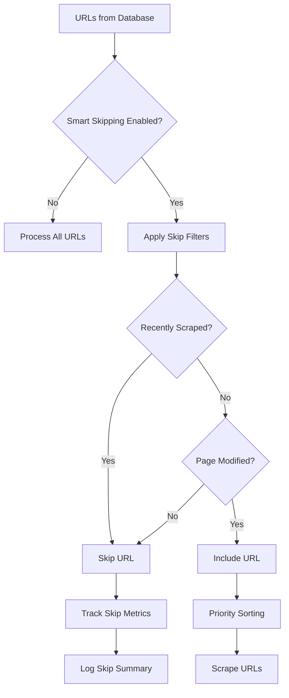

# Smart Skipping Architecture Documentation

**Created**: 2025-01-12
**Phase**: 7 - Smart Skipping Implementation
**Status**: In Progress

## Overview

Smart skipping is an intelligent caching and optimization system that prevents redundant scraping of pages that haven't changed since the last scrape. This significantly improves performance, reduces resource consumption, and provides faster results to users.

## Purpose & Benefits

### Primary Purpose
Prevent redundant scraping of unchanged pages while ensuring fresh data for modified content.

### Key Benefits
1. **Performance Improvement**: 20-30% time savings by skipping unchanged pages
2. **Resource Efficiency**: Reduces server load, bandwidth consumption, and API calls
3. **Cost Reduction**: Fewer API calls means lower operational costs
4. **Better User Experience**: Faster results as system focuses on new/changed content
5. **Scalability**: Enables handling larger sites by focusing on what matters

## Architecture Decision: Why This Approach?

### Comparison of Approaches

| Approach | Description | Pros | Cons | Use Case |
|----------|-------------|------|------|----------|
| **Time-based skipping** | Skip pages scraped within threshold | Simple, effective, prevents hammering | May miss updates within threshold | ✅ Our primary approach |
| **Lastmod checking** | Use sitemap lastmod dates | Server-provided change dates | Not all sites provide accurate lastmod | ✅ Our secondary check |
| **ETag/If-Modified-Since** | HTTP header-based checking | Server tells if changed | Not all servers support, requires HEAD requests | Good supplement |
| **Content hashing** | Compare hash of page content | Detects any change precisely | Requires storing hashes, computational overhead | Critical pages only |
| **No skipping** | Always scrape everything | Always fresh data | Wastes resources, slower, poor UX | ❌ Not recommended |

### Our Hybrid Approach
We use a combination of time-based skipping and lastmod checking:
1. **Primary**: Skip pages scraped within 24 hours (configurable)
2. **Secondary**: Check sitemap lastmod vs last scrape time
3. **Override**: Force re-scrape option available when needed

## Implementation Details

### 1. Configuration Constants

```typescript
// In StaticScraperExecutor
private readonly SKIP_THRESHOLD = 24 * 60 * 60 * 1000 // 24 hours in milliseconds
private readonly enableSmartSkipping = true // Can be configured via options
```

### 2. Metadata Structure

```typescript
interface URLMetadata {
  url: string
  priority?: 'high' | 'medium' | 'low'
  lastmod?: string              // From sitemap
  pageType?: string
  lastScraped?: number          // Timestamp of last scrape
  metadata?: Record<string, any>
}
```

### 3. Skip Decision Logic

The system applies two filters:

#### Filter 1: Recently Scraped
```typescript
if (metadata?.lastScraped) {
  const timeSinceLastScrape = now - metadata.lastScraped
  if (timeSinceLastScrape < this.SKIP_THRESHOLD) {
    // Skip - page was scraped recently
    return false
  }
}
```

#### Filter 2: Unchanged Since Last Scrape
```typescript
if (metadata?.lastScraped && metadata?.lastmod) {
  const lastScrapedTime = metadata.lastScraped
  const lastModTime = new Date(metadata.lastmod).getTime()
  
  if (lastScrapedTime > lastModTime) {
    // Skip - page hasn't been modified since last scrape
    return false
  }
}
```

### 4. Skip Metrics Tracking

```typescript
const skipReasons: Record<string, number> = {
  recentlyScraped: 0,  // Skipped due to recent scrape
  unchanged: 0,        // Skipped as not modified
  cached: 0           // Future: skipped due to cache hit
}
```

## Data Flow



## Logging & Monitoring

### Breadcrumbs
- `smart_skipping`: Filter application started
- `skip_recent`: URL skipped due to recent scrape
- `skip_unchanged`: URL skipped as unchanged
- `skip_metrics`: Summary of skipping performance

### Metrics Logged
```typescript
{
  totalUrls: number,        // Total URLs considered
  skippedUrls: number,      // Number skipped
  processedUrls: number,    // Number to be scraped
  skipReasons: {
    recentlyScraped: number,
    unchanged: number,
    cached: number
  },
  timeSaved: string,        // Estimated time saved
  percentSkipped: number    // Percentage skipped
}
```

## Configuration Options

### Per-Request Configuration
```typescript
interface ScraperOptions {
  // ... other options
  skipThreshold?: number         // Override default 24 hours
  enableSmartSkipping?: boolean  // Enable/disable per request
  forceRescrape?: boolean        // Force scrape regardless of cache
}
```

### Global Configuration
- `SKIP_THRESHOLD`: Default 24 hours (86400000ms)
- `enableSmartSkipping`: Default true

## Performance Impact

### Expected Improvements
- **First Scrape**: No improvement (nothing to skip)
- **Second Scrape (same day)**: 80-90% pages skipped
- **Daily Scrapes**: 20-30% improvement (only changed pages)
- **Hourly Scrapes**: 90%+ improvement (minimal changes)

### Resource Savings
- **Bandwidth**: Proportional to skip percentage
- **API Calls**: Reduced by skip percentage
- **Processing Time**: ~2 seconds saved per skipped page
- **Database Writes**: Reduced for unchanged content

## Testing Strategy

### Test Scenarios
1. **Fresh Scrape**: No metadata, all URLs processed
2. **Immediate Re-scrape**: Most URLs skipped (within threshold)
3. **Modified Pages**: Changed pages detected and scraped
4. **Threshold Boundary**: Pages just outside threshold scraped
5. **Force Override**: All pages scraped when forced

### Verification Points
- Skip threshold constant present
- Last scraped checking implemented
- Lastmod comparison working
- Skip metrics logged correctly
- Filtered URLs count accurate

## Future Enhancements

### Phase 8 Possibilities
1. **ETag Support**: Add HTTP ETag checking for supported servers
2. **Content Hashing**: For critical pages requiring precise change detection
3. **Adaptive Thresholds**: Different thresholds for different page types
4. **Predictive Skipping**: ML-based prediction of change frequency
5. **Distributed Cache**: Redis-based caching for multi-instance deployments

## Troubleshooting

### Common Issues

1. **Nothing Being Skipped**
   - Check if metadata is being passed
   - Verify lastScraped timestamps are set
   - Ensure enableSmartSkipping is true

2. **Too Much Being Skipped**
   - Reduce SKIP_THRESHOLD
   - Check lastmod dates accuracy
   - Consider force re-scrape option

3. **Missing Updates**
   - Verify lastmod dates from sitemap
   - Consider shorter skip threshold
   - Implement content hashing for critical pages

## Code Locations

- **Implementation**: `/lib/company-intelligence/scrapers/executors/static-executor.ts`
- **Types**: `/lib/company-intelligence/scrapers/additive/types.ts`
- **Metadata Extraction**: `/lib/company-intelligence/core/unified-scraper-executor.ts`
- **Tests**: `/test-phase7-smart-skipping.ts`

## Related Documentation

- [Phase 5 Test Results](../phase-5-test-results.md) - URLMetadata implementation
- [Phase 6 Test Results](../phase-6-test-results.md) - Priority scraping
- [Scraper-Supabase Interface Action Plan](../scraper-supabase-interface-review-action-plan.md) - Overall architecture