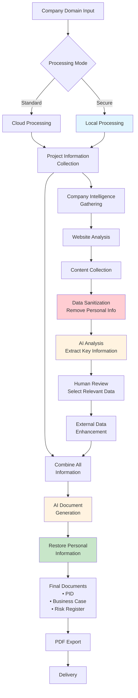

# Project Genie System Flow - Executive Summary

## Overview
Project Genie combines traditional project documentation with intelligent company research to create comprehensive, context-rich business documents.

## System Process Flow

## Key Process Stages

### 1. Input & Configuration
The system begins when a user enters a company's website address. They can choose between cloud processing for standard operations or local processing for sensitive data that must remain within the organisation's network.

### 2. Information Collection
The traditional wizard collects essential project details through a simple five-step process, gathering information about project goals, stakeholders, timelines, and requirements.

### 3. Company Intelligence Gathering
Simultaneously, the system analyses the company's website to understand their business, market position, and context. This happens through several intelligent phases that adapt to different website types.

### 4. Data Protection & Security
Before any external processing, the system automatically identifies and removes personal information such as names, email addresses, and phone numbers. These are replaced with secure tokens and stored separately in an encrypted vault.

### 5. AI-Powered Analysis
Artificial intelligence analyses the collected information to extract meaningful insights about the company's operations, market position, competitive landscape, and potential risks. This analysis uses sanitised data to ensure privacy.

### 6. Human Oversight
Users review the extracted information through an intuitive interface, selecting which insights are relevant for their documentation. This ensures accuracy and relevance while maintaining human control over the process.

### 7. Information Enhancement
If enabled, the system can gather additional context from public sources such as financial databases, news articles, and industry reports. This enrichment provides deeper insights for more comprehensive documentation.

### 8. Document Generation
The system combines project information with company intelligence to generate professional documents. These documents are contextually aware, incorporating real market data and company-specific insights rather than generic templates.

### 9. Final Processing
Before delivery, all personal information is restored to the documents using the secure token system. The final documents are then converted to PDF format with appropriate security classifications and watermarks.

## Security & Compliance Features

### Data Protection
The system employs multi-layer security to protect sensitive information throughout the process. Personal data is encrypted and isolated, with comprehensive audit trails tracking all access and modifications.

### Compliance Standards
The architecture supports major regulatory requirements including GDPR for data protection, HIPAA for healthcare information, and SOC 2 for security controls. All data handling follows industry best practices.

### Local Processing Option
For organisations with strict data sovereignty requirements, the system offers complete local processing where no information leaves the corporate network. This airgapped mode ensures absolute data control.

## Processing Modes

### Cloud Processing
Standard mode using advanced cloud-based AI services. Provides fastest processing and access to the latest AI models. All data is sanitised before cloud processing to ensure privacy.

### Local Processing
Secure mode using on-premises AI models. Ideal for sensitive projects where data cannot leave the organisation. Maintains full functionality while ensuring complete data isolation.

### Hybrid Processing
Intelligent routing where public information uses cloud services while sensitive data remains local. Optimises performance while maintaining security requirements.

## Generated Documents

### Project Initiation Document (PID)
Combines project objectives with real market analysis, competitor insights, and industry-specific considerations. The result is a comprehensive foundation document grounded in actual business context.

### Business Case
Integrates financial projections with actual market data, competitive positioning, and industry benchmarks. Provides evidence-based justification using real company intelligence.

### Risk Register
Identifies project risks enhanced with industry-specific threats, regulatory requirements, and competitive challenges discovered through intelligence gathering.

## Benefits

### Enhanced Quality
Documents contain real market data and company-specific insights rather than generic content, providing immediate value and relevance.

### Time Savings
Automated research and analysis reduces document creation time from days to hours while improving comprehensiveness.

### Compliance Assurance
Built-in security and audit features ensure regulatory compliance without additional overhead.

### Flexibility
Supports both cloud and local processing modes to meet varying security and performance requirements.

## Implementation Considerations

### Infrastructure Requirements
Cloud mode requires only internet access and a web browser. Local mode requires on-premises AI infrastructure with sufficient processing capability.

### User Training
The intuitive interface requires minimal training. Users familiar with standard document wizards can immediately use the system effectively.

### Integration
The system integrates with existing project management and documentation workflows through standard export formats and APIs.

### Scalability
Architecture supports processing from single documents to enterprise-scale operations with appropriate infrastructure scaling.

## Monitoring & Audit

### Performance Tracking
Real-time dashboards show processing status, resource usage, and document generation metrics. Administrators can monitor system health and user activity.

### Security Monitoring
Continuous monitoring of data access patterns, with alerts for unusual activity. All personal data access is logged for compliance reporting.

### Quality Assurance
Generated documents undergo automatic quality checks with options for human review at key stages. Ensures consistency and accuracy across all outputs.

## Conclusion

Project Genie represents a significant advancement in automated documentation, combining traditional project information with intelligent company research. The system's flexible architecture supports various security requirements while delivering high-quality, contextually relevant documentation.

The multi-layer security approach ensures data protection throughout the process, while the choice of processing modes allows organisations to balance performance with security requirements. Whether using cloud services for speed or local processing for security, Project Genie delivers professional documentation enhanced with real business intelligence.