# Project Genie Complete System Flow

## Full Document Generation with Company Intelligence, Data Sanitization, and Airgapped Processing

This comprehensive flow diagram shows the complete Project Genie system including data sanitization, PII handling, and local Ollama LLM processing options.

```mermaid
flowchart TB
    Start[User Enters Domain] --> Config{LLM Configuration}

    Config -->|Cloud LLMs| CloudPath[Cloud Processing Path]
    Config -->|Local Ollama| LocalPath[Airgapped Local Path]

    %% Cloud Path with Sanitization
    CloudPath --> Split{Two Parallel Flows}

    %% Document Generation Flow (Left Side)
    Split -->|Traditional Flow| Wizard[Document Generation Wizard]

    Wizard --> WizStep1[Step 1: Project Details<br/>- Name, Description<br/>- Start/End Dates<br/>- Budget]
    WizStep1 -->|DB Write| DB1[(projects table)]

    WizStep1 --> WizStep2[Step 2: Objectives & Scope<br/>- Goals, Deliverables<br/>- Success Criteria<br/>- Constraints]
    WizStep2 -->|DB Write| DB2[(project_objectives table)]

    WizStep2 --> WizStep3[Step 3: Stakeholders<br/>- Roles, Responsibilities<br/>- Contact Info<br/>- Influence/Interest]
    WizStep3 -->|DB Write| DB3[(stakeholders table)]

    %% Sanitization for Stakeholder Data
    WizStep3 --> SanitizeWiz[SANITIZE Layer 1<br/>- Extract PII<br/>- Generate tokens<br/>- Store mapping]
    SanitizeWiz -->|Sanitized| DB3Token[(pii_tokens table<br/>token_mapping)]

    SanitizeWiz --> WizStep4[Step 4: Risks & Assumptions<br/>- Risk Assessment<br/>- Mitigation Plans<br/>- Dependencies]
    WizStep4 -->|DB Write| DB4[(risks table)]

    WizStep4 --> WizStep5[Step 5: Additional Context<br/>- Industry Info<br/>- Regulatory Requirements<br/>- Special Considerations]
    WizStep5 -->|DB Write| DB5[(project_context table)]

    %% Company Intelligence Flow (Right Side)
    Split -->|Intelligence Flow| CIStart[Company Intelligence Pipeline]

    CIStart --> Phase1[Phase 1: Discovery<br/>Site Analysis]
    Phase1 --> P1Process[- Domain validation<br/>- Sitemap discovery<br/>- Technology detection<br/>- Site structure mapping]
    P1Process -->|DB Write| CIDB1[(company_intelligence_sessions<br/>site_analysis_results)]
    P1Process -->|SSE Stream| Stream1[Progress Events to UI]

    CIDB1 --> Phase2[Phase 2: Scraping<br/>Content Collection]
    Phase2 --> P2Strategy{Strategy Selection}

    P2Strategy -->|Static Sites| Static[Static Strategy<br/>Cheerio & Axios]
    P2Strategy -->|Dynamic Sites| Dynamic[Dynamic Strategy<br/>Playwright]
    P2Strategy -->|SPAs| SPA[SPA Strategy<br/>Framework-aware]

    Static --> P2Process[Scrape Selected Pages]
    Dynamic --> P2Process
    SPA --> P2Process

    P2Process -->|Raw HTML| Sanitize1[SANITIZE Layer 2<br/>PII Detection & Removal]

    Sanitize1 --> PIIDetect[PII Detection Engine<br/>- Email regex patterns<br/>- Phone number patterns<br/>- Name entity recognition<br/>- Address detection<br/>- SSN/ID patterns]

    PIIDetect --> TokenGen[Token Generation<br/>- Create UUID tokens<br/>- Map PII to tokens<br/>- Store in secure vault]

    TokenGen -->|Sanitized Content| CIDB2[(scraped_content<br/>page_intelligence)]
    TokenGen -->|PII Mappings| PIIVault[(pii_vault<br/>encrypted_mappings)]
    TokenGen -->|SSE Stream| Stream2[Incremental Updates<br/>Sanitized]

    CIDB2 --> Phase3[Phase 3: Extraction<br/>🧩 Data Structuring]
    Phase3 --> LLM1[LLM Stage 1: Content Analysis<br/>GPT-4 Turbo<br/>Sanitized Data]
    LLM1 --> Extract[- Extract entities<br/>- Identify relationships<br/>- Categorize content<br/>- Find patterns]
    Extract -->|DB Write| CIDB3[(extracted_entities<br/>entity_relationships)]

    CIDB3 --> Phase4[Phase 4: Data Review<br/>Human Validation]

    Phase4 --> Rehydrate1[REHYDRATE Point 1<br/>- Retrieve PII tokens<br/>- Display real names<br/>- Show actual contacts]

    Rehydrate1 --> Review[- Tree view of data<br/>- Cost calculator<br/>- Selection controls<br/>- Preview pane<br/>With Real Data]

    Review -->|User Selection| Selected[Selected Data Points]

    Selected --> ReSanitize[SANITIZE Again<br/>Before Storage]

    ReSanitize -->|DB Write| CIDB4[(selected_intelligence<br/>Tokenized)]

    CIDB4 --> Phase5[Phase 5: Enrichment<br/>External Data]
    Phase5 --> EnrichCheck{Enrichers Enabled?}

    EnrichCheck -->|If Enabled| Enrichers[Multiple Enrichers<br/>- Financial Data<br/>- LinkedIn Profiles<br/>- Google Business<br/>- Social Media<br/>- News & PR<br/>- Competitors]

    Enrichers --> Sanitize2[SANITIZE Layer 3<br/>External Data Sanitization]

    Sanitize2 --> LLM2[LLM Stage 2: Enrichment<br/>GPT-5 Mini<br/>Sanitized Data]
    LLM2 -->|DB Write| CIDB5[(enriched_intelligence<br/>external_intelligence_summary)]

    EnrichCheck -->|If Disabled| SkipEnrich[Use Scraped Data Only]

    Phase5 --> Phase6[Phase 6: Generation<br/>📄 Intelligence Pack]
    LLM2 --> Phase6
    SkipEnrich --> Phase6

    Phase6 --> LLM3[LLM Stage 3: Pack Generation<br/>GPT-5 Mini<br/>Sanitized Data]
    LLM3 --> GenPack[Generate Intelligence Pack<br/>- Executive Summary<br/>- Market Analysis<br/>- Competitor Insights<br/>- Risk Assessment<br/>- Recommendations]
    GenPack -->|DB Write| CIDB6[(intelligence_packs<br/>Tokenized)]

    %% Local Ollama Path
    LocalPath --> LocalWizard[Local Data Collection<br/>Same Wizard]

    LocalWizard --> LocalScrape[Local Scraping<br/>Via Playwright]

    LocalScrape --> OllamaCheck{Ollama Models}

    OllamaCheck --> OllamaModels[Available Models:<br/>- llama2:13b<br/>- codellama:7b<br/>- mistral:7b<br/>- mixtral:8x7b<br/>- Custom fine-tuned]

    OllamaModels --> LocalProcess[🏠 Local Processing<br/>- No data leaves network<br/>- Full PII retained<br/>- No sanitization needed<br/>- Complete airgap]

    LocalProcess --> LocalExtract[Local Extraction<br/>via Ollama API]
    LocalExtract --> LocalEnrich[Local Enrichment<br/>Internal sources only]
    LocalEnrich --> LocalGen[Local Generation<br/>via Ollama]

    LocalGen -->|Secure Write| LocalDB[(Local Database<br/>Full PII Retained)]

    %% Merge Points
    WizStep5 --> Merge{Combine Data Sources}
    GenPack --> Merge
    LocalGen --> Merge

    %% Document Generation with Enhanced Context
    Merge --> FinalSanitize{Final Sanitization Check}

    FinalSanitize -->|Cloud Path| CloudDocGen[Cloud Document Generation]
    FinalSanitize -->|Local Path| LocalDocGen[Local Document Generation]

    CloudDocGen --> LLM4[LLM Stage 4: Document Generation<br/>GPT-4.1 Mini / GPT-5 Mini<br/>Sanitized]

    LocalDocGen --> OllamaDoc[Ollama Document Generation<br/>Local Models<br/>Full PII]

    LLM4 --> DocTypes{Document Type}
    OllamaDoc --> DocTypes

    DocTypes -->|PID| PID[Project Initiation Document<br/>• Market Context<br/>• Competitor Analysis<br/>• Industry Risks]
    DocTypes -->|Business Case| BC[Business Case<br/>• Financial Insights<br/>• Market Opportunity<br/>• ROI Analysis]
    DocTypes -->|Risk Register| RR[Risk Register<br/>• Industry Risks<br/>• Regulatory Risks<br/>• Competitor Threats]

    PID --> FinalRehydrate[REHYDRATE Final<br/>- Replace all tokens<br/>- Restore PII<br/>- Add personal data]
    BC --> FinalRehydrate
    RR --> FinalRehydrate

    FinalRehydrate -->|Structured Output| Format1[Unified Pack Formatter]
    FinalRehydrate -->|Unstructured Output| Format2[Document Formatter]

    Format1 -->|DB Write| FinalDB[(artifacts table<br/>Full Document)]
    Format2 -->|DB Write| FinalDB

    FinalDB --> PDF[PDF Generation<br/>Playwright HTML→PDF]

    PDF --> SecurityCheck{Security Audit}

    SecurityCheck --> AuditLog[Audit Trail:<br/>- PII access logs<br/>- Token usage<br/>- Rehydration events<br/>- User actions]

    AuditLog -->|Log Write| AuditDB[(audit_log table)]

    SecurityCheck --> Output[Enhanced Document with<br/>Company Intelligence<br/>Full PII Restored]

    %% Legend and Styling
    style Sanitize1 fill:#ffcdd2
    style Sanitize2 fill:#ffcdd2
    style SanitizeWiz fill:#ffcdd2
    style ReSanitize fill:#ffcdd2
    style Rehydrate1 fill:#c8e6c9
    style FinalRehydrate fill:#c8e6c9
    style LocalProcess fill:#e1f5fe
    style OllamaModels fill:#e1f5fe
    style LocalDocGen fill:#e1f5fe
    style OllamaDoc fill:#e1f5fe
    style LLM1 fill:#fff3e0
    style LLM2 fill:#fff3e0
    style LLM3 fill:#fff3e0
    style LLM4 fill:#fff3e0
    style SecurityCheck fill:#f3e5f5
    style AuditLog fill:#f3e5f5
```



## Data Sanitization & Security Architecture

### Multi-Layer Sanitization Approach

#### Layer 1: Wizard Data Sanitization
- **Location**: After stakeholder information collection
- **Purpose**: Protect personal contact details
- **Process**:
  ```typescript
  // Sanitization process at /lib/security/sanitizer.ts
  interface SanitizationResult {
    sanitizedData: any;           // Data with PII replaced by tokens
    tokenMappings: TokenMapping[]; // UUID -> PII mappings
    detectedPII: PIIType[];        // Types of PII found
  }
  ```

#### Layer 2: Scraped Content Sanitization
- **Location**: After web scraping, before LLM processing
- **Purpose**: Remove discovered PII from web content
- **Detection Patterns**:
  - Email addresses: `/[\w._%+-]+@[\w.-]+\.[A-Z]{2,}/i`
  - Phone numbers: Various international formats
  - Social Security: `XXX-XX-XXXX` patterns
  - Names: NER (Named Entity Recognition) via spaCy
  - Addresses: Geographic entity detection

#### Layer 3: External Data Sanitization
- **Location**: After enrichment API calls
- **Purpose**: Sanitize third-party data
- **Special Handling**: LinkedIn profiles, social media handles

### PII Token Management

```typescript
// Token mapping structure at /lib/security/token-manager.ts
interface PIIToken {
  id: string;                    // UUID v4
  token: string;                  // Replacement token (e.g., "PERSON_001")
  originalValue: string;          // Encrypted original value
  type: PIIType;                  // email | phone | name | ssn | address
  context: string;                // Where it was found
  createdAt: Date;
  expiresAt: Date;               // Auto-cleanup after 24 hours
  sessionId: string;              // Link to CI session
  userId: string;                 // Owner of the data
}

enum PIIType {
  EMAIL = 'email',
  PHONE = 'phone',
  NAME = 'name',
  SSN = 'ssn',
  ADDRESS = 'address',
  CREDIT_CARD = 'credit_card',
  CUSTOM = 'custom'
}
```

### Rehydration Points

#### Rehydration Point 1: Data Review UI
- **Purpose**: Show real data to users for validation
- **Security**: Client-side only, ephemeral
- **Implementation**:
  ```typescript
  // At /components/company-intelligence/data-review/DataReviewPanel.tsx
  const rehydrateForDisplay = async (data: any) => {
    const tokens = await fetchTokenMappings(sessionId);
    return replacetokensWithPII(data, tokens);
  };
  ```

#### Final Rehydration: Document Generation
- **Purpose**: Restore PII in final documents
- **Timing**: After LLM processing, before PDF generation
- **Audit**: Every rehydration logged

### Security Vault Architecture

```sql
-- PII Vault Table Structure
CREATE TABLE pii_vault (
  id UUID PRIMARY KEY DEFAULT gen_random_uuid(),
  token VARCHAR(255) UNIQUE NOT NULL,
  encrypted_value TEXT NOT NULL,  -- AES-256 encrypted
  value_type VARCHAR(50) NOT NULL,
  session_id UUID REFERENCES company_intelligence_sessions(id),
  user_id UUID REFERENCES auth.users(id),
  created_at TIMESTAMP WITH TIME ZONE DEFAULT NOW(),
  expires_at TIMESTAMP WITH TIME ZONE DEFAULT NOW() + INTERVAL '24 hours',
  access_count INTEGER DEFAULT 0,
  last_accessed TIMESTAMP WITH TIME ZONE
);

-- Row Level Security
ALTER TABLE pii_vault ENABLE ROW LEVEL SECURITY;

CREATE POLICY "Users can only access their own PII tokens"
  ON pii_vault FOR ALL
  USING (auth.uid() = user_id);
```

## Ollama Local LLM Integration (Airgapped Mode)

### Configuration
```typescript
// At /lib/providers/ollama-provider.ts
interface OllamaConfig {
  endpoint: string;          // Default: http://localhost:11434
  model: OllamaModel;        // Selected model
  airgapped: boolean;        // No external API calls
  retainPII: boolean;        // Skip sanitization
  localEnrichment: boolean;  // Use internal data only
}

enum OllamaModel {
  LLAMA2_13B = 'llama2:13b',
  CODELLAMA_7B = 'codellama:7b',
  MISTRAL_7B = 'mistral:7b',
  MIXTRAL_8X7B = 'mixtral:8x7b',
  CUSTOM = 'custom:fine-tuned'
}
```

### Airgapped Processing Flow

#### 1. Local Discovery & Scraping
- Uses Playwright locally
- No external API calls
- Respects robots.txt
- Internal network only

#### 2. Local LLM Processing
```typescript
// Processing pipeline at /lib/ollama/pipeline.ts
async function processWithOllama(content: string, task: TaskType) {
  const response = await fetch('http://localhost:11434/api/generate', {
    method: 'POST',
    body: JSON.stringify({
      model: config.model,
      prompt: buildPrompt(content, task),
      stream: true,
      options: {
        temperature: 0.7,
        top_p: 0.9,
        max_tokens: 4096
      }
    })
  });

  // Handle streaming response
  return handleOllamaStream(response);
}
```

#### 3. Local Enrichment Sources
- Internal databases only
- Company intranet
- Local file shares
- No external APIs

#### 4. Benefits of Airgapped Mode
- **Complete Data Sovereignty**: No data leaves organization
- **Compliance**: Meets strict regulatory requirements
- **PII Retention**: No sanitization needed
- **Speed**: No network latency to cloud
- **Cost**: No API usage charges

### Hybrid Mode Option

```typescript
// Hybrid configuration at /lib/providers/hybrid-config.ts
interface HybridConfig {
  sensitiveDataProvider: 'ollama';     // Local for PII
  publicDataProvider: 'openai';        // Cloud for public
  decisionLogic: (data: DataPacket) => Provider;

  // Smart routing rules
  rules: [
    { pattern: /personal|private|confidential/i, provider: 'ollama' },
    { pattern: /public|market|industry/i, provider: 'openai' }
  ];
}
```

## Audit Trail & Compliance

### Comprehensive Audit Logging

```typescript
// Audit structure at /lib/security/audit-logger.ts
interface AuditEntry {
  id: string;
  timestamp: Date;
  userId: string;
  action: AuditAction;
  resourceType: ResourceType;
  resourceId: string;
  details: {
    piiAccessed?: string[];      // Token IDs accessed
    sanitizationApplied?: boolean;
    rehydrationPerformed?: boolean;
    provider?: 'openai' | 'ollama';
    dataClassification?: 'public' | 'internal' | 'confidential';
    ipAddress?: string;
    userAgent?: string;
  };
  outcome: 'success' | 'failure';
  errorMessage?: string;
}

enum AuditAction {
  SANITIZE = 'sanitize',
  REHYDRATE = 'rehydrate',
  TOKEN_CREATE = 'token_create',
  TOKEN_ACCESS = 'token_access',
  LLM_CALL = 'llm_call',
  EXPORT = 'export',
  DELETE = 'delete'
}
```

### Compliance Features

#### GDPR Compliance
- Right to erasure: Token deletion cascades
- Data portability: Export with/without PII
- Access logs: Complete audit trail
- Purpose limitation: Tokens expire after 24h

#### HIPAA Compliance (Healthcare)
- PHI detection and isolation
- Audit logs for all access
- Encryption at rest and in transit
- Role-based access control

#### SOC 2 Compliance
- Security controls documented
- Access monitoring
- Change tracking
- Incident response logging

### Security Best Practices

```typescript
// Security configuration at /lib/security/config.ts
export const securityConfig = {
  pii: {
    autoDetect: true,
    sanitizationLevel: 'strict',    // strict | moderate | minimal
    tokenExpiry: '24h',
    encryptionAlgo: 'AES-256-GCM',
    keyRotation: '30d'
  },

  audit: {
    enabled: true,
    retention: '7y',                // 7 years for compliance
    realTimeAlerts: true,
    suspiciousPatterns: [
      'bulk_token_access',
      'after_hours_access',
      'unusual_export_volume'
    ]
  },

  ollama: {
    enabledForPII: true,
    fallbackToCloud: false,         // Never fallback for sensitive
    maxLocalRetries: 3,
    timeout: 60000
  }
};
```

## Performance Considerations

### Sanitization Performance

```typescript
// Benchmarks at /lib/security/benchmarks.ts
interface PerformanceMetrics {
  sanitization: {
    avgTime: 250,        // ms per MB of content
    overhead: '5-10%',   // Total processing overhead
    caching: true        // Cache sanitized versions
  };

  rehydration: {
    avgTime: 50,         // ms per document
    batchSupport: true,  // Batch token lookups
    lazyLoad: true       // Only rehydrate visible content
  };

  ollama: {
    firstToken: 500,     // ms to first token
    tokensPerSec: 30,    // Generation speed
    ramUsage: '8-16GB'   // Depends on model
  };
}
```

### Optimization Strategies

1. **Token Caching**
   - Redis cache for frequent tokens
   - 5-minute TTL for active sessions
   - Preload common patterns

2. **Batch Processing**
   - Group sanitization operations
   - Parallel token generation
   - Bulk database writes

3. **Ollama Optimization**
   - Model quantization (4-bit/8-bit)
   - GPU acceleration when available
   - Response streaming

## Implementation Checklist

### Phase 1: Core Sanitization
- [ ] Implement PII detection engine
- [ ] Create token management system
- [ ] Build encryption/decryption layer
- [ ] Add audit logging

### Phase 2: Ollama Integration
- [ ] Install Ollama server
- [ ] Configure model selection
- [ ] Implement streaming responses
- [ ] Add fallback handling

### Phase 3: Security Hardening
- [ ] Enable row-level security
- [ ] Implement key rotation
- [ ] Add rate limiting
- [ ] Set up monitoring alerts

### Phase 4: Compliance
- [ ] GDPR controls
- [ ] Export capabilities
- [ ] Retention policies
- [ ] Documentation

## Environment Variables

```bash
# Security Configuration
ENCRYPTION_KEY=             # AES-256 key for PII encryption
TOKEN_SALT=                 # Salt for token generation
PII_VAULT_URL=             # Separate DB for PII if needed

# Ollama Configuration
OLLAMA_ENDPOINT=http://localhost:11434
OLLAMA_MODEL=llama2:13b
OLLAMA_TIMEOUT=60000
ENABLE_AIRGAP=true

# Audit Configuration
AUDIT_RETENTION_DAYS=2555  # 7 years
AUDIT_REAL_TIME=true
SUSPICIOUS_THRESHOLD=10    # Tokens per minute

# Hybrid Mode
HYBRID_MODE_ENABLED=true
SENSITIVE_DATA_PROVIDER=ollama
PUBLIC_DATA_PROVIDER=openai
```

## Monitoring & Alerts

### Key Metrics Dashboard

```typescript
// Dashboard config at /components/monitoring/security-dashboard.tsx
interface SecurityMetrics {
  realTime: {
    activeSanitizations: number;
    tokenCreationRate: number;
    rehydrationRequests: number;
    ollamaQueueDepth: number;
  };

  daily: {
    totalPIIDetected: number;
    uniqueUsersAccessing: number;
    documentsProcessed: number;
    complianceScore: number;  // 0-100
  };

  alerts: {
    suspiciousActivity: Alert[];
    performanceIssues: Alert[];
    complianceViolations: Alert[];
  };
}
```

### Alert Conditions

1. **Security Alerts**
   - Bulk token access (>100 in 1 minute)
   - After-hours PII access
   - Failed decryption attempts
   - Unusual export patterns

2. **Performance Alerts**
   - Sanitization >5 seconds
   - Token generation failures
   - Ollama timeout
   - Cache miss rate >20%

3. **Compliance Alerts**
   - Token expiry approaching
   - Audit log gaps
   - Unauthorized access attempts
   - Data retention violations

## Support & Troubleshooting

### Common Issues

1. **Ollama Connection Failed**
   ```bash
   # Check Ollama service
   curl http://localhost:11434/api/tags

   # Restart Ollama
   systemctl restart ollama
   ```

2. **Token Mapping Lost**
   ```sql
   -- Recover from audit log
   SELECT * FROM audit_log
   WHERE action = 'token_create'
   AND resource_id = 'session_id';
   ```

3. **Slow Sanitization**
   ```typescript
   // Enable performance profiling
   permanentLogger.timing('sanitization', {
     contentSize: content.length,
     piiFound: detectedPII.length
   });
   ```

## Conclusion

This complete flow ensures:
- **Data Security**: Multi-layer sanitization protects PII
- **Flexibility**: Cloud, local, or hybrid processing options
- **Compliance**: Full audit trail and regulatory adherence
- **Performance**: Optimized for real-world usage
- **Reliability**: Fallback mechanisms and error handling

The system provides enterprise-grade security while maintaining the rich intelligence gathering capabilities of Project Genie.