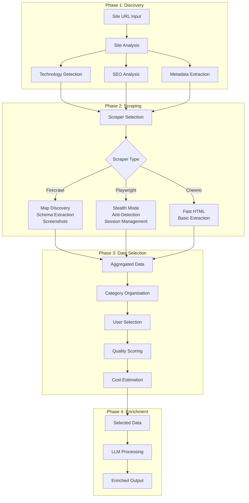

# Scraping UI v3 Architecture

## Overview
The v3 Scraping UI provides a comprehensive interface for site discovery, data scraping, and intelligent data selection for LLM enrichment. It combines existing site analysis capabilities with new v3 scraper features and a sophisticated data selection interface.

## Core Components

### 1. Scraping Dashboard (`/components/company-intelligence/scraping-dashboard/`)
Main container orchestrating all scraping phases:
- **Site Analysis Panel** (top) - Existing technology, SEO, metadata discovery
- **Scraper Controls** (middle) - v3 scraper configuration and execution
- **Data Selection Grid** (bottom) - Cherry-pick data for enrichment
- **Enrichment Preview** - Review selected data before LLM processing

### 2. Data Selection System

#### Categories
Data is organised into logical categories for easy review:
- **Company Information** - Business details, about us, mission
- **Contact Details** - Email, phone, addresses
- **Technology Stack** - Detected technologies, frameworks
- **Social Media** - Social links and profiles
- **Products & Services** - Offerings, pricing, features
- **Page Content** - Main content blocks
- **SEO & Metadata** - Meta tags, structured data
- **Images & Media** - Screenshots, logos, media files

#### Selection Features
- Individual item selection via checkboxes
- Batch selection (select all/clear)
- Quality scoring for each data item
- Cost estimation for enrichment
- Visual previews with expand/collapse
- Source attribution (Firecrawl/Playwright/Cheerio)

### 3. Animation System (Framer Motion)

#### Animation Types
- **Category Expansion** - Smooth accordion-style collapse/expand
- **Item Selection** - Visual feedback on selection state
- **List Staggering** - Sequential item appearance
- **Hover Effects** - Subtle scale and highlight
- **Progress Indicators** - Animated loading states

#### Animation Specifications
```typescript
// Category animations
categoryAnimation: {
  open: { opacity: 1, height: "auto", transition: { duration: 0.3 } },
  collapsed: { opacity: 0, height: 0, transition: { duration: 0.2 } }
}

// Selection animations
itemSelection: {
  selected: { scale: 1.02, backgroundColor: "rgba(34, 197, 94, 0.1)" },
  unselected: { scale: 1, backgroundColor: "transparent" }
}
```

## Data Flow Architecture



## Component Specifications

### SiteAnalysisPanel
**Location**: `/components/company-intelligence/scraping-dashboard/site-analysis-panel.tsx`
- Reuses existing site analysis functionality
- Shows technology stack, SEO metrics, metadata
- Collapsible with refresh capability
- Export functionality for discovered data

### ScraperControls
**Location**: `/components/company-intelligence/scraping-dashboard/scraper-controls.tsx`
- Scraper type selector (Firecrawl/Playwright/Cheerio)
- Preset configurations (Discovery/Quick/Comprehensive/Stealth)
- Advanced settings toggle
- Real-time progress indicator
- Cost estimation display

### DataSelectionGrid
**Location**: `/components/company-intelligence/scraping-dashboard/data-selection-grid.tsx`
- Main data review interface
- Category-based organisation
- Checkbox selection per item
- Batch operations (select all/clear)
- Search and filter capabilities

### DataCategoryCard
**Location**: `/components/company-intelligence/scraping-dashboard/data-category-card.tsx`
- Individual category container
- Collapsible with animation
- Shows item count and selection state
- Quality indicators
- Source attribution

### EnrichmentPreview
**Location**: `/components/company-intelligence/scraping-dashboard/enrichment-preview.tsx`
- Sticky bottom panel
- Shows selected item count
- Token estimation
- Cost calculation
- Preview and proceed buttons

## State Management

### Selection State
```typescript
interface SelectionState {
  categories: Map<string, CategoryData>
  selectedItems: Set<string>
  totalTokens: number
  estimatedCost: number
  enrichmentReady: boolean
}

interface CategoryData {
  id: string
  title: string
  items: DataItem[]
  expanded: boolean
  selectedCount: number
}

interface DataItem {
  id: string
  categoryId: string
  type: string
  source: 'firecrawl' | 'playwright' | 'cheerio'
  content: any
  preview: string
  selected: boolean
  quality: number  // 0-100
  tokens: number
  cost: number
}
```

## UI Libraries & Components

### Core UI (shadcn/ui)
- `Card`, `CardHeader`, `CardContent` - Layout structure
- `Checkbox` - Selection controls
- `ScrollArea` - Scrollable content
- `Badge` - Status indicators
- `Button` - Action triggers
- `Separator` - Visual separation
- `Tabs` - View organisation

### Animation (Framer Motion)
- `motion.div` - Animated containers
- `AnimatePresence` - Exit animations
- `motion.button` - Interactive elements
- `useAnimation` - Programmatic control

### Icons (Lucide React)
- Category icons (Building, Phone, Code, etc.)
- Action icons (Eye, Download, Refresh, etc.)
- State icons (Check, X, ChevronDown, etc.)

## Quality Scoring Algorithm

```typescript
// Quality score calculation (0-100)
function calculateQuality(item: DataItem): number {
  let score = 0;

  // Content completeness (40 points)
  if (item.content) score += 20;
  if (item.content?.length > 100) score += 20;

  // Source reliability (30 points)
  if (item.source === 'playwright') score += 30;
  else if (item.source === 'firecrawl') score += 25;
  else if (item.source === 'cheerio') score += 15;

  // Data freshness (20 points)
  const age = Date.now() - item.timestamp;
  if (age < 60000) score += 20; // < 1 min
  else if (age < 3600000) score += 10; // < 1 hour

  // Validation passed (10 points)
  if (item.validated) score += 10;

  return Math.min(100, score);
}
```

## Cost Estimation

```typescript
// Token and cost calculation
function calculateEnrichmentCost(items: DataItem[]): {
  tokens: number;
  cost: number;
} {
  let totalTokens = 0;

  for (const item of items) {
    // Estimate tokens (rough: 1 token per 4 chars)
    const content = JSON.stringify(item.content);
    const tokens = Math.ceil(content.length / 4);
    totalTokens += tokens;
  }

  // GPT-5 pricing (example)
  const costPerMillion = 15.00; // $15 per 1M tokens
  const cost = (totalTokens / 1000000) * costPerMillion;

  return { tokens: totalTokens, cost };
}
```

## Accessibility Features
- Keyboard navigation support
- ARIA labels on interactive elements
- Focus management in modals
- Screen reader announcements
- High contrast mode support

## Mobile Responsiveness
- Stacked layout on mobile
- Touch-friendly controls (44x44px minimum)
- Swipe gestures for expand/collapse
- Responsive grid layouts
- Optimised animations for mobile

## Performance Optimisations
- Virtualised lists for large datasets
- Lazy loading of category contents
- Debounced search/filter
- Memoised expensive calculations
- Optimistic UI updates

## Error Handling
All errors logged via permanentLogger:
```typescript
try {
  // Scraping operation
} catch (error) {
  permanentLogger.captureError('SCRAPING_UI', error as Error, {
    operation: 'data_selection',
    category: categoryId,
    itemCount: items.length
  });
}
```

## Testing Considerations
- Component testing with React Testing Library
- Animation testing with Framer Motion mocks
- State management testing
- Accessibility testing with axe-core
- Mobile responsiveness testing

## Future Enhancements
- AI-powered auto-selection suggestions
- Data quality improvement recommendations
- Historical selection patterns
- Bulk editing capabilities
- Custom category creation
- Advanced filtering (regex, conditions)
- Export selection templates
- Collaborative selection (team features)

## Integration Points

### API Routes
- `/api/company-intelligence/scrapers-v3/execute` - Execute scrapers
- `/api/company-intelligence/scrapers-v3/aggregate` - Aggregate data
- `/api/company-intelligence/phases/enrichment` - Send to LLM

### Database Tables
- `company_intelligence_sessions` - Scraping sessions
- `scraped_data` - Raw scraped content
- `enrichment_selections` - User selections
- `enriched_data` - Final enriched output

## Compliance Checklist
- ✅ TooltipWrapper on all interactive elements
- ✅ Repository pattern for data access
- ✅ No mock/fallback data
- ✅ permanentLogger for error handling
- ✅ Session management via getOrCreateUserSession()
- ✅ TypeScript with strict types
- ✅ Component files under 500 lines
- ✅ Mobile responsive design
- ✅ Semantic HTML structure
- ✅ UK English in documentation