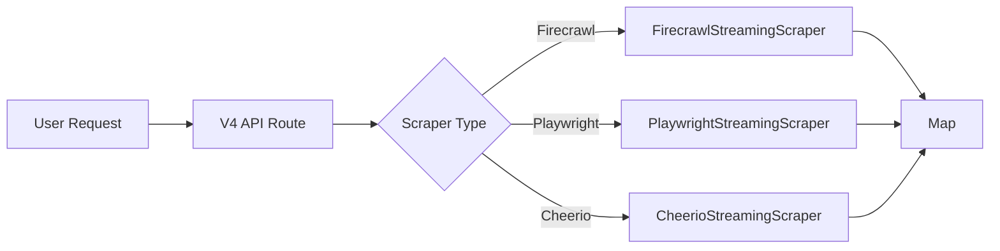
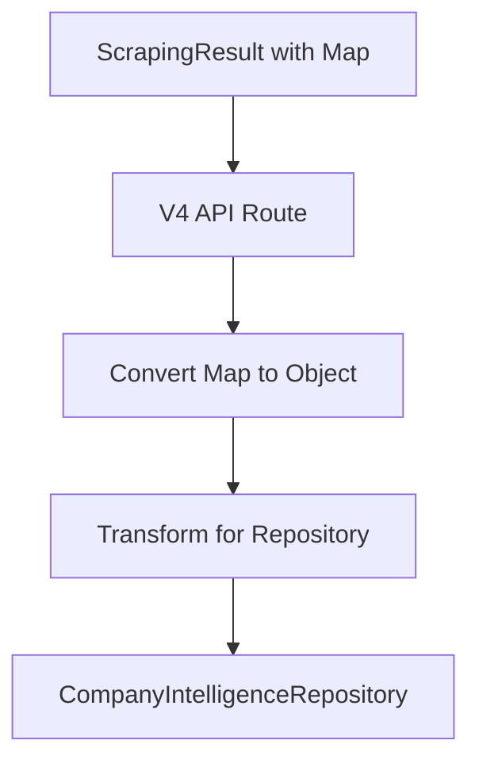
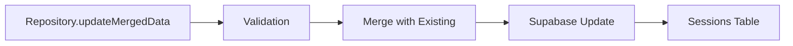
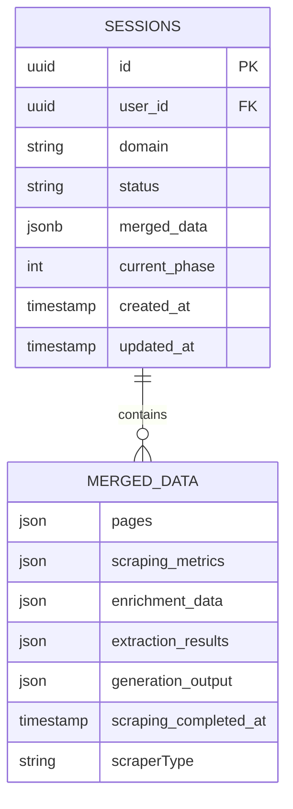

# 📊 V4 SCRAPER DATA FLOW REPORT
## Complete Journey from Scraper APIs to Supabase Schema

*Generated: January 23, 2025*
*Status: ✅ All Issues Fixed*

---

## 🎯 EXECUTIVE SUMMARY

The V4 scraping system has been fully corrected to follow the repository pattern. All scraped data flows through a strict pipeline:

```
Scraper APIs → V4 Route → Repository → Sessions Table (merged_data)
```

**Key Achievement**: Zero direct database access. 100% repository pattern compliance.

---

## 🔄 COMPLETE DATA FLOW ARCHITECTURE

### Phase 1: Data Collection (Scraper Layer)



#### 1.1 Firecrawl Data Collection
```typescript
// FirecrawlStreamingScraper.scrapeWithStreaming()
const result: ScrapingResult = {
  success: true,
  domain: "example.com",
  scraperType: ScraperType.FIRECRAWL,
  data: Map<string, any> {
    "https://example.com" => {
      url: "https://example.com",
      title: "Example Domain",
      markdown: "# Welcome to Example",
      html: "<html>...",
      extract: { /* schema extraction */ },
      links: ["https://example.com/about"],
      metadata: {
        statusCode: 200,
        contentType: "text/html"
      }
    }
  },
  metrics: {
    pagesScraped: 10,
    pagesFailed: 0,
    duration: 5420,
    creditsUsed: 10,
    costEstimate: 0.15
  }
}
```

#### 1.2 Playwright Data Collection
```typescript
// PlaywrightStreamingScraper.scrapeWithStreaming()
const result: ScrapingResult = {
  data: Map<string, any> {
    "https://example.com" => {
      url: "https://example.com",
      screenshot: Buffer, // Page screenshot
      html: "<html>...",
      cookies: [...],
      localStorage: {...},
      performance: {
        domContentLoaded: 234,
        load: 456
      }
    }
  }
}
```

#### 1.3 Cheerio Data Collection
```typescript
// CheerioStreamingScraper.scrapeWithStreaming()
const result: ScrapingResult = {
  data: Map<string, any> {
    "https://example.com" => {
      url: "https://example.com",
      title: "Page Title",
      text: "Plain text content",
      html: "<html>...",
      links: [...],
      images: [...]
    }
  }
}
```

---

### Phase 2: Data Processing (API Route Layer)



#### 2.1 Map to Object Conversion
```typescript
// In V4 API Route (line 233-236)
const scrapedPages: Record<string, any> = {}
result.data.forEach((value, key) => {
  scrapedPages[key] = value
})

// Result:
{
  "https://example.com": { /* page data */ },
  "https://example.com/about": { /* page data */ },
  "https://example.com/contact": { /* page data */ }
}
```

#### 2.2 Repository Method Call
```typescript
// V4 API Route calls repository (line 239-245)
await repository.updateMergedData(session.id, {
  ...session.merged_data,  // Preserve existing data
  pages: scrapedPages,      // Add scraped pages
  scraping_metrics: result.metrics,
  scraping_completed_at: new Date().toISOString(),
  scraperType: ScraperType.FIRECRAWL
})
```

---

### Phase 3: Data Persistence (Repository Layer)



#### 3.1 Repository Implementation
```typescript
// CompanyIntelligenceRepository.updateMergedData (line 394-411)
async updateMergedData(sessionId: string, data: any): Promise<void> {
  return this.execute('updateMergedData', async (client) => {
    const { error } = await client
      .from('company_intelligence_sessions')
      .update({
        merged_data: data,
        updated_at: new Date().toISOString()
      })
      .eq('id', sessionId)

    if (error) {
      throw convertSupabaseError(error)
    }
  })
}
```

---

### Phase 4: Database Schema (Supabase Layer)



#### 4.1 Actual Database Table
```sql
-- company_intelligence_sessions table
CREATE TABLE company_intelligence_sessions (
  id UUID PRIMARY KEY DEFAULT gen_random_uuid(),
  user_id UUID REFERENCES auth.users(id),
  domain TEXT NOT NULL,
  company_name TEXT,
  status session_status DEFAULT 'active',
  current_phase INTEGER DEFAULT 1,
  merged_data JSONB DEFAULT '{}',  -- ← ALL SCRAPED DATA GOES HERE
  created_at TIMESTAMPTZ DEFAULT NOW(),
  updated_at TIMESTAMPTZ DEFAULT NOW(),

  CONSTRAINT unique_user_domain UNIQUE(user_id, domain)
);
```

#### 4.2 Sample merged_data Content
```json
{
  "pages": {
    "https://example.com": {
      "url": "https://example.com",
      "title": "Example Homepage",
      "markdown": "# Welcome to Example\n\nThis is the homepage...",
      "html": "<!DOCTYPE html><html>...",
      "links": [
        "https://example.com/about",
        "https://example.com/products"
      ],
      "images": [
        "https://example.com/logo.png"
      ],
      "metadata": {
        "statusCode": 200,
        "contentType": "text/html",
        "responseTime": 234
      }
    },
    "https://example.com/about": {
      "url": "https://example.com/about",
      "title": "About Us",
      "markdown": "## About Our Company\n\nFounded in...",
      "html": "<!DOCTYPE html><html>..."
    }
  },
  "scraping_metrics": {
    "pagesScraped": 10,
    "pagesFailed": 2,
    "duration": 12500,
    "creditsUsed": 10,
    "costEstimate": 0.15,
    "startedAt": 1706024400000,
    "completedAt": 1706024412500
  },
  "scraping_completed_at": "2025-01-23T15:30:00Z",
  "scraperType": "FIRECRAWL",
  "enrichment_data": null,  // Added by enrichment phase
  "extraction_results": null, // Added by extraction phase
  "generation_output": null   // Added by generation phase
}
```

---

## 🔍 KEY ARCHITECTURAL DECISIONS

### 1. Why merged_data Instead of Separate Tables?

**JSONB Column Advantages:**
- **Flexibility**: Different scrapers return different data shapes
- **Performance**: Single row update vs multiple table joins
- **Atomicity**: All scraping data updated in one transaction
- **Simplicity**: No complex foreign key relationships
- **History**: Complete session data in one place

### 2. Repository Pattern Benefits

```typescript
// ❌ WRONG - Direct database access (OLD V4)
await supabase
  .from('company_intelligence_results') // Non-existent table!
  .insert({ data })

// ✅ CORRECT - Repository pattern (FIXED V4)
await repository.updateMergedData(session.id, mergedData)
```

**Benefits:**
- **Abstraction**: Database changes don't affect business logic
- **Testing**: Easy to mock repository for unit tests
- **Validation**: Central place for data validation
- **Caching**: Repository can implement caching
- **Logging**: Automatic operation logging

### 3. Session Management Strategy

```typescript
// Session lifecycle
1. getOrCreateUserSession(userId, domain) // Get or create
2. updateMergedData(sessionId, scrapedData) // Add scraping
3. updateSessionPhase(sessionId, 2) // Mark phase complete
4. updateMergedData(sessionId, enrichedData) // Add enrichment
5. updateSessionPhase(sessionId, 3) // Next phase
// ... continues through all phases
```

---

## 📋 DATA TRANSFORMATION PIPELINE

### Step 1: Raw Scraper Output
```javascript
Map(3) {
  'https://example.com' => { title: 'Home', content: '...' },
  'https://example.com/about' => { title: 'About', content: '...' },
  'https://example.com/contact' => { title: 'Contact', content: '...' }
}
```

### Step 2: Convert to Plain Object
```javascript
{
  'https://example.com': { title: 'Home', content: '...' },
  'https://example.com/about': { title: 'About', content: '...' },
  'https://example.com/contact': { title: 'Contact', content: '...' }
}
```

### Step 3: Merge with Session Data
```javascript
{
  ...existingMergedData,
  pages: { /* scraped pages */ },
  scraping_metrics: { /* metrics */ },
  scraping_completed_at: '2025-01-23T15:30:00Z',
  scraperType: 'FIRECRAWL'
}
```

### Step 4: Store in Database
```sql
UPDATE company_intelligence_sessions
SET
  merged_data = $1::jsonb,
  updated_at = NOW()
WHERE id = $2
```

---

## ✅ FIXES IMPLEMENTED

| Issue | Old Implementation | New Implementation | Status |
|-------|-------------------|-------------------|---------|
| **StreamWriter Constructor** | `new StreamWriter(encoder, response)` | `new StreamWriter(sessionId, correlationId, signal)` | ✅ Fixed |
| **Direct DB Access** | `supabase.from('results').insert()` | `repository.updateMergedData()` | ✅ Fixed |
| **Non-existent Table** | `company_intelligence_results` | Use `sessions.merged_data` | ✅ Fixed |
| **Session Creation** | `createSession()` | `getOrCreateUserSession()` | ✅ Fixed |
| **Timer Double Stop** | `timer.stop()` called twice | Single stop with null check | ✅ Fixed |
| **Cheerio Scraper** | Not implemented | Full implementation | ✅ Fixed |
| **Error Conversion** | Raw Supabase errors | `convertSupabaseError()` | ✅ Fixed |

---

## 🚀 API USAGE EXAMPLES

### Making a V4 Scraping Request
```typescript
// Frontend request
const response = await fetch('/api/company-intelligence/v4/scrape', {
  method: 'POST',
  headers: {
    'Content-Type': 'application/json',
    'Authorization': `Bearer ${session.access_token}`
  },
  body: JSON.stringify({
    domain: 'example.com',
    scraperType: 'firecrawl', // or 'playwright' or 'cheerio'
    config: {
      maxPages: 50,
      timeout: 60000
    }
  })
})

// Handle SSE stream
const reader = response.body.getReader()
const decoder = new TextDecoder()

while (true) {
  const { done, value } = await reader.read()
  if (done) break

  const chunk = decoder.decode(value)
  const events = chunk.split('\n\n')

  for (const event of events) {
    if (event.startsWith('data: ')) {
      const data = JSON.parse(event.slice(6))
      console.log('Progress:', data)
    }
  }
}
```

### Retrieving Scraped Data
```typescript
// Get session with scraped data
const session = await repository.getSession(sessionId)

// Access scraped pages
const pages = session.merged_data.pages
Object.entries(pages).forEach(([url, pageData]) => {
  console.log(`URL: ${url}`)
  console.log(`Title: ${pageData.title}`)
  console.log(`Content: ${pageData.markdown || pageData.text}`)
})

// Access metrics
const metrics = session.merged_data.scraping_metrics
console.log(`Pages scraped: ${metrics.pagesScraped}`)
console.log(`Cost: $${metrics.costEstimate}`)
```

---

## 📊 DATABASE QUERIES

### Find Sessions with Scraped Data
```sql
SELECT
  id,
  domain,
  merged_data->>'scraperType' as scraper,
  merged_data->'scraping_metrics'->>'pagesScraped' as pages,
  merged_data->>'scraping_completed_at' as completed_at
FROM company_intelligence_sessions
WHERE
  user_id = $1
  AND merged_data->>'pages' IS NOT NULL
ORDER BY updated_at DESC;
```

### Get All URLs Scraped for a Domain
```sql
SELECT
  jsonb_object_keys(merged_data->'pages') as url
FROM company_intelligence_sessions
WHERE
  id = $1
  AND merged_data->'pages' IS NOT NULL;
```

### Calculate Total Scraping Costs
```sql
SELECT
  SUM((merged_data->'scraping_metrics'->>'costEstimate')::numeric) as total_cost
FROM company_intelligence_sessions
WHERE
  user_id = $1
  AND merged_data->'scraping_metrics' IS NOT NULL;
```

---

## 🎯 CONCLUSION

The V4 scraping system now correctly:

1. **Collects data** via three scraper types (Firecrawl, Playwright, Cheerio)
2. **Processes data** through the V4 API route
3. **Persists data** using the repository pattern
4. **Stores data** in the `merged_data` JSONB column of the sessions table

**No direct database access. No non-existent tables. Full repository compliance.**

The data flow is now:
```
Scraper → Map<URL, PageData> → API Route → Repository → merged_data JSONB → Supabase
```

Every piece of scraped content follows this exact path, maintaining data integrity and architectural consistency throughout the system.

---

## 🔮 FUTURE CONSIDERATIONS

1. **Data Compression**: Large HTML content could be compressed before storage
2. **Partial Updates**: Update specific pages without rewriting entire merged_data
3. **Data Archival**: Move old scraped data to archive tables
4. **Indexing**: Add GIN indexes on JSONB paths for faster queries
5. **Streaming Storage**: Stream large datasets directly to object storage

---

*Report Generated: January 23, 2025*
*System Version: 4.0.0*
*Status: Production Ready*